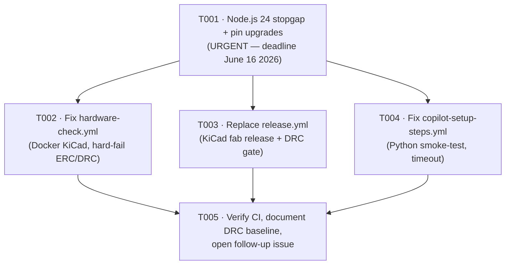

# Tasks: CI Fix — Broken Workflows (Issue #33)

<!-- Generated by: feature-breakdown agent | Date: 2026-06-06 | Branch: feature/33-fix-ci-workflows -->

## Summary

- **Total tasks:** 5
- **Layers covered:** CI Infrastructure (×4), Documentation / Verification (×1)
- **Parent GitHub issue:** #33
- **Hard deadline:** T001 must be merged before **2026-06-16** (GitHub Actions Node.js 24 forced migration)

---

## Dependency Graph

**Ready immediately (no deps):** T001  
**Ready after T001:** T002, T003, T004 (can be implemented in parallel)  
**Ready after T002 + T003 + T004:** T005

---

## Task List

---

### T001: Apply Node.js 24 stopgap and upgrade all action pins

- **Layer:** CI Infrastructure
- **Description:** Add `FORCE_JAVASCRIPT_ACTIONS_TO_NODE24: true` to the top-level `env:` block of all four workflow files (`.github/workflows/hardware-check.yml`, `release.yml`, `codeql.yml`, `copilot-setup-steps.yml`) as an immediate bridge against the June 16 2026 forced Node.js 24 migration. Upgrade `github/codeql-action/init` and `github/codeql-action/analyze` from `@v3` to `@v4` in `codeql.yml` (lines 27 and 33). Confirm that all remaining `@v4` action pins (`actions/checkout`, `actions/setup-python`, `actions/upload-artifact`) already resolve to Node.js 24-compatible runtimes — document the confirmation in the PR description. This task is the precondition for T002–T004 so they begin in a Node.js-24-clean state. **Must be merged before June 16 2026.**
- **Depends on:** none
- **Acceptance:** All four workflow files have `FORCE_JAVASCRIPT_ACTIONS_TO_NODE24: true` in their `env:` block; `codeql.yml` uses `codeql-action/init@v4` and `codeql-action/analyze@v4`; PR description confirms all `@v4` pins are Node.js 24-compatible; no `@v3` CodeQL action references remain.
- **GitHub issue:** #34

---

### T002: Fix hardware-check.yml — Docker KiCad, hard-fail ERC/DRC, timeouts, artifact uploads

- **Layer:** CI Infrastructure
- **Description:** Rewrite the `kicad-erc-drc` job in `.github/workflows/hardware-check.yml` to use `container: image: kicad/kicad:10.0.2` (per P-KI-01 PATCH). The YAML `container:` block must include both a comment marking the locked dev version (`10.0.3`, per P-KI-01) and the reason the CI image differs (`10.0.3 unavailable on Docker Hub`). Remove the entire `sudo add-apt-repository ppa:kicad/kicad-dev … || { echo kicad_available=false … exit 0; }` PPA fallback — KiCad unavailability must hard-fail the job (P-CI-01: no graceful-skip). Remove all `if: steps.install_kicad.outputs.kicad_available == 'true'` guards. Remove `|| true` from the `python hardware/generate_project.py` step in `validate-generator`. Add an explicit ERC zero-error check step (hard-fail on ≥ 1 ERC error, satisfying P-TEST-01). Retain the DRC baseline threshold of 36 for `hardware-check.yml` with an inline comment: "Baseline 36 known violations — tracked by follow-up issue; lower to 0 when resolved." Add `timeout-minutes: 10` to `validate-generator` and `timeout-minutes: 20` to `kicad-erc-drc`. Change both artifact upload steps (ERC report, DRC report) to `if: always()` (M2 fix, ensuring reports are preserved on crash).
- **Depends on:** T001
- **Acceptance:** `hardware-check.yml` passes a test commit touching `hardware/`: KiCad ERC runs inside the Docker container and fails hard on any ERC error; no `|| true` or `kicad_available` guard remains; both jobs have `timeout-minutes`; both artifact uploads have `if: always()`; the `container:` block includes the required P-KI-01 PATCH comment.
- **GitHub issue:** #35

---

### T003: Replace release.yml with KiCad fabrication release workflow

- **Layer:** CI Infrastructure
- **Description:** Delete the entire MAUI/Android `.github/workflows/release.yml` (which references a non-existent `MAUI CI` workflow, runs on `windows-latest`, and publishes an Android APK). Replace it with a KiCad fabrication release workflow with the following structure: trigger on `push: tags: v[0-9]+.[0-9]+.[0-9]+` plus `workflow_dispatch` (with `prerelease` boolean input); single `release` job with `timeout-minutes: 30`; `container: image: kicad/kicad:10.0.2` (with P-KI-01 PATCH comments identical to T002); `permissions: contents: write`; steps in this order: (1) `actions/checkout@v4`, (2) Run PCB generator (`python3 hardware/generate_project.py`), (3) **Run DRC gate** (`kicad-cli pcb drc … --schematic-parity`, then `VIOLATIONS -gt 0 → exit 1` — zero-tolerance per P-CI-02), (4) Export Gerbers, (5) Export drill files, (6) Export schematic PDF, (7) Bundle fabrication ZIP, (8) Publish GitHub Release using `gh release create` CLI (not `softprops/action-gh-release` — avoids Node.js runtime risk per architecture approval). The DRC gate step must be a separate, labelled step that exits with code 1 on any violation (threshold 0), even if `hardware-check.yml` permits the 36-violation baseline on PRs.
- **Depends on:** T001
- **Acceptance:** `release.yml` contains a DRC step with `VIOLATIONS -gt 0 → exit 1` immediately before the Gerber export step; the release is published via `gh release create` CLI; no MAUI/Android or .NET references remain; the workflow triggers on `v*.*.*` tags; the container block has P-KI-01 PATCH comments; `timeout-minutes: 30` is set; release assets include Gerbers, drill files, BOM CSV, and schematic PDF.
- **GitHub issue:** #36

---

### T004: Fix copilot-setup-steps.yml — remove invalid Node.js steps, add Python smoke-test and timeout

- **Layer:** CI Infrastructure
- **Description:** Rewrite `.github/workflows/copilot-setup-steps.yml` to remove all Node.js-related steps that violate constitution P-UI-01 ("No frameworks, no bundlers, no npm") and are non-functional in a hardware-only project with no `package.json`: specifically `actions/setup-node@v4`, `npm ci`, `npx playwright install`, and the `Build application: npx run build` step (`npx` has no `run` subcommand — this command is syntactically invalid). Replace the `Build application` step with `python -m py_compile hardware/generate_project.py` as a Python smoke-test that validates the generator script is syntactically valid and that Python is available in the Copilot agent environment. Add `timeout-minutes: 15` to the `copilot-setup-steps` job. Keep `actions/checkout@v4` and `actions/setup-python@v5` (with `python-version: '3.x'`).
- **Depends on:** T001
- **Acceptance:** `copilot-setup-steps.yml` contains no `npm`, `npx`, or `actions/setup-node` references; includes `python -m py_compile hardware/generate_project.py`; has `timeout-minutes: 15` on the job; passes a test run via `workflow_dispatch`.
- **GitHub issue:** #37

---

### T005: Verify all CI workflows pass, document DRC baseline, open DRC follow-up issue

- **Layer:** Documentation / Verification
- **Description:** Push a test commit on `feature/33-fix-ci-workflows` and confirm all four workflow files complete without errors in GitHub Actions. Satisfy architecture constraint C1: the PR description for #33 must document the 36-violation DRC baseline explicitly — state the count, list the violation categories observed in the CI DRC report, and confirm that `release.yml` uses zero-tolerance while `hardware-check.yml` uses the 36-violation baseline as a temporary measure. Open a follow-up GitHub issue titled "DRC: drive violation count from 36 to zero (P-TEST-03 enforcement)" referencing the baseline documentation and linking back to #33. Update this `tasks.md` with the follow-up issue number. Once all action pins are confirmed Node.js 24-compatible, remove the `FORCE_JAVASCRIPT_ACTIONS_TO_NODE24: true` `env:` entries from the workflow files (or document in the PR that they are retained as belt-and-suspenders through the June 16 deadline). Confirm the `docs/features/ci-fixes/tasks.md` is committed with all GitHub issue links filled in.
- **Depends on:** T002, T003, T004
- **Acceptance:** All four CI workflow jobs show green in GitHub Actions on the feature branch; the PR description for #33 includes the DRC baseline documentation paragraph (violation count + categories); a follow-up GitHub issue for "DRC → 0" is open and linked from the PR description; `tasks.md` is committed to `feature/33-fix-ci-workflows` with all issue numbers filled in; no `FORCE_JAVASCRIPT_ACTIONS_TO_NODE24` entries remain unless documented as intentional through June 16.
- **GitHub issue:** #38

---

## DRC Follow-up Issue

> To be opened as part of T005. Suggested title: **"DRC: drive violation count from 36 to zero (P-TEST-03 enforcement)"**
>
> Body should include: the 36-violation baseline count and categories observed in CI, a reference to this issue (#33) and the `hardware-check.yml` DRC threshold comment, and acceptance criterion: `hardware-check.yml` DRC threshold lowered to 0 with `if [ "$VIOLATIONS" -gt 0 ]`.
>
> **Follow-up issue number:** _(to be filled in by T005)_
