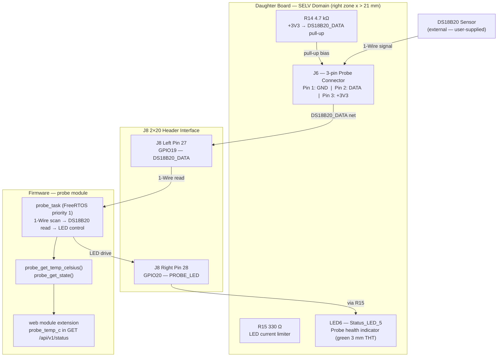

# Feature Architecture: DS18B20 External Temperature Probe

<!-- Feature: ds18b20-temperature-probe | Issue: #97 | Branch: feature/97-ds18b20-temperature-probe -->
<!-- Stage: 3 — Architecture Validation -->
<!-- Constitution reference: v3.3.0 | Validated: 2026-06-08 -->

---

## Validation Result

**APPROVED WITH CHANGES**

One blocking issue must be resolved in `plan.md` before Stage 4 (hardware implementation) may begin.
The Phase 0 constitution prerequisite (GPIO19/GPIO20 assignment) has been **resolved by the architect
during Stage 3** — constitution v3.3.0 is now in effect.

---

## Stage 3 Actions Taken

### Constitution Amendment Applied — v3.2.0 → v3.3.0 (MINOR)

The plan correctly identified that GPIO19 and GPIO20 must be formally registered in P-FW-02 before
any implementation file may change (plan.md §Phase 0). That amendment has been applied now as part
of Stage 3 validation, unblocking this prerequisite for Stage 4.

**P-FW-02 additions (constitution v3.3.0):**

| ESP32 Peripheral | Owner module | Pins | Notes |
|---|---|---|---|
| 1-Wire bus (DS18B20 probe DATA) | `probe` | GPIO19 (DS18B20_DATA → R14 4.7kΩ pull-up → J6 pin 2) | Via J8 left pin 27; 4.7kΩ pull-up R14 to +3V3 on daughter board |
| GPIO output (probe status LED) | `probe` | GPIO20 (PROBE_LED → R15 330Ω → LED6 green 3mm THT) | Via J8 right pin 28; Status_LED_5 probe health indicator |

---

## GPIO Conflict Analysis

Checked against `firmware/include/pins.h` (all current assignments) and `docs/constitution.md` §P-FW-02.

| GPIO | Current use in pins.h | Forbidden? (EMAC/UART/strapping) | Available for DS18B20 feature? |
|---|---|---|---|
| GPIO4 | FAN1_PWM | No | **TAKEN** |
| GPIO5 | FAN2_PWM | No | **TAKEN** |
| GPIO6 | FAN3_PWM | No | **TAKEN** |
| GPIO7 | FAN4_PWM | No | **TAKEN** |
| GPIO8 | FAN1_TACH | No | **TAKEN** |
| GPIO9 | FAN2_TACH | No | **TAKEN** |
| GPIO10 | FAN3_TACH | No | **TAKEN** |
| GPIO11 | FAN4_TACH | No | **TAKEN** |
| GPIO15 | PROG_LED | No | **TAKEN** |
| GPIO16 | NTC_ADC | No | **TAKEN** |
| GPIO2 | STATUS_LED | No | **TAKEN** |
| **GPIO19** | **Not defined** | Not forbidden | **✅ AVAILABLE — assigned DS18B20_DATA** |
| **GPIO20** | **Not defined** | Not forbidden | **✅ AVAILABLE — assigned PROBE_LED** |
| GPIO21 | reserved I2C | No | Available (pending esp32.expert — not used here) |
| GPIO22 | reserved I2C | No | Available (not used here) |
| GPIO31 | ETH_MDC | Yes — EMAC SMI | Forbidden |
| GPIO32–37 | EMAC RMII | Yes — IO_MUX fixed | Forbidden |
| GPIO38 | UART0_TX | Yes — debug UART | Avoid |
| GPIO39 | UART0_RX | Yes — debug UART | Avoid |
| GPIO50 | EMAC_REF_CLK | Yes — EMAC fixed | Forbidden |
| GPIO51 | ETH_PHY_RST | Yes — PHY internal | Forbidden |
| GPIO52 | ETH_MDIO | Yes — EMAC SMI | Forbidden |

**Verdict:** GPIO19 and GPIO20 are clean. No conflict with any existing firmware assignment or
hardware-reserved GPIO. Assignment is valid.

---

## Hardware Architecture for This Feature

### Block Diagram



### Schematic Additions (generator-driven, P-HW-05 / P-KI-04)

| Ref | Value | Net connections | Footprint family |
|---|---|---|---|
| J6 | 3-pin polarized connector *(see BLOCKING-01)* | Pin 1: GND; Pin 2: DS18B20_DATA; Pin 3: +3V3 | Molex KK 254 or JST XH — **TBD, kicad.expert required** |
| R14 | 4.7 kΩ THT | DS18B20_DATA ↔ +3V3 | `Resistor_THT:R_Axial_DIN0207_L6.3mm_D2.5mm_P7.62mm_Horizontal` |
| R15 | 330 Ω THT | GPIO20 (PROBE_LED net) → LED6 anode | same as R3, R13 |
| LED6 | 3 mm green THT LED | Anode via R15; cathode to GND | `LED_THT:LED_D3.0mm` |

### PCB Placement (P-HW-02, P-HW-03, P-HW-04)

- All four components on **F.Cu only** (P-HW-02 ✓)
- J6 placed on **right edge** below J5, consistent with J2–J5 column (P-HW-03 ✓)
- All components in **right zone x > 21 mm** (P-HW-04 ✓)
- DATA trace: 0.25 mm signal class (P-HW-07 ✓); keep ≥ 1.5 mm from 25 kHz PWM traces (NFR-04)

### Power Impact (§5.2 — no change to PoE class)

| Addition | Rail | Current | Power |
|---|---|---|---|
| DS18B20 VCC-powered | +3.3V | ≤ 1.5 mA | ≤ 5 mW |
| LED6 solid on | +3.3V | ≤ 10 mA | ≤ 33 mW |
| **Total addition** | +3.3V | **≤ 11.5 mA** | **≤ 38 mW** |

The +3.3V rail is the Waveshare board's internal LDO — not subject to the Ag9905M 20 W cap.
The +12V fan rail is unaffected. No PoE class change required (P-POE-01 ✓).

---

## Firmware Architecture for This Feature

### Module Map Extension (P-FW-01)

| Module | Change | Notes |
|---|---|---|
| `probe` | **New** | Owns 1-Wire bus (GPIO19), probe LED (GPIO20), DS18B20 read cycle |
| `fan` | None | Unaffected |
| `temp` | None | NTC module continues independently |
| `web` | Extended | Adds `probe_temp_c` field to `GET /api/v1/status` — calls `probe_get_temp_celsius()` only |
| `config` | Extended | Adds `curve_sensor` NVS key (`"ntc"` / `"probe"` / `"max"`) |
| `ota` | None | Unaffected |
| `main` | Extended | Calls `probe_init()` in `setup()` after `temp_init()`, before `web_init()` |

### Non-blocking Compliance (P-FW-04)

The DS18B20 750 ms conversion cycle runs entirely inside `probe_task`, a dedicated FreeRTOS task
at priority 1. The task calls `vTaskDelay()` (not `delay()`) during the conversion window.
No 1-Wire operation occurs inside any ESPAsyncWebServer callback. The `web` module only reads
the cached result via `probe_get_temp_celsius()`, which is an atomic float read. ✓

### New Libraries

| Library | Version | Source | Compatibility note |
|---|---|---|---|
| `paulstoffregen/OneWire` | `^2.3.8` | PlatformIO registry | arduino-esp32 ≥ 3.x ✓ |
| `milesburton/DallasTemperature` | `^3.11.0` | PlatformIO registry | Depends on OneWire; no conflict with ESPAsyncWebServer |

### REST API Extension (P-UI-03)

The `GET /api/v1/status` response gains one new key:

```json
{
  "probe_temp_c": 23.4
}
```

or, when no probe is detected:

```json
{
  "probe_temp_c": null
}
```

Format: float, one decimal place, or JSON `null`. Existing keys are unchanged — no client breakage.
Satisfies P-UI-03 (float/°C convention) and FR-09. ✓

---

## Principle-by-Principle Compliance Check

| Principle | Status | Notes |
|---|---|---|
| P-HW-01 — 2-layer FR4 | ✅ PASS | No layer additions |
| P-HW-02 — Top layer only | ✅ PASS | J6, R14, R15, LED6 all on F.Cu |
| P-HW-03 — Side-edge connectors | ✅ PASS | J6 on right edge, consistent with J2–J5 |
| P-HW-04 — Board outline and zones | ✅ PASS | All new components in right zone (x > 21 mm) |
| P-HW-05 / P-KI-04 — Generator is schematic source | ✅ PASS | All changes via `hardware/generator/components.py`; no hand-editing `.kicad_sch` |
| P-HW-06 — Grid discipline | ✅ PASS | Plan requires 2.54 mm grid placement |
| P-HW-07 — Track standards | ✅ PASS | DATA trace: 0.25 mm signal class |
| P-HW-08 — Single GND domain | ✅ PASS | No new ground domains; single SELV GND unchanged |
| **P-HW-09 — Polarized connectors** | ❌ **FAIL — BLOCKING** | Plan proposes screw terminal (Phoenix Contact 1714977) for J6. P-HW-09 explicitly lists J6 and requires a keyed/polarized housing. Screw terminals are not keyed housings. **Must be changed to Molex KK 254 3-pin or JST XH 3-pin (MPN to be confirmed by kicad.expert).** |
| P-FW-01 — Module boundaries | ✅ PASS | New `probe` module owns all 1-Wire logic; `web` calls only the public API |
| P-FW-02 — Peripheral ownership | ✅ PASS | GPIO19 and GPIO20 formally registered by constitution v3.3.0 (applied Stage 3) |
| P-FW-03 — PWM specification | ✅ PASS | `probe` module does not touch LEDC |
| P-FW-04 — No blocking in async | ✅ PASS | 750 ms conversion runs in FreeRTOS task via `vTaskDelay()` |
| P-FW-05 — Safe defaults | ✅ PASS | Probe state initialises to `PROBE_ABSENT` on boot |
| P-POE-01 — 802.3at Class 4 only | ✅ PASS | No PoE class change; addition < 50 mW |
| P-POE-02 — No primary-side changes | ✅ PASS | DS18B20 is SELV-only |
| P-ISO-01–05 — Isolation rules | ✅ PASS | All new components in SELV domain; no signal crosses isolation barrier |
| P-SCH-01 — Global labels | ✅ PASS | `DS18B20_DATA` and `PROBE_LED` use global labels |
| P-SCH-02 — Isolated ground domains | ✅ PASS | Single `GND` domain; no `GND_PRI` on daughter board |
| P-SCH-03 — Section header style | ✅ PASS | New section header planned in generator |
| P-SCH-04/05 — Pin types | ✅ PASS | Passive/bidirectional/output pin types correct |
| P-TEST-01 — Zero ERC | ✅ PASS (required) | ERC gate in CI; prerequisite before PCB layout |
| P-TEST-03 — Zero DRC | ✅ PASS (required) | DRC gate in CI; prerequisite before Gerber export |
| P-TEST-05 — Native unit tests | ✅ PASS | Sentinel, JSON serialisation, range guard, pin conflict tests planned |
| P-TEST-06 — Tests pass in CI | ✅ PASS (required) | All native tests must pass on every PR |
| P-UI-01 — No JS frameworks | ✅ PASS | UI delta is plain JS; < 500 bytes |
| P-UI-02 — LittleFS ≤ 200 kB | ✅ PASS | No new web assets; delta well under budget |
| P-UI-03 — REST conventions | ✅ PASS | `probe_temp_c`: float (one decimal) or `null`; GET `/api/v1/status` |
| P-UI-04 — Assets in `data/` only | ✅ PASS | No C-string assets |
| P-KI-01 — KiCad 10.0.3 | ✅ PASS | No version change |
| P-KI-05 — Custom symbols/footprints in-project | ⚠️ WARNING | Footprint for polarized J6 connector must exist in KiCad standard library or be added to `Custom.pretty/`. Verify with kicad.expert when MPN is confirmed. |
| P-KI-07 — PCB layout in KiCad GUI | ✅ PASS | PCB changes made via KiCad GUI; no script writes `.kicad_pcb` |
| P-CI-01 — ERC/DRC in CI | ✅ PASS (required) | PR touching `hardware/` must pass ERC + DRC |
| P-DEV-01 — Commit conventions | ✅ PASS | `hw:`, `feat:`, `test:` prefixes documented |
| P-DEV-04 — Amendment before implementation | ✅ PASS | Constitution v3.3.0 applied in Stage 3 before any implementation changes |

---

## Blocking Issues

### BLOCKING-01 — J6 connector type violates P-HW-09

**Severity:** BLOCKING — Stage 4 hardware implementation may not begin with this outstanding.

**Principle violated:** P-HW-09 (constitution v3.2.0, in force).

**What the plan says:**
> J6: "3-pin 2.54 mm pitch screw terminal | Phoenix Contact 1714977 (or Wurth 691102510003) |
> `TerminalBlock_Phoenix_PT-1,5mm_3-pin`"

**What the constitution requires:**
> "Any connector that accepts a cable assembly from an external device (fan, temperature probe,
> or similar) **must** use a mechanically keyed or polarized housing that physically prevents
> incorrect plug orientation."
>
> "Applies to: J2–J5 (fan headers), **J6 (temperature probe header)**, and any future external
> cable connectors."
>
> "Recommended: Molex KK 254 (2.54 mm pitch, latching housing, keyed) or equivalent polarized
> 2.54 mm housing confirmed by `kicad.expert`. JST XH (2.5 mm pitch) is also acceptable."
>
> "The specific polarized connector MPN... must be locked in §2.2 before PCB layout begins."

**Root cause:** `plan.md` was written against constitution v3.1.0. P-HW-09 was added in v3.2.0 on
the same date and explicitly names J6. The plan predates the rule's publication.

**Required fix before Stage 4:**
1. Change J6 connector in `plan.md` hardware section from screw terminal to a Molex KK 254 3-pin
   or JST XH 3-pin polarized connector.
2. Obtain `kicad.expert` confirmation of the specific MPN and KiCad footprint.
3. Lock the MPN in `docs/constitution.md` §2.2 via a MINOR amendment.
4. Confirm the footprint is available in the KiCad standard `Connector_Molex` or `Connector_JST`
   library, or add it to `hardware/kicad/footprints/Custom.pretty/` per P-KI-05.

**Note on screw terminals:** A screw terminal is not a polarized housing. The wire insertion order
is entirely at the operator's discretion, making GND/DATA/+3V3 transposition possible. This risk
is exactly what P-HW-09 was written to eliminate. The DS18B20 would likely be destroyed if +3.3V
were applied to the DATA pin without the pull-up in circuit.

---

## Warnings

### WARNING-01 — GPIO19/GPIO20 physical pin positions are MEDIUM confidence

**Principle:** P-FW-02 (now v3.3.0).

GPIO19 at J8 left pin 27 and GPIO20 at J8 right pin 28 are derived from comments in
`hardware/generator/components.py`. The board-reference.md (`docs/kb/ESP32-P4-POE-ETH/board-reference.md`)
marks all GPIO-to-pin-position assignments as 🟡 MEDIUM confidence (OQ-04 is still open).
GPIO19 and GPIO20 are NOT listed in the board-reference.md §4.2 GPIO table at all — they appear
only in generator source comments.

**Risk:** Low (generator comments have been consistent with other verified GPIOs), but if wrong,
the 1-Wire DATA line will be connected to the wrong J8 pin, causing either a no-probe-detected
condition or a short.

**Required action before PCB routing (Stage 4):**
- Verify GPIO19 = J8 left pin 27 and GPIO20 = J8 right pin 28 from the Waveshare ESP32-P4-POE-ETH
  schematic PDF (`docs/kb/ESP32-P4-POE-ETH/ESP32-P4-ETH-datasheet.pdf`) or pinout image before
  committing PCB trace routing. Add verification note to plan.md risk register.
- Alternatively: perform a GPIO toggle test on the physical board (flash a test sketch that drives
  GPIO19/20 high/low and probe the J8 header with a meter to confirm pin position).

### WARNING-02 — Plan.md constitution reference is outdated

**Current plan.md header:** `<!-- Constitution reference: v3.1.0 | Plan date: 2026-06-08 -->`

**Actual constitution version:** v3.3.0 (after Stage 3 amendment).

**Required action:** Update `plan.md` header to `Constitution reference: v3.3.0` and add
P-HW-09 to the Constitution Compliance table in plan.md (currently absent).

### WARNING-03 — J6 MPN must be locked in §2.2 before PCB layout begins

**Principle:** P-HW-09 ("The specific polarized connector MPN... must be locked in §2.2 before
PCB layout begins").

Once `kicad.expert` confirms the J6 MPN (Molex KK 254 3-pin or JST XH 3-pin), a MINOR
constitution amendment must add the MPN to §2.2 (Key Components BOM-locked). This is a gate
before Stage 4 PCB layout, not before schematic work.

### WARNING-04 — Pre-existing error in P-FW-02 Ethernet row (not related to this feature)

The P-FW-02 table lists `GPIO28 (MDIO)` for the Ethernet MAC/RMII peripheral. The board-reference.md
and `pins.h` both confirm the correct value is **GPIO52** (EMAC_MDIO on Waveshare ESP32-P4 boards).
GPIO28 is the MDIO pin on classic ESP32, not ESP32-P4. This pre-existing error does not affect the
DS18B20 feature (GPIO19 and GPIO20 are clear of this entry), but should be corrected in a separate
PATCH amendment. Tracked here for visibility.

---

## Pre-Stage 4 Checklist

Before Stage 4 (hardware implementation) may begin, the following must be complete:

| # | Item | Owner | Status |
|---|---|---|---|
| 1 | **BLOCKING-01 resolved**: J6 connector changed to Molex KK 254 or JST XH in plan.md | Spec author | ❌ Outstanding |
| 2 | `kicad.expert` confirms J6 polarized connector MPN and KiCad footprint | kicad.expert | ❌ Outstanding |
| 3 | J6 MPN locked in §2.2 of constitution (MINOR amendment) | architect | ❌ Outstanding |
| 4 | plan.md constitution reference updated to v3.3.0 | Spec author | ❌ Outstanding |
| 5 | GPIO19/GPIO20 pin positions verified from Waveshare schematic PDF or hardware test (WARNING-01) | Developer | ❌ Outstanding |
| 6 | Constitution v3.3.0 in effect — GPIO19/GPIO20 in P-FW-02 | architect | ✅ **DONE (Stage 3)** |
| 7 | Phase 1 (library validation): `pio run -e esp32-p4-eth` passes with stub `probe.cpp` | Developer | ❌ Outstanding |

---

## Summary

| Category | Count | Items |
|---|---|---|
| **BLOCKING** | 1 | BLOCKING-01: J6 screw terminal violates P-HW-09 |
| **WARNINGS** | 4 | GPIO pin position confidence; plan.md reference outdated; J6 MPN §2.2 lock; pre-existing MDIO typo |
| **RESOLVED IN STAGE 3** | 1 | GPIO19/GPIO20 formally registered in P-FW-02 (constitution v3.3.0) |
| **PASSED** | 31 | All remaining principle checks |

The feature design is architecturally sound. The firmware module structure, non-blocking task
approach, REST API extension, power budget impact, and isolation compliance are all correct.
The single blocking issue (J6 connector type) is a straightforward component selection change
that does not affect any other aspect of the design.
