# Tasks: External DS18B20 Temperature Probe Support

## Summary
- **Total tasks**: 18
- **Layers covered**: Hardware Schematic, Hardware ERC, Hardware Layout, Hardware DRC, Hardware BOM, Firmware Module, Firmware Config, Web UI, Unit Tests, Documentation, Issue Update
- **GitHub issue**: #97
- **Feature branch**: feature/97-ds18b20-temperature-probe
- **Constitution prerequisite**: v3.3.0 (GPIO19/GPIO20 registered in P-FW-02) — APPLIED IN STAGE 3 ✅

---

## Dependency Graph

```mermaid
graph TD
    T001["T001: Add J6/R14/R15/LED6 symbols to generator"]
    T002["T002: Update J8 symbol with DS18B20_DATA/PROBE_LED labels"]
    T003["T003: Regenerate schematic from generator"]
    T004["T004: Run ERC, confirm 0 violations"]
    T005["T005: Import netlist and place J6/R14/R15/LED6 on PCB"]
    T006["T006: Route DS18B20_DATA, PROBE_LED, +3V3, GND connections"]
    T007["T007: Run DRC, confirm 0 errors"]
    T008["T008: Add OneWire/DallasTemperature to platformio.ini"]
    T009["T009: Add DS18B20_DATA_PIN/PROBE_LED_PIN to pins.h"]
    T010["T010: Create probe.h (public API stub)"]
    T011["T011: Implement probe.cpp (FreeRTOS task)"]
    T012["T012: Update web.cpp to include probe_temp_c in /api/v1/status"]
    T013["T013: Update main.cpp to call probe_init"]
    T014["T014: Extend config module with curve_sensor NVS key"]
    T015["T015: Update data/ assets (web UI) to display probe_temp_c"]
    T016["T016: Create test_probe.cpp (5 native unit tests)"]
    T017["T017: Extend test_pins.cpp with GPIO19/GPIO20 conflict checks"]
    T018["T018: Update feature issue #97 with completion status"]

    T001 --> T002
    T002 --> T003
    T003 --> T004
    T004 --> T005
    T005 --> T006
    T006 --> T007
    T008 --> T009
    T009 --> T010
    T010 --> T011
    T011 --> T012
    T012 --> T013
    T013 --> T014
    T014 --> T015
    T007 --> T008
    T015 --> T016
    T016 --> T017
    T017 --> T018
```



---

## Task List

### T001: Add J6, R14, R15, LED6 component symbols to generator
- **Layer**: Hardware: Schematic
- **Description**: 
  Update `hardware/generator/components.py` to define symbols for the four new components:
  - `J6`: 3-pin Molex KK 254 connector (Molex 22-01-3037 housing)
  - `R14`: 4.7 kΩ pull-up resistor for DS18B20_DATA
  - `R15`: 330 Ω current-limiting resistor for LED6
  - `LED6`: 3 mm green status LED (Status_LED_5)
  
  Each symbol must conform to generator conventions (net references, pin labels, coordinates on 2.54 mm grid).
  Schematic section header "DS18B20 Temperature Probe" must be added to the component list in the generator.
- **Depends on**: none
- **Acceptance**: `hardware/generator/components.py` updated with all four new component symbol definitions, verified via code review
- **GitHub issue**: #101

---

### T002: Update J8 header symbol in generator with DS18B20_DATA and PROBE_LED labels
- **Layer**: Hardware: Schematic
- **Description**:
  Update the J8 (2×20 header) symbol definition in `hardware/generator/components.py`:
  - Change pin 27 (left) from `NC` to `DS18B20_DATA`, pin type: bidirectional
  - Change pin 28 (right) from `NC` to `PROBE_LED`, pin type: output
  
  Ensure pin coordinates and net names align with generator conventions.
  Must reference `hardware/kb/ESP32-P4-POE-ETH/board-reference.md` for pin confirmation.
- **Depends on**: T001
- **Acceptance**: J8 symbol updated; pin labels verified in generator output via preview
- **GitHub issue**: #102

---

### T003: Run hardware/generate_project.py to regenerate schematic
- **Layer**: Hardware: Schematic
- **Description**:
  Execute the generator script to regenerate `hardware/kicad/PoE-FanController.kicad_sch`:
  ```bash
  cd hardware && python generate_project.py
  ```
  
  Verify that all four new components (J6, R14, R15, LED6) appear in the schematic with correct 
  net connections (DS18B20_DATA, PROBE_LED, +3V3, GND). 
  Global labels `DS18B20_DATA` and `PROBE_LED` must be present.
- **Depends on**: T002
- **Acceptance**: `PoE-FanController.kicad_sch` regenerated with no errors; diff shows all four new components and global labels
- **GitHub issue**: #103

---

### T004: Run ERC on updated schematic and confirm 0 violations
- **Layer**: Hardware: ERC
- **Description**:
  Execute electrical rules check on the regenerated schematic using KiCad CLI:
  ```bash
  kicad-cli sch erc hardware/kicad/PoE-FanController.kicad_sch --output hardware/kicad/erc_output.json
  ```
  
  Verify that the output contains zero errors. Warnings are acceptable if pre-existing.
  Commit the updated `erc_output.json` with zero-error count.
  
  Common issues to verify are not present:
  - Floating inputs on J6 (pin 1 GND and pin 3 +3V3 are driven; pin 2 is pulled up by R14)
  - Dangling +3V3 or GND nets on R14/R15/LED6 (confirm proper net continuity in generator)
- **Depends on**: T003
- **Acceptance**: ERC runs successfully; `erc_output.json` reports 0 errors
- **GitHub issue**: #104

---

### T005: Import updated netlist into PCB and place J6, R14, R15, LED6
- **Layer**: Hardware: Layout
- **Description**:
  Open `hardware/kicad/PoE-FanController.kicad_pcb` in KiCad 10.0.3 GUI:
  1. Import netlist from the regenerated schematic (`PoE-FanController.kicad_sch`)
  2. Select "Update PCB from schematic"
  3. Place the four new components in the right zone (x > 21 mm), below J5 (FAN_4 header):
     - J6: right edge, vertically aligned with J2–J5 column
     - LED6: immediately left of J6, similar to existing LED2–LED5 placement
     - R14: close to J6 pin 2 (DATA) to minimize antenna length
     - R15: between GPIO20 route and LED6 anode
  4. Verify component courtyard clearances (no DRC errors for placement yet; will verify in T007)
  5. All components on F.Cu only (P-HW-02 compliance)
- **Depends on**: T004
- **Acceptance**: All four components placed on PCB; footprints visible in KiCad; no manual placement changes needed; PCB diff shows additions
- **GitHub issue**: #105

---

### T006: Route DS18B20_DATA, PROBE_LED, +3V3, and GND nets on PCB
- **Layer**: Hardware: Layout
- **Description**:
  Route the four new nets in KiCad PCB layout:
  
  1. **DS18B20_DATA net** (high priority — noise sensitive):
     - From J6 pin 2 (DATA) → through R14 → to J8 left pin 27 (GPIO19)
     - Use 0.25 mm signal class trace (P-HW-07)
     - Keep ≥ 1.5 mm away from 25 kHz PWM traces (J2–J5 signals) to minimize noise coupling (NFR-04)
     - Minimize trace length (target < 50 mm on PCB)
  
  2. **PROBE_LED net** (GPIO20 output):
     - From J8 right pin 28 (GPIO20) → through R15 → to LED6 anode
     - Use 0.25 mm signal class trace
     - Route away from sensitive signals (same as DS18B20_DATA)
  
  3. **+3V3 net**:
     - From J6 pin 3 → pick up from existing +3V3 copper or net pour
     - Ensure no isolation violations (SELV domain only)
  
  4. **GND net**:
     - From J6 pin 1 → connect to existing GND pour
     - LED6 cathode → GND
     - R14 and R15 → GND (as applicable)
  
  Update GND copper pour to ensure continuity. Run DRC interactively during routing to catch clearance issues early.
- **Depends on**: T005
- **Acceptance**: All four nets routed; trace clearances verified visually; no unconnected airwires; layer stack follows 2-layer FR4 rule
- **GitHub issue**: #106

---

### T007: Run DRC on updated PCB and confirm 0 errors
- **Layer**: Hardware: DRC
- **Description**:
  Execute design rules check on the updated PCB using KiCad CLI:
  ```bash
  kicad-cli pcb drc hardware/kicad/PoE-FanController.kicad_pcb --output hardware/kicad/drc_result.rpt
  ```
  
  Verify that the output contains zero errors (warnings are acceptable if pre-existing).
  Regenerate Gerber files (via KiCad GUI: File → Plot) to ensure export compatibility.
  Commit the updated `drc_result.rpt` and `.gbr` files with zero-error count.
  
  Typical DRC checks that must pass:
  - Trace clearance to other nets and board edge
  - Via clearance
  - Minimum trace width (0.25 mm signal class)
  - Courtyard overlap checks for component placement
- **Depends on**: T006
- **Acceptance**: DRC runs successfully; `drc_result.rpt` reports 0 errors; Gerber export completes without warnings
- **GitHub issue**: #107

---

### T008: Add OneWire and DallasTemperature library dependencies to platformio.ini
- **Layer**: Firmware: Config
- **Description**:
  Update `firmware/platformio.ini` to include the required external libraries:
  
  In the `lib_deps` section (or create if not present), add:
  ```ini
  lib_deps =
      ...existing deps...
      paulstoffregen/OneWire @ ^2.3.8
      milesburton/DallasTemperature @ ^3.11.0
  ```
  
  Also add build-time #define flags for both target and native environments:
  ```ini
  [env:esp32-p4-eth]
  build_flags =
      ...existing flags...
      -DDS18B20_DATA_PIN=19
      -DPROBE_LED_PIN=20
  
  [env:native]
  build_flags =
      ...existing flags...
      -DDS18B20_DATA_PIN=19
      -DPROBE_LED_PIN=20
  ```
  
  Verify no version conflicts with existing dependencies (ESPAsyncWebServer, AsyncTCP, ArduinoJson, ArduinoOTA).
- **Depends on**: T007
- **Acceptance**: platformio.ini updated; `pio run -e esp32-p4-eth` compiles without dependency resolution errors; `pio run -e native` succeeds
- **GitHub issue**: #108

---

### T009: Add DS18B20_DATA_PIN and PROBE_LED_PIN defines to pins.h
- **Layer**: Firmware: Config
- **Description**:
  Update `firmware/include/pins.h` to formally declare the two new GPIO assignments:
  
  ```cpp
  // DS18B20 1-Wire temperature probe (Issue #97, constitution v3.3.0)
  #ifndef DS18B20_DATA_PIN
  #define DS18B20_DATA_PIN  19  ///< GPIO19 — 1-Wire DATA, J8 left pin 27; 4.7kΩ pull-up R14 on PCB
  #endif
  
  #ifndef PROBE_LED_PIN
  #define PROBE_LED_PIN     20  ///< GPIO20 — Status_LED_5 (probe health), J8 right pin 28; 330Ω series R15
  #endif
  ```
  
  Include inline documentation referencing J8 header pin numbers and on-board resistor values.
  Verify no macro conflicts with existing pin constants (GPIO4–GPIO11 for fans/tach, GPIO2/GPIO15/GPIO16 for existing LEDs/ADC).
- **Depends on**: T008
- **Acceptance**: pins.h updated with both #defines; compile passes; no duplicate #define errors
- **GitHub issue**: #109

---

### T010: Create probe.h with public API stub
- **Layer**: Firmware: Module
- **Description**:
  Create `firmware/include/probe.h` defining the public API for the new probe module:
  
  ```cpp
  #ifndef PROBE_H
  #define PROBE_H
  
  #include <stdint.h>
  
  // Probe state enum
  typedef enum {
      PROBE_ABSENT = 0,      // No DS18B20 detected on 1-Wire bus
      PROBE_READING = 1,     // Conversion in progress or warming up
      PROBE_OK = 2           // Last reading valid and cached
  } probe_state_t;
  
  // Initialization (called once from main.cpp setup())
  void probe_init();
  
  // Query API (called from web handlers, non-blocking)
  float probe_get_temp_celsius();    // Returns float in [-55, +125] or -127.0f if absent
  probe_state_t probe_get_state();   // Returns PROBE_ABSENT, PROBE_READING, or PROBE_OK
  
  #endif // PROBE_H
  ```
  
  Document parameter types, return values, and non-blocking guarantees.
- **Depends on**: T009
- **Acceptance**: probe.h created; API signatures match specification; inline documentation complete; no syntax errors
- **GitHub issue**: #110

---

### T011: Implement probe.cpp with full FreeRTOS task
- **Layer**: Firmware: Module
- **Description**:
  Create `firmware/src/probe.cpp` implementing the complete 1-Wire bus scanning and temperature reading logic:
  
  **Core responsibilities:**
  1. `probe_init()`: Initialize GPIO pins (DS18B20_DATA as INPUT; PROBE_LED as OUTPUT, initially LOW), create FreeRTOS task
  2. `probe_task()`: FreeRTOS task (priority 1, stack 2048):
     - Loop: scan 1-Wire bus, attempt ROM address discovery
     - If no DS18B20 found: set state PROBE_ABSENT, LED OFF, delay 5s, retry
     - If found:
       - Request temperature conversion (DallasTemperature::requestTemperatures())
       - Blink LED (PROBE_READING state) during 750 ms conversion window using millis-based toggle (not delay())
       - Read result (DallasTemperature::getTempCByIndex(0))
       - Validate range [-55, +125°C]; if invalid, set state to PROBE_ABSENT
       - Cache temperature and set state PROBE_OK, LED solid on
       - Repeat from conversion request after 2s
  3. Global state: `_probe_state`, `_probe_temp_c` (atomic or protected by mutex)
  4. Public API: `probe_get_temp_celsius()` and `probe_get_state()` (non-blocking reads)
  
  **Key constraints:**
  - No `delay()` inside the task; use `vTaskDelay()` for FreeRTOS integration
  - LED control logic must be non-blocking (millis-based toggle, not sleep)
  - Temperature caching ensures web handler never blocks on 1-Wire operations (P-FW-04)
  - Proper OneWire/DallasTemperature initialization (CRC check, ROM address management)
  
  **Reference libraries:**
  - `paulstoffregen/OneWire` for low-level 1-Wire signaling
  - `milesburton/DallasTemperature` for DS18B20 command abstraction
- **Depends on**: T010
- **Acceptance**: probe.cpp compiles without errors; `pio run -e esp32-p4-eth` succeeds; function bodies implement all steps above; non-blocking constraints verified via code review
- **GitHub issue**: #111

---

### T012: Update web.cpp to include probe_temp_c in GET /api/v1/status response
- **Layer**: Web UI
- **Description**:
  Modify `firmware/src/web.cpp`, specifically the `handle_status()` handler, to include probe temperature:
  
  1. Add forward declaration: `extern float probe_get_temp_celsius();`
  2. In the JSON response building code (inside `handle_status()`), add:
     ```cpp
     float probe_t = probe_get_temp_celsius();
     if (probe_t > -100.0f) {  // Valid reading (not sentinel -127.0f)
         doc["probe_temp_c"] = (float)((int)(probe_t * 10)) / 10.0f;  // Round to 1 decimal place
     } else {
         doc["probe_temp_c"] = nullptr;  // Serialize as JSON null
     }
     ```
  3. Ensure the new field is placed in the JSON after existing fields (e.g., after `temp_c` for grouping)
  4. Document the new field in inline comments with reference to FR-09 and P-UI-03
  5. Test JSON serialization: confirm no syntax errors; existing fields unchanged
  
  The new field does not break existing API clients (additive change, no removal).
- **Depends on**: T011
- **Acceptance**: web.cpp compiles without errors; `GET /api/v1/status` JSON includes `probe_temp_c` key (float or null); existing fields unchanged
- **GitHub issue**: #112

---

### T013: Update main.cpp to call probe_init() in setup()
- **Layer**: Firmware: Module
- **Description**:
  Modify `firmware/src/main.cpp` to initialize the probe module as part of the startup sequence:
  
  1. Add forward declaration: `extern void probe_init();`
  2. In the `setup()` function, add the call to `probe_init()` in the correct order:
     ```cpp
     void setup() {
         fan_init();       // Initialize PWM and tach
         temp_init();      // Initialize NTC ADC
         probe_init();     // ← NEW: Initialize 1-Wire bus and probe task
         ota_init();       // Initialize OTA
         web_init();       // Start web server (must come after all modules are ready)
     }
     ```
  3. Placement is critical: after `temp_init()` (so NTC is ready before probe potentially uses it in curve_sensor logic) and before `web_init()` (so probe state is initialized before API handlers can query it)
  4. Add inline comment explaining the initialization order dependency
- **Depends on**: T012
- **Acceptance**: main.cpp compiles without errors; `pio run -e esp32-p4-eth` succeeds; probe_init() call present in correct position within setup()
- **GitHub issue**: #113

---

### T014: Extend config module with curve_sensor NVS key
- **Layer**: Firmware: Config
- **Description**:
  Update the NVS configuration schema in `firmware/src/config.cpp` (and `firmware/include/config.h` public API) 
  to support probe temperature as an optional sensor source for fan curve calculations:
  
  1. Add NVS key definition in config schema:
     ```
     curve_sensor: string, values = ["ntc" | "probe" | "max"], default = "ntc"
     ```
  2. Implement `config_get_curve_sensor()` getter function (returns enum or string)
  3. Add config_set_curve_sensor() setter (if user-configurable via API in future)
  4. Document semantics:
     - `"ntc"` — use NTC board temperature only (existing behavior, default)
     - `"probe"` — use DS18B20 probe temperature (fallback to NTC if probe absent)
     - `"max"` — use whichever reads higher (probe or NTC), safest for thermal management
  5. Add NVS persistence layer: new key written to/read from NVS at config_init() / config_save()
  6. Default on first boot: "ntc" (no regression)
  
  **Note:** The full fan curve sensor-selection UI/API endpoint is out of scope for this task;
  this task provides only the storage and retrieval infrastructure.
- **Depends on**: T013
- **Acceptance**: config.cpp/config.h updated; NVS key persists and reads back correctly; `pio run -e esp32-p4-eth` succeeds; config schema documented
- **GitHub issue**: #114

---

### T015: Update web UI assets in data/ to display probe_temp_c
- **Layer**: Web UI
- **Description**:
  Modify the web UI HTML/CSS/JS files in `firmware/data/` to display the probe temperature on the status page:
  
  1. Identify the relevant HTML template file (e.g., `data/status.html` or `data/index.html`)
  2. Add a DOM element to display probe temperature (e.g., a `<div>` or `<span>` with id="probe-temp")
  3. Update the JS fetch and DOM-update logic (typically in `data/script.js`) to:
     - Read `probe_temp_c` from the `/api/v1/status` JSON response
     - Format and display it alongside the existing NTC temperature (e.g., "Probe temp: 23.4°C" or "—" if null)
     - Update the display on each API poll cycle
  4. Apply consistent styling (match existing temperature display style)
  5. Estimated delta: < 500 bytes (one element, one JS field read, one innerHTML assignment)
  6. Verify LittleFS total budget remains ≤ 200 kB (P-UI-02)
  
  **No new page or endpoint required** — only extending existing status page with one additional field display.
- **Depends on**: T014
- **Acceptance**: data/ assets updated; web UI renders probe temperature on status page; JSON field correctly mapped and displayed; total asset size < 200 kB
- **GitHub issue**: #115

---

### T016: Create test_probe.cpp with 5 native unit tests
- **Layer**: Unit Tests
- **Description**:
  Create `firmware/test/test_probe/test_probe.cpp` with comprehensive unit tests for probe module logic
  (excluding 1-Wire bus operations, which require hardware):
  
  **Test cases:**
  1. **test_probe_sentinel**: Verify `probe_get_temp_celsius()` returns −127.0f when probe state is PROBE_ABSENT
  2. **test_probe_json_null**: When probe absent, verify JSON serialization produces `null` (not a number) in API response
  3. **test_probe_json_float**: When probe state is PROBE_OK with T=42.0°C, verify JSON serializes as `42.0`
  4. **test_probe_range_guard**: Readings outside [−55, +125]°C are rejected; sentinel returned instead
  5. **test_probe_state_transitions**: Verify state machine (PROBE_ABSENT → PROBE_READING → PROBE_OK) transitions correctly
  
  Each test must:
  - Use PlatformIO test framework (built-in Unity)
  - Be runnable in native environment: `pio test -e native`
  - Include clear assertions and descriptive failure messages
  - Mock or stub 1-Wire hardware dependencies (only test logic, not hardware)
  
  **Reference:** `firmware/test/` directory structure (examine existing test files for framework usage)
- **Depends on**: T015
- **Acceptance**: test_probe.cpp created with all 5 test cases; `pio test -e native` runs without errors and passes all assertions
- **GitHub issue**: #116

---

### T017: Extend test_pins.cpp to verify GPIO19/GPIO20 conflict checks
- **Layer**: Unit Tests
- **Description**:
  Update `firmware/test/test_pins/test_pins.cpp` to verify that the two new GPIO assignments (GPIO19 and GPIO20)
  do not conflict with any existing pin constants:
  
  **Test cases to add:**
  1. **test_gpio19_no_conflict**: Verify `DS18B20_DATA_PIN (GPIO19)` is not equal to any existing pin constant:
     - FAN1_PWM, FAN2_PWM, FAN3_PWM, FAN4_PWM (GPIO4–7)
     - FAN1_TACH, FAN2_TACH, FAN3_TACH, FAN4_TACH (GPIO8–11)
     - PROG_LED (GPIO15), NTC_ADC (GPIO16), STATUS_LED (GPIO2)
  2. **test_gpio20_no_conflict**: Verify `PROBE_LED_PIN (GPIO20)` is not equal to any of the above
  3. **test_gpio19_gpio20_distinct**: Verify GPIO19 ≠ GPIO20 (two different pins)
  
  Each assertion must clearly reference the conflicting pin constant if a collision is detected.
  Tests run in native environment: `pio test -e native`
- **Depends on**: T016
- **Acceptance**: test_pins.cpp extended with 3 new GPIO conflict assertions; `pio test -e native` passes all existing and new tests
- **GitHub issue**: #117

---

### T018: Update feature issue #97 with completion status
- **Layer**: Issue Update
- **Description**:
  After all 17 prior tasks are complete, update the GitHub issue #97 with a final summary:
  
  1. Close issue #97 (if all acceptance criteria met)
  2. Add a comment summarizing completion:
     - Link all 17 task issues (T001–T017)
     - Confirm:
       - ERC: 0 errors (T004)
       - DRC: 0 errors (T007)
       - Firmware: compiles (`pio run -e esp32-p4-eth`)
       - Native tests: all passing (`pio test -e native`)
       - Web UI: includes `probe_temp_c` display
       - Hardware BOM: J6, R14, R15, LED6 added
     - Note constitution version applied (v3.3.0) with GPIO19/GPIO20 registration
     - Reference successful architecture validation (Stage 3) and task completion (Stage 4)
  3. Update any linked pull requests to reference this issue
  
  This task is not a technical implementation task, but a tracking/administrative task to close out the feature workflow.
- **Depends on**: T017
- **Acceptance**: Issue #97 updated with final summary comment; all task issue numbers documented; status reflects completion of all 17 technical tasks
- **GitHub issue**: #118

---

## Summary Statistics

| Category | Count |
|---|---|
| **Hardware layers** | 4 (Schematic, ERC, Layout, DRC, BOM) |
| **Firmware layers** | 5 (Module, Config, Web UI, Unit Tests, Documentation) |
| **Dependencies per task** | Avg 1.2 (serial chain with one split into parallel firmware work) |
| **Critical path length** | 8 tasks (T001 → T002 → T003 → T004 → T007 → T008 → T009 → T010 → T011 → T012 → T013 → T014 → T015 → T016 → T017 → T018) |
| **Parallelizable tasks** | T008–T010 can start immediately after T007 (hardware independent) |

---

## Completion Criteria

The feature is **COMPLETE** when:

1. ✅ All 18 tasks have GitHub issues created and linked as children of #97
2. ✅ All task issues marked DONE with verifiable evidence (commits, test results, code review approval)
3. ✅ Hardware: ERC and DRC both report 0 errors
4. ✅ Firmware: `pio run -e esp32-p4-eth` compiles without errors
5. ✅ Firmware: `pio test -e native` runs all native tests successfully
6. ✅ Web UI: `/api/v1/status` includes `probe_temp_c` field
7. ✅ Documentation: spec.md, plan.md, architecture.md marked COMPLETE
8. ✅ Feature branch: all commits squashed and merged to `main` via PR
9. ✅ Issue #97: closed with link to merged PR

---

## Notes

- **Constitution prerequisite**: GPIO19/GPIO20 registered in P-FW-02 (constitution v3.3.0) — **already applied in Stage 3**, no Phase 0 blocking task required
- **Stage 3 blocking issues**: All resolved (J6 connector type locked to Molex KK 254; footprint confirmed; constitution updated)
- **Risk mitigations**: 
  - GPIO19/GPIO20 pin positions verified against Waveshare schematic before PCB routing (pre-T005 checklist)
  - Library compatibility verified in Phase 1 (before schematic changes)
  - Noise coupling risk (NFR-04) mitigated by routing rules in T006 (DATA trace ≥ 1.5 mm from PWM)
