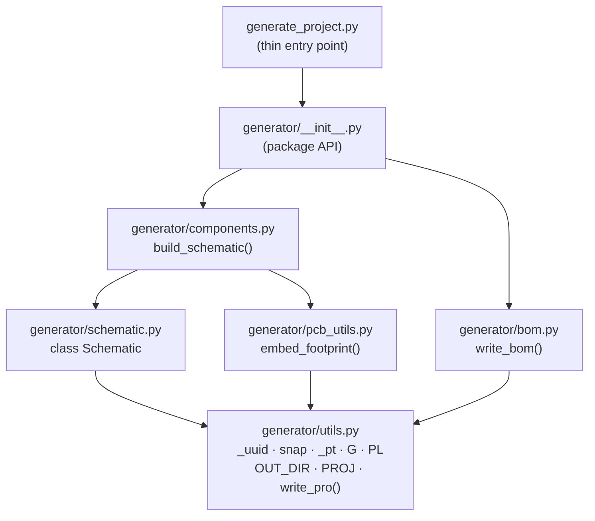

# Feature Architecture: Generator Refactor (#62)

> **Validation result: APPROVED**
> Branch: `feature/62-split-generator-kicad-gui-pcb`
> Constitution: v1.3.0 (amended by MINOR-001, 2026-06-07)
> Architect sign-off: 2026-06-07

---

## Decision Summary

The user has approved **Option A** (architecture-agent Stage 3):

| Dimension | Decision |
|---|---|
| Generator structure | Split `hardware/generate_project.py` into `hardware/generator/` Python package |
| Entry point | `hardware/generate_project.py` retained as a thin wrapper (≤ 30 lines) |
| `write_pcb()` | **Deleted entirely** — PCB layout becomes KiCad GUI territory |
| Generator scope | Schematic (`.kicad_sch`) and BOM (`bom.csv`) only |
| `.kicad_pcb` lifecycle | Committed source of truth — no script may touch it (P-KI-07) |

---

## 1. Package Structure

```
hardware/
├── generate_project.py          # thin entry point ≤ 30 lines
│                                # imports generator; calls write_pro(), build_schematic(), write_bom()
└── generator/
    ├── __init__.py              # package docstring; public API: build_schematic, write_bom
    ├── utils.py                 # _uuid(), snap(), _pt(), G, PL, KICAD_FP_BASE
    │                            # OUT_DIR, PROJ, SCH_UUID, write_pro()
    ├── schematic.py             # class Schematic — full S-expression builder
    ├── components.py            # build_schematic() — all component definitions + wiring
    ├── pcb_utils.py             # embed_footprint() only — write_pcb() does NOT exist here
    └── bom.py                   # write_bom() — BOM CSV output
```

### Origin map (source lines in pre-refactor `generate_project.py`)

| Module | Source lines | Notes |
|---|---|---|
| `generator/__init__.py` | 1–16 (docstring) | Package docstring; re-exports `build_schematic`, `write_bom` |
| `generator/utils.py` | 17–47, 52–71 | All shared constants, helpers, `write_pro()` |
| `generator/schematic.py` | 76–362 | `class Schematic` with all S-expression builder methods |
| `generator/components.py` | 363–900 | `build_schematic()` — component defs + full wiring |
| `generator/pcb_utils.py` | 901–950 | `embed_footprint()` only |
| ~~`write_pcb()`~~ | ~~951–1149~~ | **Deleted — not moved to any module** |
| `generator/bom.py` | 1155–1185 | `write_bom()` |
| `generate_project.py` | 1191–1212 (rewritten) | Thin entry-point wrapper; delegates to package |

---

## 2. Module Responsibilities

| Module | Exported symbol(s) | Responsibility |
|---|---|---|
| `generate_project.py` | — (entry point) | CLI entry point only; parses environment vars; calls `write_pro()`, `build_schematic()`, `write_bom()` |
| `generator/__init__.py` | `build_schematic`, `write_bom` | Package API surface; re-exports from sub-modules; package docstring |
| `generator/utils.py` | `_uuid`, `snap`, `_pt`, `G`, `PL`, `KICAD_FP_BASE`, `OUT_DIR`, `PROJ`, `SCH_UUID`, `write_pro` | All shared constants and stateless utility functions; writes `.kicad_pro` only |
| `generator/schematic.py` | `Schematic` | S-expression builder class; `render()` produces `.kicad_sch` text; owns no I/O |
| `generator/components.py` | `build_schematic` | Instantiates `Schematic`; defines every component symbol, pin, net, wire, label; returns `Schematic` for caller to `render()` |
| `generator/pcb_utils.py` | `embed_footprint` | Reads footprint files from `KICAD_FP_BASE`; embeds inline into schematic; **no PCB file writes** |
| `generator/bom.py` | `write_bom` | Reads BOM data; writes `hardware/bom/bom.csv`; no schematic involvement |

---

## 3. Import Graph

The dependency graph is strictly acyclic. Arrow direction = "imports".



**Cycle check:** All paths terminate at `utils.py`. No module imports its own ancestor. ✓

### Import declarations per module

| Module | `from` imports |
|---|---|
| `generate_project.py` | `from generator import build_schematic, write_bom` · `from generator.utils import OUT_DIR, PROJ, write_pro` |
| `generator/__init__.py` | `from .components import build_schematic` · `from .bom import write_bom` |
| `generator/schematic.py` | `from .utils import _uuid, snap, _pt, G, PL, OUT_DIR, PROJ, SCH_UUID` |
| `generator/pcb_utils.py` | `from .utils import _uuid, snap, KICAD_FP_BASE` |
| `generator/components.py` | `from .schematic import Schematic` · `from .pcb_utils import embed_footprint` |
| `generator/bom.py` | `from .utils import OUT_DIR` (+ stdlib `os`, `csv`) |
| `generator/utils.py` | stdlib only (`json`, `os`, `itertools`, `csv`, `re`) |

---

## 4. PCB Source-of-Truth Transition

| Dimension | Before (monolithic) | After (package) |
|---|---|---|
| `write_pcb()` | Present (lines 951–1149) | **Deleted** — function does not exist anywhere |
| `.kicad_pcb` lifecycle | Build artefact — overwritten on every `python3 generate_project.py` | Committed source of truth — never touched by any script |
| PCB routing work | Lost on every generator run | Survives indefinitely in Git |
| PCB change workflow | Edit Python → `python3 generate_project.py` | Open KiCad GUI → edit → save → commit |
| CI DRC input | PCB was regenerated by script, then checked | DRC runs directly on committed `.kicad_pcb` |
| Governing rule | (none — script was implicit owner) | **P-KI-07** (new, constitution v1.3.0) |

---

## 5. CI Changes (`hardware-check.yml`)

### `validate-generator` job — syntax check expansion

**Before:**
```yaml
- name: Syntax check generator
  run: python -m py_compile hardware/generate_project.py && echo "Syntax OK"
```

**After:**
```yaml
- name: Syntax check generator
  run: |
    python -m py_compile hardware/generate_project.py && echo "Entry point OK"
    for f in hardware/generator/*.py; do
      python -m py_compile "$f" && echo "  OK: $f"
    done
    echo "All generator modules syntax OK"
```

Covers all six package modules plus the entry point (AC-8 / FR-09).

### `kicad-erc-drc` job — step rename + PCB guard

**Before:**
```yaml
- name: Run PCB generator
  run: |
    cd hardware
    KICAD_FP_BASE=/usr/share/kicad/footprints python3 generate_project.py
```

**After:**
```yaml
- name: Regenerate schematic
  run: |
    cd hardware
    KICAD_FP_BASE=/usr/share/kicad/footprints python3 generate_project.py

- name: Verify PCB file not modified by generator
  run: git diff --exit-code hardware/kicad/PoE-FanController.kicad_pcb
```

The guard step (`git diff --exit-code`) exits non-zero if any byte of `.kicad_pcb` changed after the
generator ran — catching P-KI-07 regressions automatically (AC-5 / FR-08).

All other steps (`Run ERC`, `Check ERC results`, `Run DRC`, `Check DRC violation count`,
`Upload ERC report`, `Upload DRC report`) are **unchanged**.

---

## 6. What Is Now Forbidden (P-KI-07)

The following actions are **explicitly prohibited** by constitution rule P-KI-07 (v1.3.0):

| Forbidden action | Why |
|---|---|
| Any function named `write_pcb()` or equivalent inside `hardware/generator/` | Would regenerate `.kicad_pcb`, destroying hand-routed layout |
| Any script that opens and writes `hardware/kicad/PoE-FanController.kicad_pcb` | Same reason |
| Calling `python3 generate_project.py` and committing the resulting `.kicad_pcb` | PCB changes must come from KiCad GUI, not regeneration |
| A CI step that regenerates `.kicad_pcb` before DRC | DRC must run on the committed file, not a generated one |
| Any agent (including architect) modifying `.kicad_pcb` programmatically | P-DEV-05 + P-KI-07 combined prohibition |

**CI enforcement:** `git diff --exit-code hardware/kicad/PoE-FanController.kicad_pcb` in the
`kicad-erc-drc` job will fail the pipeline with exit code 1 if the file is modified.

---

## 7. Constitution Compliance Matrix

| Principle | Status | Notes |
|---|---|---|
| P-HW-05 (amended v1.3.0) | ✅ Compliant | Generator package is sole `.kicad_sch` source of truth |
| P-KI-04 (amended v1.3.0) | ✅ Compliant | Package replaces monolithic script; thin-wrapper pattern |
| P-KI-05 | ✅ Compliant | No external library paths introduced; all footprints remain in-project |
| P-KI-07 (new v1.3.0) | ✅ Enforced | `write_pcb()` deleted; CI guard added; KiCad GUI is sole PCB editor |
| P-DEV-04 | ✅ Compliant | Constitution amendment (MINOR-001) committed before code refactor lands |
| P-DEV-05 | ✅ Compliant | Architect touches only `docs/`; no source code modified |
| P-DEV-06 | ✅ Required | All `hardware/generator/` Python modules must follow PEP 8, 4-space indent |
| §7A preamble (amended v1.3.0) | ✅ Compliant | Schematic readability rules apply to `hardware/generator/` package |
| P-CI-01 | ✅ Compliant | ERC gate unchanged; still enforced on regenerated `.kicad_sch` |

---

## 8. Validation Result

**APPROVED**

The plan as approved (Option A) is fully consistent with constitution v1.3.0. The five amendment
items (§2.1, P-HW-05, P-KI-04, §7A preamble, new P-KI-07) have been applied and recorded as
MINOR-001. No hardware component, firmware module boundary, PoE standard, or web UI standard is
affected. No expert consultation is required for this tooling-only workflow change.

Implementation may proceed in the phase order defined in `docs/features/generator-refactor/plan.md`:

| Phase | Action | Prerequisite |
|---|---|---|
| Phase 0 | Constitution amendment (this commit) | ✅ Complete |
| Phase 1 | Create `hardware/generator/` package skeleton | Phase 0 merged |
| Phase 2 | Thin-wrap entry point; delete `write_pcb()` | Phase 1 validated locally |
| Phase 3 | Update `hardware-check.yml` CI | Phase 2 green in CI |
| Phase 4 | Acceptance sign-off per AC-1 through AC-10 | Phase 3 CI green |
