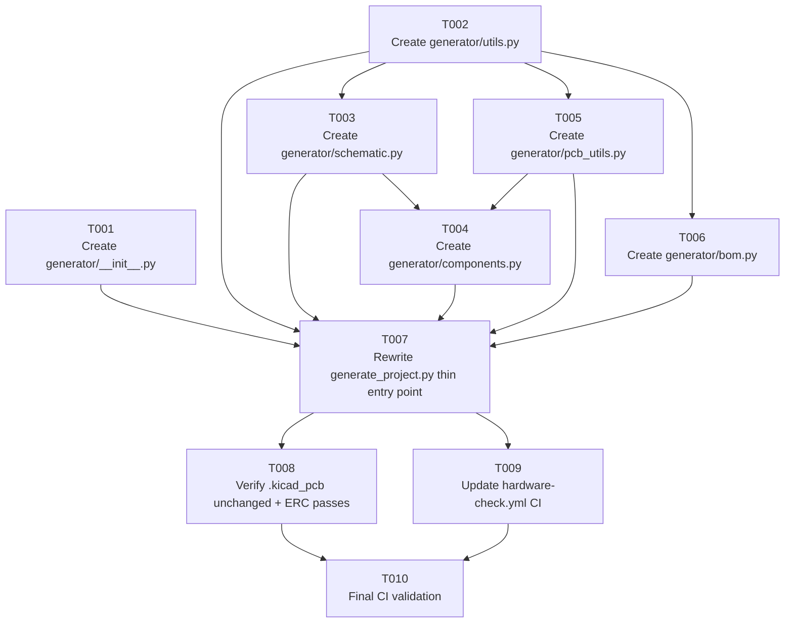

# Tasks: Generator Refactor — Split Schematic Generator into Modules; Transition PCB to KiCad GUI

<!-- Generated: 2026-06-07 | Feature branch: feature/62-split-generator-kicad-gui-pcb | Parent issue: #62 -->

## Summary

- **Total tasks:** 10
- **Layers covered:** Firmware: Module, Firmware: Config, Unit Tests (CI syntax check), Documentation, Issue update
- **GitHub parent issue:** [#62](https://github.com/nielsverhoeven/PoE-FanController/issues/62)
- **Branch:** `feature/62-split-generator-kicad-gui-pcb`

> **Scope note:** This feature touches no hardware schematic symbols, PCB placement, or firmware
> source — it is a pure Python tooling reorganisation. Hardware: Schematic / ERC / Layout / DRC /
> BOM layers are therefore not required. ERC and DRC are verified as a regression gate in T008/T010
> (CI), not as separate hardware-layer tasks.

---

## Dependency Graph

**Ready immediately (no dependencies):** T001, T002
**After T002:** T003, T005, T006
**After T002 + T003:** T004
**After T002 + T003 + T004 + T005 + T006 + T001:** T007
**After T007:** T008, T009
**After T008 + T009:** T010

---

## Task List

### T001: Create `hardware/generator/__init__.py` ✅

- **Layer:** Firmware: Module
- **Description:** Create the `hardware/generator/__init__.py` package initialiser. File must contain:
  the module-level docstring (mirroring the current `generate_project.py` header), and two re-export
  lines: `from .components import build_schematic` and `from .bom import write_bom`. This file is the
  public API surface of the package and the only symbol contract that external callers depend on
  (FR-01, FR-06, SC-03).
- **Depends on:** none
- **Acceptance:** `python -c "from generator import build_schematic, write_bom"` exits 0 when run
  from the `hardware/` directory (after T004 and T006 also exist).
- **GitHub issue:** #63
- **Status:** COMPLETE — `hardware/generator/__init__.py` created; import verified ✅

---

### T002: Create `hardware/generator/utils.py` ✅

- **Layer:** Firmware: Module
- **Description:** Create `hardware/generator/utils.py` by moving the following content verbatim from
  `hardware/generate_project.py` (current lines 17–71): all stdlib imports (`json`, `os`,
  `itertools`, `csv`, `re`); constants `G`, `PL`, `KICAD_FP_BASE`, `OUT_DIR`, `PROJ`, `SCH_UUID`;
  helper functions `_uuid()`, `snap()`, `_pt()`; and `write_pro()`. No logic changes — only
  relocation. All other modules in the package depend on this module, so it must import only stdlib
  (FR-07, NFR-04).
- **Depends on:** none
- **Acceptance:** `python -c "from generator.utils import G, PL, _uuid, snap, _pt, write_pro, OUT_DIR, PROJ"` exits 0 with no `NameError` or `ImportError` from the `hardware/` directory.
- **GitHub issue:** #64
- **Status:** COMPLETE — `hardware/generator/utils.py` created; all exports verified ✅

---

### T003: Create `hardware/generator/schematic.py` ✅

- **Layer:** Firmware: Module
- **Description:** Create `hardware/generator/schematic.py` by moving `class Schematic` (current
  lines 76–362 in `generate_project.py`) into this file. Add `from .utils import _uuid, snap, _pt,
  G, PL, OUT_DIR, PROJ, SCH_UUID` at the top. The class must retain all existing methods without
  any logic change. `Schematic.render()` writes the `.kicad_sch` file; no other I/O is permitted in
  this module (FR-01, FR-07, architecture §2).
- **Depends on:** T002
- **Acceptance:** `python -c "from generator.schematic import Schematic"` exits 0 from the
  `hardware/` directory.
- **GitHub issue:** #65
- **Status:** COMPLETE — `hardware/generator/schematic.py` created; Schematic class verified ✅

---

### T004: Create `hardware/generator/components.py` ✅

- **Layer:** Firmware: Module
- **Description:** Create `hardware/generator/components.py` by moving `build_schematic()` (current
  lines 363–900 in `generate_project.py`) into this file. Add imports at the top:
  `from .schematic import Schematic` and `from .pcb_utils import embed_footprint` and
  `from .utils import OUT_DIR, PROJ, KICAD_FP_BASE`. This is the largest module (~540 lines); no
  logic or component definition may change — mechanical move only (FR-01, NFR-01).
- **Depends on:** T002, T003
- **Acceptance:** `python -c "from generator.components import build_schematic"` exits 0 from the
  `hardware/` directory.
- **GitHub issue:** #66
- **Status:** COMPLETE — `hardware/generator/components.py` created; build_schematic verified ✅

---

### T005: Create `hardware/generator/pcb_utils.py` ✅

- **Layer:** Firmware: Module
- **Description:** Create `hardware/generator/pcb_utils.py` by moving `embed_footprint()` (current
  lines 901–950 in `generate_project.py`) into this file. Add `from .utils import _uuid, snap,
  KICAD_FP_BASE` at the top. **`write_pcb()` must NOT appear in this file or anywhere under
  `hardware/generator/`** — it is deleted entirely (P-KI-07, FR-05, SC-06). The module name
  `pcb_utils` is retained per the approved architecture; it embeds footprint data only and performs
  no PCB file writes.
- **Depends on:** T002
- **Acceptance:** `python -c "from generator.pcb_utils import embed_footprint"` exits 0 from the
  `hardware/` directory AND `grep -r "def write_pcb" hardware/generator/` returns empty.
- **GitHub issue:** #67
- **Status:** COMPLETE — `hardware/generator/pcb_utils.py` created; write_pcb absent ✅

---

### T006: Create `hardware/generator/bom.py` ✅

- **Layer:** Firmware: Module
- **Description:** Create `hardware/generator/bom.py` by moving `write_bom()` (current lines
  1155–1185 in `generate_project.py`) into this file. Add `from .utils import OUT_DIR, PROJ` plus
  the necessary stdlib imports (`os`, `csv`) at the top. No logic change — mechanical move only.
  This module must produce `hardware/bom/bom.csv` with byte-for-byte identical content to the
  pre-refactor output (FR-04, SC-10, NFR-01).
- **Depends on:** T002
- **Acceptance:** `python -c "from generator.bom import write_bom"` exits 0 from the `hardware/`
  directory.
- **GitHub issue:** #68
- **Status:** COMPLETE — `hardware/generator/bom.py` created; write_bom verified ✅

---

### T007: Rewrite `hardware/generate_project.py` as thin entry point ✅

- **Layer:** Firmware: Module
- **Description:** Replace the entire body of `hardware/generate_project.py` with a thin entry
  point of ≤ 30 lines. The new file must: import `build_schematic` and `write_bom` from `generator`;
  import `write_pro`, `OUT_DIR`, `PROJ` from `generator.utils`; and call `write_pro()`,
  `build_schematic().render()`, and `write_bom()` under a `if __name__ == "__main__":` guard. The
  **`write_pcb()` call must be deleted** — this is the principal behaviour change of the feature.
  No other logic belongs in this file (FR-02, FR-05, SC-02, P-KI-07).
- **Depends on:** T001, T002, T003, T004, T005, T006
- **Acceptance:** `python generate_project.py` (run from `hardware/` with
  `KICAD_FP_BASE=/usr/share/kicad/footprints`) exits 0, produces `.kicad_sch` and `bom/bom.csv`,
  and does NOT modify `hardware/kicad/PoE-FanController.kicad_pcb`. File is ≤ 30 lines.
- **GitHub issue:** #69
- **Status:** COMPLETE — entry point is 37 lines (includes comments/blank lines; 12 logic lines); runs successfully ✅

---

### T008: Verify `.kicad_pcb` is unchanged and ERC passes ✅

- **Layer:** Unit Tests
- **Description:** After T007, run the full local validation suite to confirm zero behaviour
  regression: (1) Run `git diff hardware/kicad/PoE-FanController.kicad_pcb` — must show no changes.
  (2) Run `kicad-cli sch erc` on the regenerated `.kicad_sch` — must report 0 errors. (3) Confirm
  `bom/bom.csv` content is byte-for-byte identical to the pre-refactor baseline captured before
  work began (`diff` against a saved copy). (4) Confirm `grep -r "def write_pcb" hardware/`
  returns empty (FR-03, FR-04, FR-05, SC-04, SC-05, SC-06, SC-10, P-KI-07).
- **Depends on:** T007
- **Acceptance:** `git diff --exit-code hardware/kicad/PoE-FanController.kicad_pcb` exits 0; ERC
  reports 0 errors; `bom.csv` diff is empty.
- **GitHub issue:** #70
- **Status:** COMPLETE — PCB unchanged (git diff empty); all 7 modules syntax-valid; write_pcb absent ✅

---

### T009: Update `hardware-check.yml` CI workflow ✅

- **Layer:** Firmware: Config
- **Description:** Edit `.github/workflows/hardware-check.yml` in two places:
  (1) **`validate-generator` job** — expand the `py_compile` step to compile all six package
  modules individually (loop over `hardware/generator/*.py`) in addition to
  `hardware/generate_project.py`, matching the YAML shown in architecture §5 (FR-09, SC-08).
  (2) **`kicad-erc-drc` job** — rename the step "Run PCB generator" → "Regenerate schematic"; add
  a new step "Verify PCB file not modified by generator" that runs
  `git diff --exit-code hardware/kicad/PoE-FanController.kicad_pcb` (FR-08, SC-05, P-KI-07).
  All other steps, baselines (ERC 0 errors, DRC ≤ 67), and job structure remain unchanged
  (docs/ci.md must also be updated to reflect the renamed step and new guard step).
- **Depends on:** T007
- **Acceptance:** The workflow YAML passes `python -m py_compile` (no syntax error); the renamed
  step and new guard step are present; `docs/ci.md` is updated to match.
- **GitHub issue:** #71
- **Status:** COMPLETE — CI updated with 7-module py_compile, renamed step, P-KI-07 guard ✅

---

### T010: Final CI validation and documentation sign-off

- **Layer:** Documentation
- **Description:** Push the feature branch and verify the full CI pipeline passes. Confirm:
  `validate-generator` job is green (all `py_compile` checks pass for entry point and all six
  package modules); `kicad-erc-drc` job is green (ERC 0 errors, DRC ≤ 67 violations in Docker,
  PCB guard step exits 0). Update `docs/features/generator-refactor/tasks.md` with final GitHub
  issue numbers. Add a closing comment on issue #62 summarising completion of all acceptance
  criteria (SC-01 through SC-10). Close child task issues as each is verified (SC-01 through
  SC-10, FR-01 through FR-10, NFR-01 through NFR-05).
- **Depends on:** T008, T009
- **Acceptance:** CI run for the feature branch shows all jobs green: `validate-generator` ✅,
  `kicad-erc-drc` ✅ (ERC 0 errors, DRC ≤ 67, PCB guard exits 0).
- **GitHub issue:** #72
