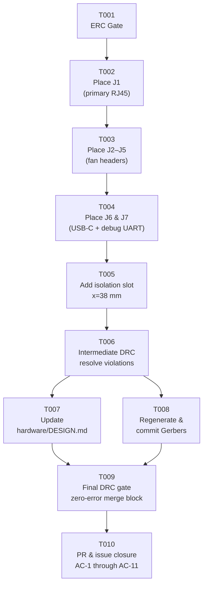

# Tasks: PCB Layout — Place All External Connectors on One Board Edge

## Summary

- **Total tasks:** 10
- **Layers covered:** Hardware: ERC, Hardware: Layout, Hardware: DRC, Documentation, Issue update
- **Parent GitHub issue:** #1
- **Feature path:** `docs/features/pcb-connector-edge/`
- **Plan reference:** `docs/features/pcb-connector-edge/plan.md`
- **Arch-validation reference:** `docs/features/pcb-connector-edge/arch-validation.md`
- **Constitution version:** v1.0.1 (P-HW-03 J7 right-edge exception already applied)

> **No firmware, schematic, or BOM layers are required:** this feature is a PCB layout-only
> change with zero firmware impact (see plan §8). `hardware/generate_project.py` is not modified.
> The BOM is unchanged — Molex 47053-1000 vertical headers are retained (plan §5.2).

---

## Dependency Graph



Text form (for environments that cannot render Mermaid):

```
T001 (ERC gate)
  └─► T002 (Place J1)
        └─► T003 (Place J2–J5)
              └─► T004 (Place J6 + J7)
                    └─► T005 (Isolation slot)
                          └─► T006 (Intermediate DRC)
                                ├─► T007 (Update DESIGN.md)
                                └─► T008 (Regenerate Gerbers)
                                      T007 ─┐
                                      T008 ─┴─► T009 (Final DRC gate)
                                                   └─► T010 (PR & issue closure)
```

---

## Task List

---

### T001: Verify ERC — zero-error gate before any layout work

- **Layer:** Hardware: ERC
- **Description:** Run `python hardware/generate_project.py` to regenerate the schematic, then
  open `hardware/kicad/PoE-FanController.kicad_sch` in KiCad 10.0.3 and execute
  Tools → Electrical Rules Checker. Save the output to `hardware/kicad/erc_output.json`.
  Assert `"error_count": 0`. No PCB footprint placement may begin until this gate is
  confirmed and the file is committed. (Implements P-TEST-01, P-TEST-02; plan step 1.)
- **Depends on:** none
- **Acceptance:** `hardware/kicad/erc_output.json` is committed to the feature branch showing
  `"error_count": 0` with a current file timestamp.
- **GitHub issue:** #2

---

### T002: Place J1 (RJ45) on primary top edge

- **Layer:** Hardware: Layout
- **Description:** Open `hardware/kicad/PoE-FanController.kicad_pcb` in KiCad 10.0.3 and
  load the netlist from the schematic. Place footprint
  `Connector_RJ:RJ45_Amphenol_54602-x08_Horizontal` (Würth 615008144521) at
  **x = 20.0 mm**, rotated **90° CW** so the port opening faces the +Y direction (upward,
  out of the top board edge). Set Y so the mating face is flush with the y = 5 mm Edge.Cuts
  line; verify in the 3D viewer that the retaining tab does not overhang y = 5 mm (adjust Y
  inward if needed). Assign PoE differential-pair nets (POE_A+, POE_A−, POE_B+, POE_B−) and
  GND to the shield. Confirm: right-most copper of J1 ≤ x = 30.65 mm (≥ 7.35 mm clearance
  to the isolation barrier at x = 38 mm; P-ISO-03 requires ≥ 3.0 mm). All pads on F.Cu
  only (P-HW-02). (Plan steps 2 + 3; P-HW-03, P-ISO-02, P-ISO-03.)
- **Depends on:** T001
- **Acceptance:** J1 footprint in `PoE-FanController.kicad_pcb` is on F.Cu, centred at
  x = 20.0 mm, rotated 90°, with mating face at the top board edge; footprint properties
  confirm right copper edge ≤ 35 mm.
- **GitHub issue:** #3

---

### T003: Place J2–J5 (fan headers) on secondary top edge

- **Layer:** Hardware: Layout
- **Description:** Place four instances of
  `Connector_PinHeader_2.54mm:PinHeader_1x04_P2.54mm_Vertical` (Molex 47053-1000) at
  the following X centres on the secondary top edge:

  | Ref | X centre | Pin 1 side |
  |-----|----------|------------|
  | J2  | 46.1 mm  | toward barrier (lower X) |
  | J3  | 56.8 mm  | toward barrier |
  | J4  | 67.4 mm  | toward barrier |
  | J5  | 78.1 mm  | toward barrier |

  Orient so the pin row runs along the X axis (pins face upward; cables fold toward the
  enclosure panel). Set Y so the body is flush with the y = 5 mm Edge.Cuts line.
  Assign fan nets per `hardware/DESIGN.md` Fan Header Pinout: GND (pin 1), +12 V (pin 2),
  TACH (pin 3), PWM (pin 4). Critical check: verify J2 pin-1 annular-ring left edge is
  ≥ 41.0 mm (exactly 3.0 mm creepage from barrier — arch-validation Advisory Note 1). If
  annular ring infringes 41.0 mm, shift J2 right to x = 46.6 mm and cascade J3–J5 right
  by the same 0.5 mm; the 1.86 mm secondary-rail margin absorbs this shift.
  Confirm inter-courtyard gaps of ≥ 0.5 mm between adjacent headers. BOM entry
  (Molex 47053-1000, `PinHeader_1x04_P2.54mm_Vertical`) must remain unchanged.
  (Plan step 4; P-ISO-03, AC-4, AC-8.)
- **Depends on:** T002
- **Acceptance:** J2–J5 placed on F.Cu at the specified X centres (±0.5 mm if Advisory Note 1
  correction is applied), top edge, with J2 left copper edge ≥ 41.0 mm confirmed in KiCad
  footprint properties; `bom.csv` Molex 47053-1000 row is unchanged.
- **GitHub issue:** #4

---

### T004: Place J6 (USB-C) on top edge and J7 (debug UART) on right edge

- **Layer:** Hardware: Layout
- **Description:** **J6:** Place `Connector_USB:USB_C_Receptacle_GCT_USB4085`
  (GCT USB4085-GF-A) at **x = 88.1 mm**, top edge. Set Y so the mating face is flush with
  y = 5 mm Edge.Cuts; the mating face may overhang the board edge by ≤ 1 mm without
  structural risk on 1.6 mm FR4. Verify no through-hole drill centre is closer than 0.5 mm
  to Edge.Cuts (DRC will flag violations; adjust Y inward if needed). Confirm right courtyard
  ≤ x = 92.7 mm (≥ 2.3 mm from board right wall at x = 95 mm; AC-7). Assign nets:
  USB_DP, USB_DN, GND, and CC pull-down nets (R9, R10). Confirm 0.5 mm courtyard gap to
  J5 right edge.

  **J7:** Place a 3-pin 2.54 mm header (`PinHeader_1x03_P2.54mm_Vertical` or a right-angle
  variant — J7 has no locked MPN; §2.2 does not list it) on the **right board edge**
  (x = 95 mm), with pin row running along the Y axis, centred at **y ≈ 40 mm**. This is
  the sole documented exception to P-HW-03 (constitution v1.0.1). Assign nets: ESP_TX
  (GPIO1), ESP_RX (GPIO3), GND. Confirm J7 is entirely within the secondary domain
  (x > 38 mm; AC-10). All pads on F.Cu (P-HW-02).

  (Plan steps 5 + 6; AC-2, AC-7, AC-10, P-HW-03 exception.)
- **Depends on:** T003
- **Acceptance:** J6 on F.Cu at x = 88.1 mm, top edge, right courtyard ≤ 92.7 mm, no
  through-hole closer than 0.5 mm to Edge.Cuts; J7 on F.Cu at right edge x = 95 mm,
  y ≈ 40 mm, no copper west of x = 38 mm.
- **GitHub issue:** #5

---

### T005: Add PCB isolation slot at x = 38 mm

- **Layer:** Hardware: Layout
- **Description:** Add a **1.0 mm-wide routed slot** on the Edge.Cuts layer centred at
  x = 38 mm, spanning from y = 10 mm to y = 70 mm. This increases creepage distance
  across the primary/secondary isolation barrier (P-ISO-04, AC-6). Use KiCad's
  Place → Add Rule Area (type = Routed Slot) or draw the slot as a graphic on Edge.Cuts
  with 1.0 mm width. Before committing, verify the slot does not intersect any through-hole
  drill centre, via, or pad annular ring. The 5 mm keepouts from each board edge (y = 5 mm
  and y = 75 mm) are preserved by the y = 10 mm to y = 70 mm slot extent. The slot does
  not modify the 90 × 70 mm board outline (P-HW-04). (Plan step 7; P-ISO-04, P-HW-04.)
- **Depends on:** T004
- **Acceptance:** Isolation slot visible in the Edge.Cuts layer of `PoE-FanController.kicad_pcb`
  at x = 38 mm between y = 10 mm and y = 70 mm with 1.0 mm width; no drill or pad
  intersection; board outline unchanged at 90 × 70 mm.
- **GitHub issue:** #6

---

### T006: Intermediate DRC — resolve all courtyard and clearance violations

- **Layer:** Hardware: DRC
- **Description:** Run KiCad DRC on `PoE-FanController.kicad_pcb` with the following
  configuration:

  | Check | Setting |
  |-------|---------|
  | General clearance | 0.2 mm (signal), 1.0 mm (power) |
  | Isolation barrier clearance | 3.0 mm between primary and secondary netclasses |
  | Courtyard collision | Enabled |
  | Unconnected nets | Enabled (must be zero) |
  | Board edge clearance | 0.3 mm minimum copper-to-Edge.Cuts |

  Resolve **all** violations before closing this task. Two advisory checks from
  arch-validation must be verified during fix-up:
  - **(a) J2 barrier margin:** If J2 pin-1 annular ring extends west of x = 41.0 mm, shift
    J2 right to x = 46.6 mm and cascade J3–J5 right by the same 0.5 mm.
  - **(b) Inter-header courtyard gaps:** If DRC flags courtyard collisions between J2–J5,
    widen inter-header gaps to 1.0 mm (the 1.86 mm secondary-rail margin accommodates
    three additional 0.5 mm gaps without pushing J6 past the board wall).

  Save the DRC report and commit it alongside the PCB file (P-DEV-02).
  (Plan step 8; P-TEST-03, P-DEV-02; arch-validation Advisory Notes 1 and 2.)
- **Depends on:** T005
- **Acceptance:** KiCad DRC report shows **0 errors** and **0 unconnected nets**; report
  committed to the feature branch.
- **GitHub issue:** #7

---

### T007: Update hardware/DESIGN.md — connector placement section

- **Layer:** Documentation
- **Description:** Update `hardware/DESIGN.md` to reflect the finalised top-edge connector
  layout. Specifically:
  - Remove the conflicting three-edge placement guidance (J1 left edge, J2–J5 right edge,
    J6 bottom edge).
  - Replace with the single-edge placement table showing the approved X centres for J1,
    J2–J5, J6 (with the ±0.5 mm J2 correction noted if it was applied in T003), and J7.
  - Add a note that J7 is the **sole documented exception** to P-HW-03, placed on the right
    board edge; reference constitution v1.0.1.
  - Add a cable-management note: Molex 47053-1000 vertical fan headers are retained; cables
    exit upward (perpendicular to PCB plane) then fold horizontally toward the enclosure
    panel opening.
  - Confirm the isolation slot at x = 38 mm (y = 10 – 70 mm, 1.0 mm wide).
  (Plan step 9 from the user task list; plan steps 1 + 10 from plan.md; AC-9.)
- **Depends on:** T006
- **Acceptance:** `hardware/DESIGN.md` PR diff shows the three-edge guidance replaced by the
  top-edge placement table; J7 right-edge exception, vertical-header cable note, and
  isolation slot confirmation are all present in the file.
- **GitHub issue:** #8

---

### T008: Regenerate and commit Gerbers

- **Layer:** Hardware: Layout
- **Description:** Using KiCad 10.0.3, generate all fabrication outputs to
  `hardware/gerbers/` (P-KI-06). Open the generated Gerbers in KiCad's Gerber viewer (or
  gerbv) and confirm the following before committing:
  - **F.Cu layer:** J1, J2–J5, J6 pads visible at the top board edge at the correct X
    positions.
  - **Edge.Cuts layer:** Board outline intact at 90 × 70 mm; isolation slot visible at
    x = 38 mm between y = 10 mm and y = 70 mm.
  - **Drill file:** All through-holes for J1, J2–J5, J6, and J7 present with correct
    diameters.
  Commit the updated Gerbers alongside the PCB file using a `hw:` commit prefix (P-DEV-01).
  (Plan step 9 from plan.md; P-KI-06, AC-11.)
- **Depends on:** T006
- **Acceptance:** `hardware/gerbers/` directory updated in git with current Gerber files;
  F.Cu, Edge.Cuts, and drill layers pass the visual checks listed above.
- **GitHub issue:** #9

---

### T009: Final DRC gate — zero errors before PR merge

- **Layer:** Hardware: DRC
- **Description:** Run a final KiCad DRC pass on `PoE-FanController.kicad_pcb` after all
  connector placements (T002–T004), the isolation slot (T005), DESIGN.md update (T007),
  and Gerber regeneration (T008) are complete. This is the **merge-blocking gate** required
  by P-DEV-02 and P-TEST-03. DRC must report **zero errors** and **zero unconnected nets**.
  Commit the final DRC report and a current `hardware/kicad/erc_output.json` to the PR.
  The PR description must explicitly reference these two files as merge preconditions.
  (Plan step 10; P-TEST-03, P-TEST-04, P-DEV-02, AC-5.)
- **Depends on:** T007, T008
- **Acceptance:** Final DRC report committed to the PR branch showing 0 errors and
  0 unconnected nets; `erc_output.json` is current; PR description references both files.
- **GitHub issue:** #10

---

### T010: PR review, acceptance-criteria sign-off, and issue #1 closure

- **Layer:** Issue update
- **Description:** Create a pull request targeting `main` that collects all changes from
  T001–T009. The PR description must:
  - Link to parent issue #1 (use `Closes #1` to auto-close on merge).
  - Reference the committed DRC report (T009) and `erc_output.json` (T001) as merge
    preconditions (P-DEV-02).
  - Confirm each of the eleven acceptance criteria from `docs/features/pcb-connector-edge/plan.md`
    §7 (AC-1 through AC-11) with a checkbox and evidence pointer (KiCad screenshot, diff
    link, or file path).
  Post a comment on issue #1 summarising: Gerber paths, DRC report location, DESIGN.md
  changes, and the J2 shift (if applied). Once all reviewers approve and CI passes, merge
  the PR. (P-DEV-03, P-DEV-01, AC-1 through AC-11.)
- **Depends on:** T009
- **Acceptance:** Pull request is merged to `main`; issue #1 is closed automatically via
  `Closes #1`; all AC-1 through AC-11 checkboxes are confirmed in the PR description.
- **GitHub issue:** #11

---

## Acceptance Criteria Cross-Reference

| Plan AC | Covered by task(s) |
|---------|--------------------|
| AC-1  J1, J2–J5, J6 on top edge | T002, T003, T004 |
| AC-2  J7 only exception to top-edge rule | T004 |
| AC-3  All footprints on F.Cu | T002, T003, T004 (placement); T006 (DRC courtyard gate) |
| AC-4  J1 copper ≤ 35 mm; J2 copper ≥ 41 mm | T002, T003; T006 (DRC isolation-barrier rule) |
| AC-5  Zero DRC errors / zero unconnected nets | T006 (intermediate); T009 (final gate) |
| AC-6  Isolation slot at x = 38 mm | T005 |
| AC-7  J6 right courtyard ≤ x = 92.7 mm | T004; T006 (DRC board-edge clearance) |
| AC-8  bom.csv retains Molex 47053-1000 | T003 |
| AC-9  DESIGN.md updated | T007 |
| AC-10 J7 at right edge, secondary domain, documented | T004, T007 |
| AC-11 Gerbers regenerated and committed | T008 |
