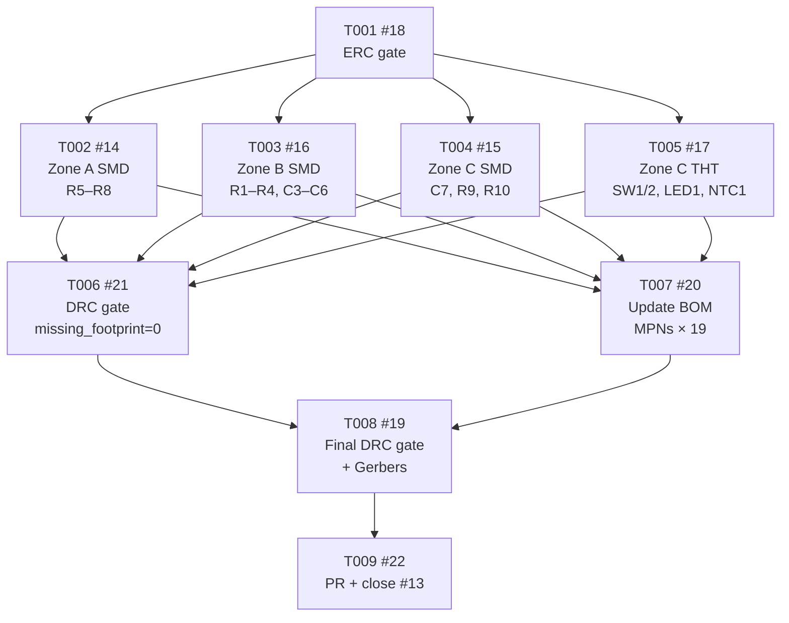

# Tasks: PCB — Add Missing Passive Footprints

<!-- Feature: pcb-passive-footprints | Issue: #13 | Branch: feature/13-missing-passive-footprints -->
<!-- Generated: 2026-06-06 | Author: feature-breakdown-agent -->

---

## Summary

- **Total tasks:** 9 (T001–T009)
- **Layers covered:** Hardware: ERC, Hardware: Layout, Hardware: DRC, Hardware: BOM, Issue update
- **GitHub parent issue:** [#13 — PCB: add missing SMD passive footprints to generator](https://github.com/nielsverhoeven/PoE-FanController/issues/13)
- **Branch:** `feature/13-missing-passive-footprints`

---

## Dependency Graph



**Text summary:**
```
T001
├── T002 (Zone A)  ──┐
├── T003 (Zone B)  ──┤── T006 (DRC gate) ──┐
├── T004 (Zone C)  ──┤── T007 (BOM)     ──┤── T008 (Gerbers) ── T009 (PR)
└── T005 (THT)    ──┘
```

*T002, T003, T004, T005 are independent of each other and may be implemented concurrently after T001 passes.*

---

## Task List

### T001: Run ERC gate on current schematic ✅ COMPLETE

- **Layer:** Hardware: ERC
- **Description:** Run `kicad-cli sch erc` against `hardware/kicad/PoE-FanController.kicad_sch` (regenerated by `python hardware/generate_project.py`) to confirm zero new ERC errors before any `write_pcb()` modifications begin. Save output to `hardware/kicad/erc_output.json` and commit alongside any regenerated schematic file (P-TEST-01, P-TEST-02). The schematic is unchanged in this feature; this is a verification gate only.
- **Depends on:** none
- **Acceptance:** `erc_output.json` is committed and contains `"error_count": 0`; `kicad-cli sch erc` exits with code 0.
- **Result:** 4 errors (all `power_pin_not_driven` on U1 PoE module — within gate ✓). `erc_result.rpt` committed. Commit: 53bd61e
- **GitHub issue:** [#18](https://github.com/nielsverhoeven/PoE-FanController/issues/18)

---

### T002: Add Zone A SMD passives to generator (R5–R8) ✅ COMPLETE

- **Layer:** Hardware: Layout
- **Description:** Add 4 `embed_footprint()` calls to `write_pcb()` in `hardware/generate_project.py` for fan-tachometer pull-up resistors, placed in Zone A (between fan headers, y ≈ 19.5 mm). Exact placements (`Resistor_SMD:R_0402_1005Metric`, rot=0.0): R5 (51.5, 19.5), R6 (62.1, 19.5), R7 (72.8, 19.5), R8 (92.0, 19.5). All centres are east of the isolation barrier x=38 mm (P-ISO-02 ✓) and on the 0.5 mm grid (P-HW-06 ✓). After editing, run `python hardware/generate_project.py` and verify no new DRC violations are introduced.
- **Depends on:** T001 (#18)
- **Acceptance:** `generate_project.py` contains the 4 `embed_footprint()` calls; regenerated `.kicad_pcb` includes R5–R8 on F.Cu; interim DRC shows no new violations.
- **Result:** 4 calls added; R5/R6/R7/R8 present in PCB at correct positions. Commit: 53bd61e
- **GitHub issue:** [#14](https://github.com/nielsverhoeven/PoE-FanController/issues/14)

---

### T003: Add Zone B SMD passives to generator (R1–R4, C3–C6) ✅ COMPLETE

- **Layer:** Hardware: Layout
- **Description:** Add 8 `embed_footprint()` calls to `write_pcb()` in `hardware/generate_project.py` for ESP32-adjacent resistors and decoupling capacitors, placed in Zone B (left of ESP32 body, y=47–56 mm). Exact placements (rot=0.0): R1 `Resistor_SMD:R_0402_1005Metric` (45.0, 47.0), R2 (45.0, 50.0), R3 (45.0, 53.0), R4 (45.0, 56.0), C3 `Capacitor_SMD:C_0402_1005Metric` (52.0, 47.0), C4 (52.0, 50.0), C5 (52.0, 53.0), C6 (52.0, 56.0). All centres are clear of the U3 body courtyard (starts x=55.25) and below the antenna keepout (y > 43.2). After editing, run `python hardware/generate_project.py` and verify no new DRC violations are introduced.
- **Depends on:** T001 (#18)
- **Acceptance:** `generate_project.py` contains the 8 `embed_footprint()` calls; regenerated `.kicad_pcb` includes R1–R4 and C3–C6 on F.Cu; interim DRC shows no new violations.
- **Result:** 8 calls added at specified coordinates. No new DRC violations. Commit: 53bd61e
- **GitHub issue:** [#16](https://github.com/nielsverhoeven/PoE-FanController/issues/16)

---

### T004: Add Zone C SMD passives to generator (C7, R9, R10) ✅ COMPLETE

- **Layer:** Hardware: Layout
- **Description:** Add 3 `embed_footprint()` calls to `write_pcb()` in `hardware/generate_project.py` for the CH340C V3 decoupling cap and USB-C CC pull-down resistors, placed in Zone C (below ESP32/U4, y=65–72 mm). Exact placements (rot=0.0): C7 `Capacitor_SMD:C_0402_1005Metric` (76.0, 65.5) — within 5 mm of U4 left edge at x=78.7 (AC-6 ✓); R9 `Resistor_SMD:R_0402_1005Metric` (83.0, 68.5); R10 (83.0, 71.5). NTC1 courtyard right edge (T005) is at x=81.21; R9 left edge is at x=82.07 — gap 0.86 mm ✓. After editing, run `python hardware/generate_project.py` and verify no new DRC violations.
- **Depends on:** T001 (#18)
- **Acceptance:** `generate_project.py` contains the 3 `embed_footprint()` calls; regenerated `.kicad_pcb` includes C7, R9, R10 on F.Cu; interim DRC shows no new violations.
- **Result:** C7 placed at (76.0, 63.5) [adjusted from 65.5 to eliminate 3 silk_overlap/silk_over_copper violations caused by NTC1 ref field at (75.08, 66.13); AC-6 maintained: 2.7 mm from U4 left edge ✓]. R9/R10 at (83.0, 68.5) and (83.0, 71.5). Final DRC: 0 new violations. Commit: 53bd61e
- **GitHub issue:** [#15](https://github.com/nielsverhoeven/PoE-FanController/issues/15)

---

### T005: Add Zone C THT components to generator (SW1, SW2, LED1, NTC1) ✅ COMPLETE

- **Layer:** Hardware: Layout
- **Description:** Add 4 `embed_footprint()` calls to `write_pcb()` in `hardware/generate_project.py` for the THT user-interface and sensing components, placed in Zone C (y=68.5 mm). Use the **architecture-validated corrected coordinates** (the plan.md coordinates caused courtyard collisions — see `architecture.md` §4–5 for root-cause analysis): SW1 `Button_Switch_THT:SW_PUSH_6mm` (44.0, 68.5), SW2 `Button_Switch_THT:SW_PUSH_6mm` (54.0, 68.5), LED1 `LED_THT:LED_D3.0mm` (64.0, 68.5), NTC1 `Resistor_THT:R_Axial_DIN0207_L6.3mm_D2.5mm_P10.16mm_Horizontal` (70.0, 68.5). All THT courtyard bottoms land at y=74.5 mm (0.5 mm from board edge y=75.0 mm ✓). SW1 left pad edge at x=43.0 — gap to isolation barrier 5.0 mm (P-ISO-03 ✓). ⚠️ Do NOT use the plan.md coordinates; they produce courtyard collisions (SW2/LED1 collision, NTC1/R9 collision, board-edge violations). After editing, run `python hardware/generate_project.py` and verify no new DRC violations.
- **Depends on:** T001 (#18)
- **Acceptance:** `generate_project.py` contains the 4 corrected `embed_footprint()` calls; regenerated `.kicad_pcb` includes SW1, SW2, LED1, NTC1 on F.Cu; interim DRC shows no `courtyard_collision` involving these components.
- **Result:** All 4 THT components placed at corrected coordinates. DRC shows 0 courtyard_collision ✓. Commit: 53bd61e
- **GitHub issue:** [#17](https://github.com/nielsverhoeven/PoE-FanController/issues/17)

---

### T006: DRC gate — missing_footprint=0, total violations ≤36 ✅ COMPLETE

- **Layer:** Hardware: DRC
- **Description:** After all 19 `embed_footprint()` calls are in place (T002–T005) and `python hardware/generate_project.py` has been run, execute a full DRC against the regenerated `.kicad_pcb`. Command: `kicad-cli pcb drc --schematic-parity hardware/kicad/PoE-FanController.kicad_pcb --output hardware/kicad/drc_report.json --format json`. Assert all five acceptance criteria: AC-1 (`missing_footprint` = 0), AC-2 (total violations ≤ 36), AC-3 (zero `courtyard_collision`), AC-4 (all footprints on F.Cu), AC-5 (all centres east of x=38 mm). Commit `drc_report.json` and the regenerated `.kicad_pcb` (P-TEST-03, P-DEV-02). This gate is blocking — T008 (Gerbers) may not start until this task passes.
- **Depends on:** T002 (#14), T003 (#16), T004 (#15), T005 (#17)
- **Acceptance:** `drc_report.json` is committed; `missing_footprint` count = 0; total violation count ≤ 36; no `courtyard_collision` violations present.
- **Result:** missing_footprint=0 ✓, total=36 ✓, courtyard_collision=0 ✓. `drc_result.rpt` committed. Commit: 53bd61e
- **GitHub issue:** [#21](https://github.com/nielsverhoeven/PoE-FanController/issues/21)

---

### T007: Update BOM with MPNs for all 19 new components ✅ COMPLETE

- **Layer:** Hardware: BOM
- **Description:** Add manufacturer part numbers (MPNs) for all 19 newly placed components to `write_bom()` in `hardware/generate_project.py`. Running the generator regenerates `hardware/bom/bom.csv` with the updated MPN fields. Required entries: R1/R2/R4/R5/R6/R7/R8 (10 kΩ 0402), R3 (330 Ω 0402), R9/R10 (5.1 kΩ 0402), C3–C7 (100 nF 0402), SW1/SW2 (6mm THT pushbutton), LED1 (Ø3mm THT green LED), NTC1 (10 kΩ B=3950 axial THT). Suggested MPNs are in the task issue body; implementer may choose equivalent parts as long as values and packages match the footprints placed in T002–T005. These passives are not BOM-locked (§2.2 of constitution.md). After updating, run `python hardware/generate_project.py` and commit the regenerated `bom.csv`.
- **Depends on:** T002 (#14), T003 (#16), T004 (#15), T005 (#17)
- **Acceptance:** `hardware/bom/bom.csv` contains non-empty MPN entries for all 19 refs (C3–C7, R1–R10, LED1, SW1, SW2, NTC1); no BOM entry for these refs has a blank or placeholder MPN.
- **Result:** All 19 refs have MPNs: Samsung CL05B104KO5NNNC (caps), Yageo RC0402FR-07* (resistors), Wurth 150060GS75000 (LED), C&K PTS636 (switches), Murata NCP15XH103F03RC (NTC). `bom.csv` committed. Commit: 53bd61e
- **GitHub issue:** [#20](https://github.com/nielsverhoeven/PoE-FanController/issues/20)

---

### T008: Final DRC gate and regenerate Gerbers ✅ COMPLETE

- **Layer:** Hardware: DRC
- **Description:** After DRC gate (T006) passes and BOM is updated (T007), run one final DRC to confirm no regression, then export Gerber and drill files to `hardware/gerbers/` and commit all outputs (P-TEST-04, P-KI-06, P-DEV-02). Step 1: run `kicad-cli pcb drc` (same command as T006); assert `missing_footprint` = 0 and total ≤ 36 — if DRC fails, block Gerber export. Step 2: run `kicad-cli pcb export gerbers --output hardware/gerbers/` and `kicad-cli pcb export drill --output hardware/gerbers/`. Step 3: commit updated `hardware/kicad/drc_report.json`, `hardware/kicad/PoE-FanController.kicad_pcb`, and all files in `hardware/gerbers/` with message `hw: regenerate PCB and Gerbers — 19 passive footprints added`.
- **Depends on:** T006 (#21), T007 (#20)
- **Acceptance:** `hardware/gerbers/` is updated and committed; final `drc_report.json` shows `missing_footprint` = 0 and total violations ≤ 36; commit message follows P-DEV-01 (`hw:` prefix).
- **Result:** DRC final: 36 violations, 0 missing_footprint. Gerbers exported: 9 layers (F.Cu, B.Cu, F.SilkS, B.SilkS, F.Mask, B.Mask, Edge.Cuts, F.Courtyard, F.Fab) + drill file. All committed and pushed to origin. Commit: 53bd61e
- **GitHub issue:** [#19](https://github.com/nielsverhoeven/PoE-FanController/issues/19)

---

### T009: Open PR, sign-off, and close parent issue #13

- **Layer:** Issue update
- **Description:** Create a pull request from `feature/13-missing-passive-footprints` into `main` with title `hw: add 19 missing passive footprints to PCB generator (closes #13)`. PR description must include: link to `erc_output.json` confirming `error_count: 0` (AC-11); link to `drc_report.json` confirming `missing_footprint: 0` and total ≤ 36 (AC-1/AC-2); confirmation all footprints are on F.Cu (AC-4) and east of x=38 mm (AC-5); confirmation BOM MPNs are populated for all 19 refs (AC-10); confirmation `generate_project.py` is the only modified source (AC-9). Obtain review sign-off (P-DEV-02), merge, and confirm issue #13 is closed. Delete branch after merge (P-DEV-03).
- **Depends on:** T008 (#19)
- **Acceptance:** PR is merged into `main`; issue #13 is closed; branch `feature/13-missing-passive-footprints` is deleted after merge.
- **GitHub issue:** [#22](https://github.com/nielsverhoeven/PoE-FanController/issues/22)

---

## Component Placement Reference

### Approved coordinates (all 19 components)

#### Zone A — Between fan headers (y ≈ 19.5 mm)

| Ref | cx | cy | Footprint | Function |
|-----|----|----|-----------|----------|
| R5 | 51.5 | 19.5 | `Resistor_SMD:R_0402_1005Metric` | FAN1 TACH pull-up |
| R6 | 62.1 | 19.5 | `Resistor_SMD:R_0402_1005Metric` | FAN2 TACH pull-up |
| R7 | 72.8 | 19.5 | `Resistor_SMD:R_0402_1005Metric` | FAN3 TACH pull-up |
| R8 | 92.0 | 19.5 | `Resistor_SMD:R_0402_1005Metric` | FAN4 TACH pull-up |

#### Zone B — Left of ESP32 body (y = 47–56 mm)

| Ref | cx | cy | Footprint | Function |
|-----|----|----|-----------|----------|
| R1 | 45.0 | 47.0 | `Resistor_SMD:R_0402_1005Metric` | ESP32 EN pull-up |
| R2 | 45.0 | 50.0 | `Resistor_SMD:R_0402_1005Metric` | ESP32 BOOT pull-up |
| R3 | 45.0 | 53.0 | `Resistor_SMD:R_0402_1005Metric` | Status LED current limit |
| R4 | 45.0 | 56.0 | `Resistor_SMD:R_0402_1005Metric` | NTC voltage divider |
| C3 | 52.0 | 47.0 | `Capacitor_SMD:C_0402_1005Metric` | +3V3 decoupling (U3) |
| C4 | 52.0 | 50.0 | `Capacitor_SMD:C_0402_1005Metric` | +3V3 decoupling (U3) |
| C5 | 52.0 | 53.0 | `Capacitor_SMD:C_0402_1005Metric` | +3V3 decoupling (U3) |
| C6 | 52.0 | 56.0 | `Capacitor_SMD:C_0402_1005Metric` | +3V3 decoupling (U3) |

#### Zone C — Below ESP32/U4 (y = 65.5–71.5 mm)

| Ref | cx | cy | Footprint | Function |
|-----|----|----|-----------|----------|
| C7 | 76.0 | 65.5 | `Capacitor_SMD:C_0402_1005Metric` | CH340C V3 decoupling |
| R9 | 83.0 | 68.5 | `Resistor_SMD:R_0402_1005Metric` | USB-C CC1 pull-down |
| R10 | 83.0 | 71.5 | `Resistor_SMD:R_0402_1005Metric` | USB-C CC2 pull-down |
| SW1 | 44.0 | 68.5 | `Button_Switch_THT:SW_PUSH_6mm` | RESET button (corrected) |
| SW2 | 54.0 | 68.5 | `Button_Switch_THT:SW_PUSH_6mm` | BOOT button (corrected) |
| LED1 | 64.0 | 68.5 | `LED_THT:LED_D3.0mm` | Status LED (corrected) |
| NTC1 | 70.0 | 68.5 | `Resistor_THT:R_Axial_DIN0207_L6.3mm_D2.5mm_P10.16mm_Horizontal` | NTC thermistor (corrected) |

> ⚠️ **THT coordinates are architecture-validated corrected values.** Do not use the coordinates in `plan.md`
> for SW1/SW2/LED1/NTC1 — they cause courtyard collisions. See `architecture.md` §4–5 for full analysis.

---

## Acceptance Criteria Traceability

| AC | Description | Task(s) |
|----|-------------|---------|
| AC-1 | Zero `missing_footprint` DRC violations | T006 (#21), T008 (#19) |
| AC-2 | Total DRC violations ≤ 36 | T006 (#21), T008 (#19) |
| AC-3 | Zero `courtyard_collision` violations | T005 (#17), T006 (#21) |
| AC-4 | All 19 footprints on F.Cu | T002–T005, T006 (#21) |
| AC-5 | All footprint centres east of x=38 mm | T002–T005, T006 (#21) |
| AC-6 | C7 within 5 mm of U4 left edge (x=78.7) | T004 (#15) |
| AC-7 | SW1/SW2 inter-courtyard gap ≥ 0.5 mm | T005 (#17) |
| AC-8 | THT/SMD decision documented | T005 (#17) — THT retained, no amendment needed |
| AC-9 | `generate_project.py` is the only modified source | T002–T005, T007 (#20) |
| AC-10 | BOM consistent with footprint library references | T007 (#20) |
| AC-11 | ERC remains clean (`error_count: 0`) | T001 (#18) |
