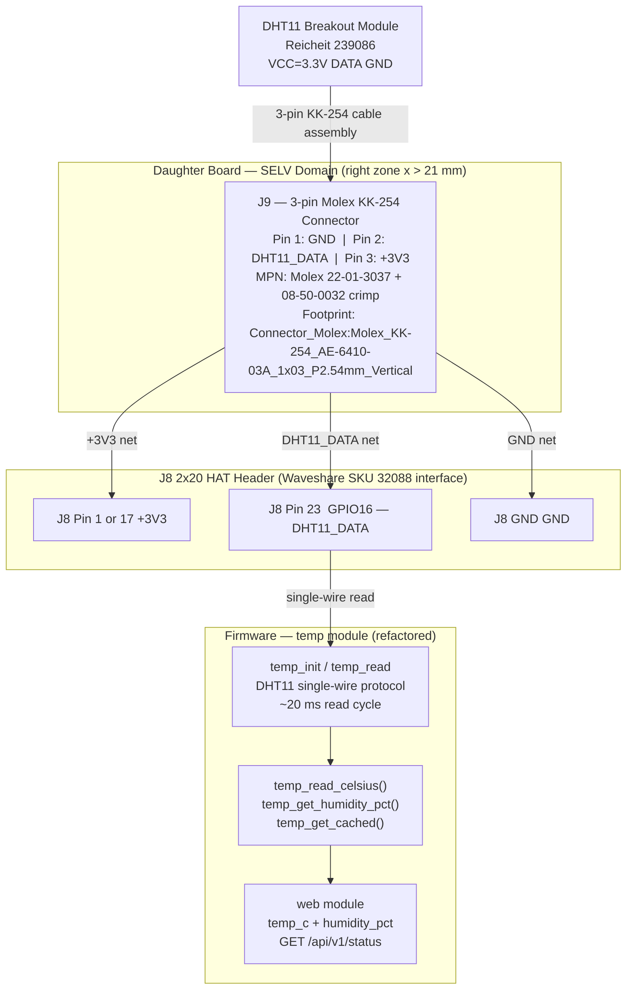

# Feature Architecture: Replace NTC1 Thermistor with DHT11 Sensor

<!-- Feature: replace-ntc1-dht11 | Issue: #135 | Branch: feature/135-replace-ntc1-dht11-sensor -->
<!-- Stage: 3 — Architecture Validation -->
<!-- Constitution reference: v4.1.0 | Validated: 2026-06-09 -->

---

## Validation Result

**APPROVED WITH CHANGES**

The change is architecturally sound. The constitution has been amended (v4.0.0 → v4.1.0) as part
of this Stage 3 validation. One conditional hardware item (DHT11 breakout pull-up) must be
confirmed before PCB routing. One firmware renaming concern (config NVS key / enum) must be
addressed in the implementation plan. See Pre-Stage 4 Checklist.

---

## Stage 3 Actions Taken

### Constitution Amendment Applied — v4.0.0 → v4.1.0 (MINOR)

The following sections of `docs/constitution.md` have been updated as part of this validation:

| Section | Change |
|---|---|
| Version header | `4.0.0` → `4.1.0`, last amended 2026-06-09 |
| §2.2 BOM | NTC1 + R4 removed; DHT11 breakout (Reichelt 239086) + J9 (Molex KK-254 3-pin) added |
| §2.3 Firmware | "ADC + Steinhart-Hart / GPIO**32**" → "DHT11 single-wire / GPIO**16**"; pre-existing GPIO# typo corrected |
| §3.1 P-HW-04 layout zones | Right-zone description: "NTC sensor (R4/NTC1)" → "DHT11 breakout connector (J9)" |
| P-FW-01 `temp` module | Module description updated to DHT11 single-wire + humidity reading |
| P-FW-02 peripheral table | "ADC (SAR ADC) / GPIO16 (NTC)" row → "GPIO digital input (DHT11 single-wire DATA) / GPIO16 (DHT11_DATA)" |
| §5.1 Power chain | R4 NTC divider reference → J9 DHT11 connector |
| §5.2 Power budget | "NTC + TACH pull-ups (passive) / 3.3V / <5 mA / ~0.02 W" → "DHT11 + TACH pull-ups / 3.3V / <15 mA / ~0.05 W" |
| §6 P-UI-03 | Temperature resolution note added (DHT11 integer-only); `humidity_pct` field added |
| §10 Amendment history | v4.1.0 entry added |

---

## GPIO Conflict Analysis

Checked against `firmware/include/pins.h` and `docs/constitution.md` §P-FW-02 (v4.1.0).

| GPIO | Current use in pins.h | Forbidden? | Assessment |
|---|---|---|---|
| **GPIO16** | `NTC_ADC_PIN` — **being removed** | No | ✅ **REUSED as DHT11_DATA_PIN** |
| GPIO4 | FAN1_PWM | No | TAKEN — no conflict |
| GPIO5 | FAN2_PWM | No | TAKEN — no conflict |
| GPIO6 | FAN3_PWM | No | TAKEN — no conflict |
| GPIO7 | FAN4_PWM | No | TAKEN — no conflict |
| GPIO8 | FAN1_TACH | No | TAKEN — no conflict |
| GPIO9 | FAN2_TACH | No | TAKEN — no conflict |
| GPIO10 | FAN3_TACH | No | TAKEN — no conflict |
| GPIO11 | FAN4_TACH | No | TAKEN — no conflict |
| GPIO2 | STATUS_LED | No | TAKEN — no conflict |
| GPIO15 | PROG_LED | No | TAKEN — no conflict |
| GPIO19 | DS18B20_DATA | No | TAKEN — no conflict |
| GPIO20 | PROBE_LED | No | TAKEN — no conflict |
| GPIO21 | reserved I2C | No | Available — not used here |
| GPIO22 | reserved I2C | No | Available — not used here |
| GPIO31 | ETH_MDC | Yes — EMAC SMI | Forbidden |
| GPIO32–37 | EMAC RMII | Yes — IO_MUX fixed | Forbidden |
| GPIO38 | UART0_TX | Yes — debug | Avoid |
| GPIO39 | UART0_RX | Yes — debug | Avoid |
| GPIO50 | EMAC_REF_CLK | Yes — EMAC fixed | Forbidden |
| GPIO51 | ETH_PHY_RST | Yes — PHY internal | Forbidden |
| GPIO52 | ETH_MDIO | Yes — EMAC SMI | Forbidden |

**Verdict:** GPIO16 is clean for reuse as a digital input. The ESP32-P4 GPIO16 supports both SAR
ADC and standard digital I/O modes; reclassifying it to digital input introduces no electrical
conflict. The DHT11 DATA logic-high level (~3.3 V) is fully within the ESP32-P4 GPIO input
specification (Vih ≥ 0.75 × 3.3 V = 2.475 V). ✅

---

## Hardware Architecture for This Feature

### Block Diagram



### Schematic Changes (generator-driven — P-HW-05 / P-KI-04)

All schematic changes must be implemented in `hardware/generator/` package.
The `.kicad_sch` file is a build artefact and must never be hand-edited.

| Action | Ref | Value / Net | Footprint |
|---|---|---|---|
| **Remove** | NTC1 | 10 kΩ NTC thermistor | `Resistor_THT:R_Axial_DIN0207_L6.3mm_D2.5mm_P10.16mm_Horizontal` |
| **Remove** | R4 | NTC voltage-divider pull-up resistor | `Resistor_THT:R_Axial_DIN0207_L6.3mm_D2.5mm_P7.62mm_Horizontal` |
| **Add** | J9 | Molex 22-01-3037 KK-254 3-pin | `Connector_Molex:Molex_KK-254_AE-6410-03A_1x03_P2.54mm_Vertical` |
| **Rename global label** | — | `NTC_ADC` → `DHT11_DATA` | — |

J9 pin assignment:
- Pin 1: `GND`
- Pin 2: `DHT11_DATA` (→ J8 pin 23 → GPIO16)
- Pin 3: `+3V3`

### Conditional BOM Item — Pull-up Resistor

| Condition | Action |
|---|---|
| Reichelt 239086 **includes** onboard pull-up (≥ 4.7 kΩ) — most breakout boards do | No additional PCB resistor needed; DATA line routes directly to J8 pin 23 |
| Reichelt 239086 **does not include** onboard pull-up | Add 10 kΩ resistor (suggest ref R16) from `DHT11_DATA` to `+3V3` on daughter board; add R16 to §2.2 via PATCH amendment before PCB routing |

> **Action required before PCB routing:** Confirm pull-up presence from Reichelt product page
> 239086 or the module's schematic/datasheet. This gates CONDITIONAL-01 below.

### PCB Placement Rules (P-HW-02, P-HW-03, P-HW-04, P-HW-09)

- J9 placed on **F.Cu only** (P-HW-02 ✓)
- J9 on **right edge** adjacent to J6, consistent with J2–J6 column (P-HW-03 ✓)
- J9 in **right zone x > 21 mm** (P-HW-04 ✓)
- J9 uses **keyed Molex KK-254 housing** — physically prevents incorrect plug orientation (P-HW-09 ✓)
- `DHT11_DATA` trace: 0.25 mm signal class, keep ≥ 1.5 mm from 25 kHz PWM traces (P-HW-07 ✓)
- NTC1 + R4 pad areas **vacated**; GND copper pour fills over freed pads after component removal

### Power Impact (§5.2 — no PoE class change)

| Change | Rail | Current delta | Power delta |
|---|---|---|---|
| Remove R4 (10 kΩ NTC bias) | 3.3V | −0.16 mA typical | −0.5 mW |
| Remove NTC1 (passive thermistor) | 3.3V | ~0 mA | ~0 mW |
| Add DHT11 breakout | 3.3V | +2.5 mA peak (during measurement burst) | +8 mW peak |
| **Net** | **3.3V** | **+~2.3 mA** | **+~8 mW** |

The +3.3V rail is the Waveshare board's internal LDO — not subject to the Ag9905M 20 W PoE cap.
The +12V fan rail is unaffected. No PoE class change (P-POE-01 ✓). Power margin unchanged.

---

## Firmware Architecture for This Feature

### Module Map Changes (P-FW-01)

| Module | Change | Notes |
|---|---|---|
| `temp` | **Refactored** | Replaces ADC + Steinhart-Hart with DHT11 single-wire driver; adds `temp_get_humidity_pct()`; removes `analogRead()`, `NTC_*` constants, `logf()` math |
| `web` | **Extended** | Adds `"humidity_pct"` integer field to `GET /api/v1/status` JSON response |
| `config` | **Updated** | `CURVE_SENSOR_NTC` enum value + NVS string `"ntc"` must be renamed → `CURVE_SENSOR_DHT11` / `"dht11"` (see Migration Concern) |
| `fan` | None | Unaffected |
| `probe` | None | DS18B20 module unaffected |
| `ota` | None | Unaffected |
| `main` | None | `temp_init()` call order unchanged; `web_init()` call order unchanged |

### `pins.h` Changes Required

| Symbol | Old | New |
|---|---|---|
| `NTC_ADC_PIN` | `16` — NTC thermistor voltage divider | **Remove** |
| `DHT11_DATA_PIN` | *(absent)* | **Add** `16` — DHT11 single-wire DATA, J8 pin 23 |
| `NTC_SERIES_OHM` | `10000` | **Remove** |
| `NTC_NOMINAL_OHM` | `10000` | **Remove** |
| `NTC_BETA` | `3950` | **Remove** |
| `NTC_NOMINAL_TEMP` | `25.0f` | **Remove** |

### `temp.cpp` Replacement

The existing `temp.cpp` (ADC + Steinhart-Hart) is replaced in full. New responsibilities:

| Function | Signature | Behaviour |
|---|---|---|
| `temp_init()` | `void temp_init()` | Configure GPIO16 as digital I/O; initialise DHT11 library on `DHT11_DATA_PIN` |
| `temp_read_celsius()` | `float temp_read_celsius()` | Trigger DHT11 read; return cached °C float (always X.0 — DHT11 is integer-degree); return last-good cache on error |
| `temp_get_humidity_pct()` | `uint8_t temp_get_humidity_pct()` | **New** — return cached humidity 0–100 % RH; return last-good cache on error |
| `temp_get_cached()` | `float temp_get_cached()` | Return last cached °C (unchanged signature; safe to call from ISR context) |

**Non-blocking compliance (P-FW-04):** The DHT11 ~20 ms read window must not run inside an
ESPAsyncWebServer callback. Recommended implementation: dedicated FreeRTOS task at priority 1,
using `vTaskDelay()` to enforce the ≥ 2 s inter-read interval (DHT11 minimum sampling period).
This is consistent with the `probe` module pattern (DS18B20 750 ms conversion in `probe_task`).

**DHT11 firmware library — TBD (requires `esp32.expert` confirmation before Stage 4):**
Recommended candidates:
- `adafruit/DHT sensor library` (PlatformIO registry) — widely used, arduino-esp32 compatible
- `beegee-tokyo/DHT sensor library for ESPx` — ESP32-optimised variant

The specific library and pinned version must be added to `platformio.ini` `lib_deps` before Stage 4
firmware implementation begins.

### Migration Concern — `config.h` / `config.cpp` NVS Key Rename

**Current state** (`firmware/include/config.h`):

```c
typedef enum {
    CURVE_SENSOR_NTC   = 0,  ///< Onboard NTC thermistor (GPIO16 ADC) — default
    CURVE_SENSOR_PROBE = 1,  ///< DS18B20 external probe (GPIO19 1-Wire)
    CURVE_SENSOR_MAX   = 2   ///< Maximum of NTC and probe readings
} curve_sensor_t;
// NVS key "curve_sensor" stores strings: "ntc", "probe", "max"
```

**Required changes:**
1. Rename enum value: `CURVE_SENSOR_NTC = 0` → `CURVE_SENSOR_DHT11 = 0` (integer value unchanged)
2. Update NVS stored string in `config_get_curve_sensor()` / `config_set_curve_sensor()`: `"ntc"` → `"dht11"`
3. Update comment: "DHT11 breakout (GPIO16 single-wire)" replaces "NTC thermistor (GPIO16 ADC)"

**NVS migration behaviour:** Any board previously flashed with NVS value `"ntc"` will silently
map to `CURVE_SENSOR_DHT11 = 0` after firmware update (enum integer 0 is unchanged). This is
correct — DHT11 is the new onboard sensor. No NVS erase is required on upgrade.

### REST API Extension (P-UI-03)

`GET /api/v1/status` response — before and after:

**Before (constitution v4.0.0):**
```json
{
  "ip": "192.168.1.100",
  "link_mbps": 100,
  "full_duplex": true,
  "temp_c": 24.6,
  "probe_temp_c": 23.4,
  "fans": [{"duty": 128, "rpm": 1200}, ...]
}
```

**After (constitution v4.1.0):**
```json
{
  "ip": "192.168.1.100",
  "link_mbps": 100,
  "full_duplex": true,
  "temp_c": 25.0,
  "humidity_pct": 48,
  "probe_temp_c": 23.4,
  "fans": [{"duty": 128, "rpm": 1200}, ...]
}
```

| Field | Type | Range | Notes |
|---|---|---|---|
| `temp_c` | Float | –40.0 to 80.0 | DHT11 integer resolution; always X.0; complies with P-UI-03 one-decimal-place rule |
| `humidity_pct` | Integer | 0–100 | DHT11 5% RH resolution; JSON integer (not float) |
| `probe_temp_c` | Float or `null` | –55.0 to 125.0 | DS18B20 probe — **unchanged** |

Existing keys are unchanged — no client breakage. On DHT11 read error: both `temp_c` and
`humidity_pct` return the last-known-good cached values (no JSON `null` — DHT11 is always-present
unlike the optional DS18B20 probe).

---

## Principle-by-Principle Compliance Check

| Principle | Status | Notes |
|---|---|---|
| P-HW-01 — 2-layer FR4 | ✅ PASS | No layer additions |
| P-HW-02 — Top layer only | ✅ PASS | J9 on F.Cu; NTC1/R4 pads vacated cleanly |
| P-HW-03 — Side-edge connectors | ✅ PASS | J9 on right edge, consistent with J2–J6 column |
| P-HW-04 — Board outline and zones | ✅ PASS | J9 in right zone (x > 21 mm); layout zone description updated in constitution |
| P-HW-05 / P-KI-04 — Generator is schematic source | ✅ PASS | All changes via `hardware/generator/`; no hand-editing `.kicad_sch` |
| P-HW-06 — Grid discipline | ✅ PASS | J9 reuses established KK-254 footprint; 2.54 mm pitch |
| P-HW-07 — Track standards | ✅ PASS | DHT11_DATA: 0.25 mm signal class |
| P-HW-08 — Single GND domain | ✅ PASS | No new ground domains; single SELV GND unchanged |
| P-HW-09 — Polarized connectors | ✅ PASS | J9 uses Molex KK-254 keyed/latching housing — identical family to J6 |
| P-FW-01 — Module boundaries | ✅ PASS | `temp` owns all DHT11 logic; `web` calls only public API (`temp_read_celsius`, `temp_get_humidity_pct`) |
| P-FW-02 — Peripheral ownership | ✅ PASS | GPIO16 formally reclassified in P-FW-02 (constitution v4.1.0); no other module holds GPIO16 |
| P-FW-03 — PWM specification | ✅ PASS | `temp` module does not touch LEDC |
| P-FW-04 — No blocking in async | ✅ PASS | DHT11 ~20 ms read runs in FreeRTOS task with `vTaskDelay()`; web callback only reads cache |
| P-FW-05 — Safe defaults | ✅ PASS | `temp` initialises with safe cached values (25.0 °C / 50% RH) on boot before first read |
| P-POE-01 — 802.3at Class 4 only | ✅ PASS | No PoE class change; net addition < 10 mW |
| P-POE-02 — No primary-side changes | ✅ PASS | DHT11 is SELV-only; no primary-side interaction |
| P-ISO-01–05 — Isolation rules | ✅ PASS | All new components in SELV domain; no signal crosses isolation barrier |
| P-SCH-01 — Global labels | ✅ PASS | `DHT11_DATA` must be implemented as a `global_label` in generator (replaces `NTC_ADC` label) |
| P-SCH-02 — Isolated ground domains | ✅ PASS | Single `GND` domain on daughter board unchanged |
| P-SCH-03 — Section header style | ✅ PASS | Generator section header style unchanged |
| P-SCH-04/05 — Pin types | ✅ PASS | J9 DATA pin: `passive`; power pins: `power_out` (standard KK-254 symbol) |
| P-TEST-01 — Zero ERC required | ✅ REQUIRED | ERC gate in CI; removing NTC1/R4 must not leave dangling nets |
| P-TEST-03 — Zero DRC required | ✅ REQUIRED | DRC gate before Gerbers; NTC1/R4 pad area must be cleanly handled |
| P-TEST-05 — Native unit tests | ✅ PASS | DHT11 JSON serialisation, `humidity_pct` range-guard, error-fallback sentinel tests required |
| P-TEST-06 — Tests pass in CI | ✅ REQUIRED | Native test suite must pass on every PR |
| P-UI-01 — No JS frameworks | ✅ PASS | `humidity_pct` display: plain JS, < 200 bytes delta |
| P-UI-02 — LittleFS ≤ 200 kB | ✅ PASS | No new web assets; total asset delta well within 200 kB |
| P-UI-03 — REST conventions | ✅ PASS | `temp_c`: float X.0; `humidity_pct`: integer 0–100; GET `/api/v1/status`; `application/json` |
| P-UI-04 — Assets in `data/` only | ✅ PASS | No C-string assets |
| P-KI-01 — KiCad 10.0.3 | ✅ PASS | No version change |
| P-KI-05 — Custom symbols/footprints in-project | ✅ PASS | J9 reuses `Connector_Molex:Molex_KK-254_AE-6410-03A_1x03_P2.54mm_Vertical` — already in KiCad standard library (confirmed for J6 in v3.3.0); no new footprint source |
| P-KI-07 — PCB layout in KiCad GUI | ✅ PASS | PCB routing made via KiCad GUI; no script writes `.kicad_pcb` |
| P-CI-01 — ERC/DRC in CI | ✅ REQUIRED | PR touching `hardware/` must pass ERC + DRC |
| P-DEV-01 — Commit conventions | ✅ PASS | `hw:`, `feat:`, `test:`, `refactor:` prefixes apply |
| P-DEV-04 — Amendment before implementation | ✅ PASS | Constitution v4.1.0 applied during Stage 3 before any implementation files change |
| P-DEV-05 — No source code modification by architect | ✅ PASS | Only `docs/` files modified by architect agent |

---

## Conditional Items

### CONDITIONAL-01 — DHT11 Breakout Pull-up Must Be Confirmed Before PCB Routing

**Severity:** Gate for PCB routing (Stage 4 sub-step — must resolve before `.kicad_pcb` trace routing)

**What:** Reichelt 239086 DHT11 breakout module pull-up status on DATA line is not yet confirmed.

**Required action:**
1. Check Reichelt product page 239086 or the module's schematic/datasheet.
2. If **onboard pull-up present** (≥ 4.7 kΩ, typical for breakout boards): no PCB change; proceed.
3. If **no onboard pull-up**: add 10 kΩ resistor (suggest ref R16) from `DHT11_DATA` to `+3V3`
   on daughter board; lock R16 MPN in §2.2 via PATCH amendment; add R16 to `hardware/generator/`.

**Who:** Hardware implementer, before Stage 4 PCB routing begins.

---

## Warnings

### WARNING-01 — DHT11 Firmware Library Not Yet Locked

**Principle:** §2.3 ("firmware library TBD — confirm with `esp32.expert`").

A DHT11 library must be selected, confirmed for arduino-esp32 ≥ 3.x compatibility with
`esp32.expert`, and version-pinned in `platformio.ini` `lib_deps` before Stage 4.
Candidates: `adafruit/DHT sensor library`, `beegee-tokyo/DHT sensor library for ESPx`.

### WARNING-02 — `config.h` NVS Key Rename Is a Soft Breaking Change

Any board previously flashed (NVS contains `"ntc"`) will silently use DHT11 after reflash,
which is correct. However, downgrading back to pre-v4.1.0 firmware will encounter an unknown
NVS value `"dht11"` and fall back to the default (also DHT11 enum 0, which is NTC in old firmware
— but NTC no longer exists). Include a note in release documentation advising against firmware
downgrade after this change, or add a NVS migration handler.

### WARNING-03 — DHT11 Minimum 2-Second Inter-Read Interval

The DHT11 datasheet mandates ≥ 2 s between successive reads. The FreeRTOS task wrapping the read
cycle must enforce this with `vTaskDelay(pdMS_TO_TICKS(2500))` (2.5 s with margin). Polling faster
will cause read errors. This is a firmware implementation constraint.

### WARNING-04 — `temp_c` Resolution Coarsens from Sub-Degree to Integer-Degree

The NTC + Steinhart-Hart path provided sub-degree resolution (e.g. 24.3 °C). DHT11 provides only
integer-degree values (e.g. 24.0, 25.0). Fan curves that use tight temperature thresholds
(< 1 °C step size) will exhibit step-function behaviour. This is an accepted design trade-off
(DHT11 adds humidity sensing). Document in user release notes.

---

## Pre-Stage 4 Checklist

| # | Item | Owner | Status |
|---|---|---|---|
| 1 | Constitution v4.1.0 in effect — GPIO16 reclassified, DHT11 in §2.2, P-FW-01/02 updated, `humidity_pct` in P-UI-03 | architect | ✅ **DONE (Stage 3)** |
| 2 | **CONDITIONAL-01**: Confirm Reichelt 239086 pull-up; add R16 to §2.2 + generator if absent | Hardware implementer | ❌ Outstanding |
| 3 | **WARNING-01**: DHT11 library confirmed with `esp32.expert`; version pinned in `platformio.ini` | Firmware implementer | ❌ Outstanding |
| 4 | `pins.h`: Remove `NTC_ADC_PIN` and `NTC_*` constants; add `DHT11_DATA_PIN 16` | Firmware implementer | ❌ Outstanding |
| 5 | `config.h` / `config.cpp`: Rename `CURVE_SENSOR_NTC` → `CURVE_SENSOR_DHT11`; NVS string `"ntc"` → `"dht11"` | Firmware implementer | ❌ Outstanding |
| 6 | Generator package: NTC1 + R4 removed; J9 added; `DHT11_DATA` global label; schematic regenerated | Hardware implementer | ❌ Outstanding |
| 7 | ERC passes (zero errors) after schematic regeneration | CI / hardware implementer | ❌ Outstanding |
| 8 | `pio run -e esp32-p4-eth` compiles with stub `temp.cpp` implementing DHT11 function signatures | Firmware implementer | ❌ Outstanding |

---

## Summary

| Category | Count | Items |
|---|---|---|
| **BLOCKING** | 0 | None |
| **CONDITIONAL** | 1 | CONDITIONAL-01: Reichelt 239086 pull-up confirmation before PCB routing |
| **WARNINGS** | 4 | Library lock; NVS key rename impact; 2 s read interval; temperature resolution coarsening |
| **APPLIED IN STAGE 3** | 1 | Constitution v4.1.0 amendment (GPIO16 reclassify, DHT11 BOM, P-FW-01/02, REST API humidity) |
| **PASSED** | 34 | All principle checks (P-HW, P-FW, P-POE, P-ISO, P-SCH, P-TEST, P-UI, P-KI, P-DEV) |

The feature design is architecturally sound. GPIO16 reuse from ADC to digital input is valid on
ESP32-P4 with no electrical conflicts. The DHT11 breakout is 3.3 V compatible; DATA logic levels
are within ESP32-P4 GPIO input specification. J9 (Molex KK-254 3-pin, same MPN family as J6)
satisfies P-HW-09. The `temp` module refactoring is clean and consistent with the existing `probe`
module pattern. The humidity addition to the REST API is backward-compatible (no existing keys
removed or changed). No PoE class change, no isolation concern, no new footprint library source.
