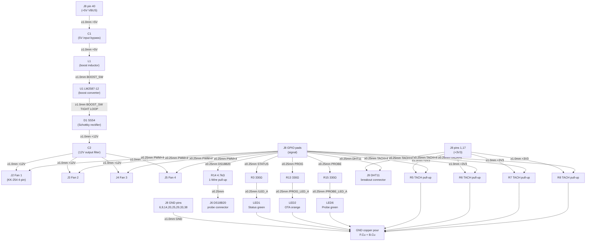

# Feature Architecture: Route All PCB Traces

<!-- Feature: route-pcb-traces | Issue: #83 | Branch: feature/83-route-pcb-traces -->
<!-- Validated against constitution v4.1.0 | Architecture review date: 2026-06-09 -->
<!-- Reviewer: architect agent -->

---

## Verdict

> **APPROVED WITH CHANGES**
>
> The plan is architecturally sound and the vast majority of its detail correctly
> implements the constitution. Three mandatory corrections must be made before any
> implementation work is committed to the branch:
>
> 1. **[BLOCKING] Gerber output path is wrong** — plan says `hardware/kicad/gerbers/`;
>    constitution P-KI-06 requires `hardware/gerbers/`.
> 2. **[BLOCKING] Formal P-KI-07 PATCH amendment required** before `hardware/fix_gnd_zones.py`
>    is committed — the deviation from P-KI-07 is correctly identified in R-01 but no
>    constitution amendment has been written.
> 3. **[MINOR] DHT11 connector reference designator is wrong** — plan uses `HUM1`
>    throughout; constitution §2.2 locks this component as `J9`. Update plan wording to `J9`.

---

## 1. Validation Matrix

### 1.1 Trace Width Standards — P-HW-07

| Net class | Constitution requirement | Plan specification | Finding |
|---|---|---|---|
| Power (+5V, +12V, +3V3, GND, BOOST_SW) | ≥ 1.0 mm | ≥ 1.0 mm (§2.1, Phases 2–3) | ✅ PASS |
| Signal (PWM, TACH, DHT11, DS18B20, LED chains) | ≥ 0.25 mm | ≥ 0.25 mm (§2.2, Phases 4–7) | ✅ PASS |
| Via pad diameter | 0.8 mm (both classes) | 0.8 mm (§2.3) | ✅ PASS |
| Via drill | 0.4 mm (both classes) | 0.4 mm (§2.3) | ✅ PASS |
| `/FANn_IND` LED intermediate nets | Signal class (≤ 12 mA LED chain) | Signal class ≥ 0.25 mm (§2.2) | ✅ PASS — current is low; classification is correct |
| +3V3 low-current power nets | Power class ≥ 1.0 mm | ≥ 1.0 mm despite < 50 mA | ✅ PASS — P-HW-07 is class-based, not current-threshold-based |

**IPC-2221A trace sizing analysis (§4.4):** The plan correctly calculates that 1.0 mm / 1 oz copper
handles ~2.5 A externally, providing adequate headroom for the ≤ 2 A +5V boost-input trace.
This analysis is **accepted**.

---

### 1.2 Board Dimensions and Layer Rules

| Constitution requirement | Plan reference | Finding |
|---|---|---|
| P-HW-01: 2-layer FR4 only (F.Cu / B.Cu) | §1.2, §10 — routing on F.Cu and B.Cu only | ✅ PASS |
| P-HW-02: All components on F.Cu | §4.3 — no component moves; all pads already on F.Cu | ✅ PASS |
| P-HW-04: Board 78.00 mm × 56.00 mm, no outline change | §10 — "no board outline change; all traces stay within outline" | ✅ PASS |

---

### 1.3 BOOST_SW Switching Loop — EMI Critical

The plan correctly identifies Phase 3 as a distinct, highest-priority routing step.

| Requirement | Plan provision | Finding |
|---|---|---|
| Trace width ≥ 1.0 mm (power class) | Phase 3: "≥ 1.0 mm trace width throughout" | ✅ PASS |
| Minimal enclosed loop area | Phase 3: target < 200 mm²; route all three segments before any other traces | ✅ PASS |
| No signal traces through loop interior | Phase 3 explicitly prohibits this | ✅ PASS |
| Routing order (SW pin first, then D1 anode, then close at L1) | Phase 3 specifies this exact sequence | ✅ PASS |

The 200 mm² loop-area target is engineering guidance (not a locked constitution constraint).
It should be measured in KiCad's board inspector and reported in the PR description.

---

### 1.4 GND Zone Strategy — P-HW-08

| Constitution requirement | Plan provision | Finding |
|---|---|---|
| GND copper pour on both F.Cu and B.Cu | Phase 1 reassigns zones to `GND`; Phase 8 fills both | ✅ PASS |
| One ground domain only (`GND` — SELV secondary) | Phase 1 script: reassigns `GND_TOP` and `GND_BOT` from `Net-(U1-GND)` to `GND` | ✅ PASS |
| No split of ground pour required on daughter board | Plan confirms no pour split | ✅ PASS |

---

### 1.5 Net-(U1-GND) Isolation — Critical Safety Constraint

> **Constitution intent:** The user directive in the issue brief states *"Net-(U1-GND) isolation
> intent must be respected — do not blindly merge into GND."* The plan honours this.

The Phase 1 Python script operates only on **zone objects** (copper pour areas named
`GND_TOP` and `GND_BOT`). KiCad zone net assignment is independent of pad net assignment.
U1's GND pin pad net (`Net-(U1-GND)`) is a footprint pad attribute set by the netlist —
a zone `SetNet()` call cannot and does not change it.

The plan is architecturally correct on this point: the zone fill will connect to GND but will
not carry a ratsnest bridge to U1's GND pad (which remains `Net-(U1-GND)` and will show as
a single-pad unconnected net throughout).

**Risk R-02 (floating U1 GND pin) is real and correctly escalated by the plan.** The LM2587-12
datasheet requires its GND pin to be connected to the power return; a truly floating GND pin
means the boost converter cannot regulate. This must be addressed in a schematic-level follow-up
issue before the board is sent for fabrication. A `Net-(U1-GND)` → `GND` connection in the
schematic generator is required. **This routing task should not proceed to Gerber generation
until that schematic issue is resolved or explicitly accepted by the project owner.**

---

### 1.6 PCB File Source of Truth — P-KI-07

**Finding: R-01 is correctly diagnosed but requires a formal constitution amendment.**

The plan identifies the tension at R-01 and proposes a reasonable mitigation:
- Phase 1 (zone net reassignment): minimal, auditable, committed Python script
- Phases 2–7 (trace routing): KiCad GUI only (fully P-KI-07 compliant)

However, P-DEV-04 is explicit:

> *"Any deviation from this constitution — however small — requires:
> 1. Consultation with the relevant expert … 2. A written amendment …
> 3. **The amendment committed before the implementing change.**"*

The plan treats the Phase 1 exception as self-documented within the plan. This is **insufficient**
under P-DEV-04. Before `hardware/fix_gnd_zones.py` is committed to the branch, a PATCH
amendment to P-KI-07 must be written in `docs/constitution.md`. See §3 below for the required
amendment text.

The option in Phase 8a (`board.FillAllZones()` in a post-route script) also conflicts with
P-KI-07 if used. The plan wisely presents this as secondary to the GUI method. The architecture
verdict: **zone fill must be done via the KiCad GUI (`B` shortcut)**; using a script for fill
requires the same PATCH amendment scope as Phase 1.

---

### 1.7 Gerber Output Path — P-KI-06

**Finding: VIOLATION — wrong path in plan.**

| | Value |
|---|---|
| Constitution P-KI-06 | `hardware/gerbers/` |
| Plan §1.2 table | `hardware/kicad/gerbers/` ❌ |
| Plan §8c (Phase 8c step) | `hardware/kicad/gerbers/` ❌ |
| Plan §10 compliance table | `hardware/kicad/gerbers/` ❌ |

All three occurrences must be corrected to `hardware/gerbers/` before implementation.
No constitution amendment is needed — this is a plan typo.

---

### 1.8 DHT11 Connector Reference Designator

**Finding: Naming discrepancy — plan uses `HUM1`; constitution §2.2 locks this as `J9`.**

| Location | Plan text | Constitution §2.2 |
|---|---|---|
| §1.1 block diagram | `HUM1 pin 1 (DHT11 VCC)` | Component reference: **J9** |
| §2.1 power nets table | `HUM1 pin 1 (DHT11 VCC)` | J9 |
| Phase 2 (+3V3 routing) | `HUM1 pin 1` | J9 |
| Phase 6 (DHT11 data) | `J8 pin 23 → HUM1 pin 2` | J9 |
| §4.2 PCB layout changes | implicit via Phase references | J9 |

In the KiCad PCB file, the component's reference designator will be whichever label the
schematic generator assigned (expected: `J9` per constitution §2.2). The plan's use of
`HUM1` is therefore both inconsistent with the constitution and potentially inconsistent
with the actual `.kicad_pcb` netlist. All plan references to `HUM1` must be updated to
`J9`. This is a documentation correction; no schematic change is required.

---

### 1.9 PoE and Power Architecture

| Principle | Plan status | Finding |
|---|---|---|
| P-POE-01 (802.3at Class 4) | Unchanged | ✅ PASS |
| P-POE-02 (no primary-side changes) | No primary-side touches | ✅ PASS |
| P-ISO-01 to P-ISO-05 (isolation) | Isolation barrier inside SKU 32088; no traces cross x = 38 mm | ✅ PASS |
| §5.2 power budget | Routing adds no electrical loads; budget unchanged (~18.9 W / 20 W) | ✅ PASS |

---

### 1.10 Testing Strategy

| Constitution requirement | Plan provision | Finding |
|---|---|---|
| P-TEST-03: Zero DRC errors before Gerbers | §8.1: DRC via `kicad-cli pcb drc`, 0 errors | ✅ PASS |
| P-TEST-04: DRC run before every Gerber generation | §8.3: PR blocked if DRC report contains any error | ✅ PASS |
| P-CI-01: ERC/DRC in CI | §8.1 uses `kicad-cli`; DRC output committed | ✅ PASS |
| P-CI-02: Release DRC gates Gerbers | §8.3 DRC gate on PR — note: separate release gate is CI pipeline responsibility, not this plan | ✅ PASS (out of feature scope) |
| P-DEV-02: ERC/DRC results committed with hardware PR | §8.3: `hardware/kicad/drc_result.rpt` committed | ✅ PASS |
| §8.4 Bring-up checklist | §8.2 covers all voltage measurements, BOOST_SW oscilloscope check, fan indicator LEDs, DS18B20 bus | ✅ PASS |

The DRC output file path `hardware/kicad/drc_result.rpt` is not specified by the constitution
(the constitution only mandates ERC output at `hardware/kicad/erc_output.json`). The chosen
path is acceptable; however, the file should be committed and the PR description should
explicitly reference it.

---

### 1.11 KiCad File Format and Version

| Principle | Plan provision | Finding |
|---|---|---|
| P-KI-01: KiCad 10.0.3 locked | "GUI and Python interpreter both at KiCad 10.0.3 installation path" | ✅ PASS |
| P-KI-03: PCB format version 20260206 | KiCad 10.0.3 writes this version; no other tool writes to PCB | ✅ PASS |
| P-KI-05: Custom footprints in-project | No new footprints introduced | ✅ PASS |
| P-KI-07: PCB in KiCad GUI | Phases 2–7 via GUI ✅; Phase 1 via script — requires P-KI-07 PATCH amendment | ⚠️ SEE §3 |

---

### 1.12 Development Agreements

| Principle | Plan provision | Finding |
|---|---|---|
| P-DEV-01: Commit convention `hw: <subject>` | All commits use `hw:` prefix | ✅ PASS |
| P-DEV-03: No direct commits to `main` | Feature branch; merge via PR | ✅ PASS |
| P-DEV-04: Amendment before deviation | Phase 1 script needs P-KI-07 PATCH first | ⚠️ SEE §3 |

---

## 2. Mandatory Pre-Implementation Corrections

These must be applied to `docs/features/route-pcb-traces/plan.md` before any implementation
work begins:

### Correction C-01 — Gerber Path (BLOCKING)

In `plan.md`, replace all three occurrences of `hardware/kicad/gerbers/` with `hardware/gerbers/`:

| Location | Current (wrong) | Required |
|---|---|---|
| §1.2 table, P-KI-06 row | `hardware/kicad/gerbers/` | `hardware/gerbers/` |
| Phase 8c body text | `hardware/kicad/gerbers/` | `hardware/gerbers/` |
| §10 compliance table, P-KI-06 row | `hardware/kicak/gerbers/` (also a typo) | `hardware/gerbers/` |

### Correction C-02 — DHT11 Reference Designator (MINOR)

Replace all occurrences of `HUM1` with `J9` throughout `plan.md`.
Verify against the actual `.kicad_pcb` netlist to confirm the generator assigned `J9`.

### Correction C-03 — P-KI-07 Amendment (BLOCKING)

Write and commit a PATCH amendment to `docs/constitution.md` for P-KI-07 before committing
`hardware/fix_gnd_zones.py`. See §3 below for the required amendment text.

---

## 3. Required P-KI-07 PATCH Amendment

The following PATCH amendment must be added to the constitution **before** any script that
writes to `.kicad_pcb` is committed. This is a PATCH (clarification/narrow exception) —
no principle is redefined or removed.

### Proposed amendment text (to insert after P-KI-07 body):

```
> **P-KI-07 PATCH — One-shot metadata scripts (Amendment v4.1.1, 2026-06-09):**
> A narrow exception is granted for minimal Python scripts that modify only zone or
> non-routing metadata in the PCB file (e.g., re-assigning a copper-pour zone's net
> name) subject to all of the following conditions:
>
> 1. The script must be committed to the repository under `hardware/` with a descriptive
>    name (e.g., `hardware/fix_gnd_zones.py`).
> 2. The script must be **one-shot** — it may not be part of any automated CI pipeline
>    or generator workflow; it is run manually exactly once and then left in place as
>    an audit record.
> 3. The change made by the script must be verified interactively in the KiCad GUI
>    immediately after execution, before any routing work begins.
> 4. The script may NOT route traces, move footprints, add/delete pads, or make any
>    design-intent change. Permitted operations: zone net assignment, zone fill settings,
>    layer-specific zone properties.
> 5. The script must use the KiCad-bundled Python interpreter at the locked KiCad 10.0.3
>    installation path (P-KI-01).
> 6. All trace routing must be performed interactively in the KiCad GUI per the original
>    P-KI-07 requirement.
>
> Rationale: existing project precedent (`hardware/pcb_cleanup_v2.py`, `hardware/fix_pcb_placement_v3.py`,
> `hardware/add_ds18b20_pcb.py`) pre-dates P-KI-07. The exception is narrow and bounded;
> it does not open the door to script-driven routing. Feature: route-pcb-traces (#83).
```

### Amendment history row to add to §10:

```
| 4.1.1 | 2026-06-09 | PATCH — P-KI-07: narrow exception for one-shot metadata-only Python scripts writing to `.kicad_pcb` (zone net reassignment only); conditions: committed to repo, one-shot, GUI-verified, no routing/placement changes, KiCad 10.0.3 Python only. Rationale: project precedent + fix_gnd_zones.py for route-pcb-traces (#83). | architect |
```

---

## 4. Architecture Notes — No New Principles Required

This feature is a pure PCB routing task. It does not:
- Introduce new hardware components (no BOM change)
- Change GPIO assignments or peripheral ownership (P-FW-02 unchanged)
- Modify power topology (§5 PoE unchanged)
- Introduce new firmware modules
- Change web UI or REST API
- Require new KiCad library dependencies

The existing constitution principles (v4.1.0 + the PATCH amendment in §3 above) fully
govern this feature. No MINOR or MAJOR amendments are required beyond the PATCH.

---

## 5. Hardware Block Diagram (Routing View)

The following diagram reflects the physical routing topology that the plan must implement.
This is a routing-level view, not a schematic-level view.



---

## 6. Risk Register — Architecture Assessment

| Risk ID | Plan description | Architecture assessment | Residual severity |
|---|---|---|---|
| R-01 | P-KI-07 tension: Phase 1 script writes to `.kicad_pcb` | Correctly bounded. Requires formal PATCH amendment per P-DEV-04 before script is committed. All routing (Phases 2–7) via GUI = fully compliant. | LOW (after amendment) |
| R-02 | Net-(U1-GND) is electrically floating — boost converter may not function | **CRITICAL hardware design issue.** Plan correctly flags and defers but Gerber generation should be blocked until a schematic follow-up issue is opened and acknowledged. Post-fab bring-up step 4 will detect this. | MEDIUM — escalate before fab |
| R-03 | Router congestion near J8 exit zone | Standard PCB routing challenge for this density. 20 signal nets on 78×56 mm is manageable with 45° fanning. Via layer-change is an acceptable escape route per plan. | LOW |
| R-04 | GND zone islands after fill | Standard mitigation (GND vias, keepout zones). Both layers carry pours, reducing island risk. | LOW |

---

## 7. Pre-Merge Checklist

The following must all be true before this PR is merged to `main`:

- [ ] C-01 applied: all `hardware/kicad/gerbers/` → `hardware/gerbers/` in plan.md
- [ ] C-02 applied: all `HUM1` → `J9` in plan.md (verified against PCB netlist)
- [ ] C-03 applied: P-KI-07 PATCH amendment committed to `docs/constitution.md` (§3 text)
- [ ] `hardware/fix_gnd_zones.py` committed and reviewed; Phase 1 verified in KiCad GUI
- [ ] GND zone net = `GND` confirmed in both `GND_TOP` and `GND_BOT` zone properties
- [ ] `Net-(U1-GND)` pad net on U1 remains unchanged (verified in KiCad pad properties dialog)
- [ ] BOOST_SW loop area measured and recorded in PR description (target < 200 mm²)
- [ ] DRC: 0 errors, 0 unconnected after Phase 8 zone fill
- [ ] `hardware/kicad/drc_result.rpt` committed alongside PCB changes
- [ ] Gerbers regenerated to `hardware/gerbers/` and committed
- [ ] Follow-up issue opened for `Net-(U1-GND)` schematic review (R-02)
- [ ] All commits use `hw:` prefix per P-DEV-01
