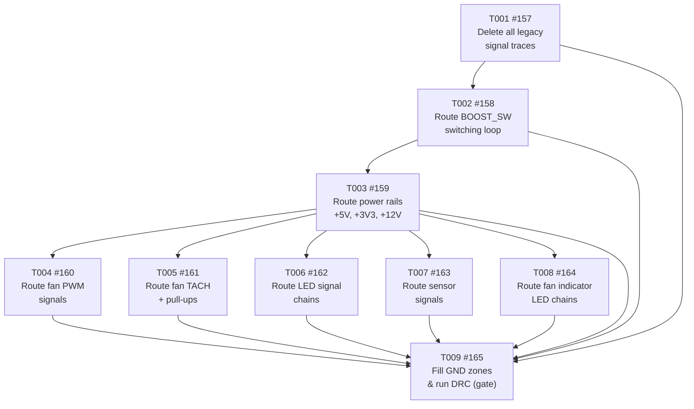

# Tasks: Route All PCB Traces

<!-- Feature: route-pcb-traces | Issue: #83 | Branch: feature/148-correct-gpio-pin-assignments -->
<!-- Generated: 2026-06-10 | Author: feature-breakdown-agent -->
<!-- SUPERSEDES: tasks generated 2026-06-09 (issues #139–#147 closed as OBSOLETE on 2026-06-10) -->
<!-- Reason: Old tasks pre-dated J8 GPIO pin assignment corrections from issue #148 -->

---

> ⚠️ **OBSOLETE TASKS NOTICE**
> Issues #139–#147 (created 2026-06-09) were **closed as OBSOLETE on 2026-06-10**.
> They were based on incorrect J8 GPIO pin assignments prior to issue #148 corrections.
> Do **not** reopen or reference those issues. The current task set is #157–#165 below.

---

## Summary

- **Total tasks:** 9 (T001–T009)
- **Layers covered:** Hardware: Layout, Hardware: DRC
- **GitHub parent issue:** [#83 — hw(pcb): route all PCB traces](https://github.com/nielsverhoeven/PoE-FanController/issues/83)
- **Branch:** `feature/148-correct-gpio-pin-assignments`
- **Constitution prerequisite:** v4.1.0 (locked; no amendments required)
- **Layers NOT required:** Hardware: Schematic, Hardware: ERC, Hardware: BOM, Firmware: Module, Firmware: Config, Web UI, Unit Tests
  (hardware layout-only change; no schematic edits, no netlist changes, no firmware logic)
- **Corrected pad assignments:** Per issue #148 (J8 GPIO pin corrections applied throughout)

---

## Dependency Graph



**Text summary:**
```
T001 → T002 → T003 ─┬─ T004 ─┐
                     ├─ T005 ─┤
                     ├─ T006 ─┼─ T009 (gate: DRC + Gerbers)
                     ├─ T007 ─┤
                     └─ T008 ─┘
```

- **T001** (delete legacy traces) has no dependencies — do this first, as an isolated commit.
- **T002** (BOOST_SW switching loop) must follow T001; EMI-critical, route before other power rails.
- **T003** (power rails) must follow T002; gates all signal routing tasks.
- **T004–T008** can execute in parallel (all depend only on T003).
- **T009** (zone fill + DRC) is the convergence gate; all preceding tasks must be complete.

---

## Task List

| ID | GitHub Issue | Title | Status | Depends on |
|----|-------------|-------|--------|------------|
| T001 | [#157](https://github.com/nielsverhoeven/PoE-FanController/issues/157) | Delete all legacy signal traces (35 shorts) | Open | none |
| T002 | [#158](https://github.com/nielsverhoeven/PoE-FanController/issues/158) | Route BOOST_SW switching loop (≥1.0mm, EMI critical) | Open | T001 |
| T003 | [#159](https://github.com/nielsverhoeven/PoE-FanController/issues/159) | Route power rails (+5V, +3V3, +12V, ≥1.0mm) | Open | T002 |
| T004 | [#160](https://github.com/nielsverhoeven/PoE-FanController/issues/160) | Route fan PWM signals (4 traces, ≥0.25mm) | Open | T003 |
| T005 | [#161](https://github.com/nielsverhoeven/PoE-FanController/issues/161) | Route fan TACH signals + R5-R8 pull-ups (≥0.25mm) | Open | T003 |
| T006 | [#162](https://github.com/nielsverhoeven/PoE-FanController/issues/162) | Route LED signal chains (PROBE_LED, STATUS_LED, PROG_LED) | Open | T003 |
| T007 | [#163](https://github.com/nielsverhoeven/PoE-FanController/issues/163) | Route sensor signals (DHT11_DATA → J9, DS18B20_DATA → R14 → J6) | Open | T003 |
| T008 | [#164](https://github.com/nielsverhoeven/PoE-FanController/issues/164) | Route fan indicator LED chains (/FAN1_IND–/FAN4_IND) | Open | T003 |
| T009 | [#165](https://github.com/nielsverhoeven/PoE-FanController/issues/165) | Fill GND zones and run DRC (gate: 0 shorts, 0 unconnected) | Open | T001–T008 |

---

## Task Details

### T001: Delete All Legacy Signal Traces

- **Layer:** Hardware: Layout
- **Description:** Use the pcbnew Python API to delete **all** `PCB_TRACK` and `PCB_ARC` objects from
  the board. The previous routing (issues #139–#147, closed OBSOLETE 2026-06-10) was based on
  incorrect J8 pad assignments. This must be done as an isolated commit before any corrected routing.
  Script interpreter: `C:\Users\Niels\AppData\Local\Programs\KiCad\10.0\bin\python.exe`
- **Depends on:** none
- **Acceptance:** DRC shows 0 `shorting_items`; all tracks removed from `.kicad_pcb`; isolated git commit.
- **GitHub issue:** [#157](https://github.com/nielsverhoeven/PoE-FanController/issues/157)

---

### T002: Route BOOST_SW Switching Loop

- **Layer:** Hardware: Layout
- **Description:** Route the L1 → U_BOOST → D1 switching loop on F.Cu. Net: `BOOST_SW`.
  Trace width ≥ 1.0 mm (power class). Route with minimal enclosed loop area to limit radiated EMI
  (constitution P-HW-07). All traces on F.Cu only.
- **Depends on:** T001 (#157)
- **Acceptance:** `BOOST_SW` loop fully routed; trace width ≥ 1.0 mm verified; minimal loop area achieved.
- **GitHub issue:** [#158](https://github.com/nielsverhoeven/PoE-FanController/issues/158)

---

### T003: Route Power Rails (+5V, +3V3, +12V)

- **Layer:** Hardware: Layout
- **Description:** Route all power distribution rails on F.Cu at ≥ 1.0 mm (power class).

  | Rail | From | To |
  |------|------|----|
  | +5V | J8 pad 40 (VBUS) | L1 input / U_BOOST VIN |
  | +3V3 | J8 pad 36 | R5, R6, R7, R8, R14, J9 pin 1 |
  | +12V | D1 cathode | J2–J5 pin 1 (VCC) |
  | GND | J8 pads 3,8,13,18,23,28,33,38 | GND zone (copper spurs where needed) |

- **Depends on:** T002 (#158)
- **Acceptance:** All power rail ratsnest cleared; no unconnected power net items; trace widths ≥ 1.0 mm.
- **GitHub issue:** [#159](https://github.com/nielsverhoeven/PoE-FanController/issues/159)

---

### T004: Route Fan PWM Signals

- **Layer:** Hardware: Layout
- **Description:** Route all four fan PWM signal traces on F.Cu (signal class ≥ 0.25 mm).

  | Net | From | To |
  |-----|------|----|
  | FAN1_PWM | J8 pad 35 | J2 pin 4 |
  | FAN2_PWM | J8 pad 34 | J3 pin 4 |
  | FAN3_PWM | J8 pad 29 | J4 pin 4 |
  | FAN4_PWM | J8 pad 27 | J5 pin 4 |

  Pad numbers per corrected J8 assignments from issue #148.

- **Depends on:** T003 (#159)
- **Acceptance:** All 4 `FANn_PWM` ratsnest items cleared; trace width ≥ 0.25 mm for all four.
- **GitHub issue:** [#160](https://github.com/nielsverhoeven/PoE-FanController/issues/160)

---

### T005: Route Fan TACH Signals + R5–R8 Pull-ups

- **Layer:** Hardware: Layout
- **Description:** Route all four fan TACH signal traces including pull-up resistors R5–R8 on F.Cu
  (signal class ≥ 0.25 mm).

  | Net | From | Via | To |
  |-----|------|-----|----|
  | FAN1_TACH | J8 pad 32 | R5 | J2 pin 3 |
  | FAN2_TACH | J8 pad 31 | R6 | J3 pin 3 |
  | FAN3_TACH | J8 pad 24 | R7 | J4 pin 3 |
  | FAN4_TACH | J8 pad 22 | R8 | J5 pin 3 |

  Pull-up resistors R5–R8: one pad on TACH net, other pad on +3V3 (routed in T003).
  Pad numbers per corrected J8 assignments from issue #148.

- **Depends on:** T003 (#159)
- **Acceptance:** All 4 `FANn_TACH` nets fully connected; both pads of R5–R8 connected; trace width ≥ 0.25 mm.
- **GitHub issue:** [#161](https://github.com/nielsverhoeven/PoE-FanController/issues/161)

---

### T006: Route LED Signal Chains

- **Layer:** Hardware: Layout
- **Description:** Route all three LED signal chains on F.Cu (signal class ≥ 0.25 mm).

  | Net | From | Via | To |
  |-----|------|-----|----|
  | PROBE_LED | J8 pad 21 | R15 | LED6 |
  | STATUS_LED | J8 pad 6 | R3 | LED1 |
  | PROG_LED | J8 pad 14 | R13 | LED2 |

  **Layout note:** Pads 6 and 14 are on Row A (left column, x ≈ 2.81 mm) — route traces leftward
  from these pads before turning to reach their targets.
  Pad numbers per corrected J8 assignments from issue #148.

- **Depends on:** T003 (#159)
- **Acceptance:** All 3 LED signal nets fully connected; trace width ≥ 0.25 mm for all three.
- **GitHub issue:** [#162](https://github.com/nielsverhoeven/PoE-FanController/issues/162)

---

### T007: Route Sensor Signals

- **Layer:** Hardware: Layout
- **Description:** Route both sensor data signal traces on F.Cu (signal class ≥ 0.25 mm).

  | Net | From | Via | To |
  |-----|------|-----|----|
  | DHT11_DATA | J8 pad 15 | — | J9 pin 2 |
  | DS18B20_DATA | J8 pad 19 | R14 | J6 pin 2 |

  **Layout note:** Pads 15 and 19 are on Row A (left column, x ≈ 2.81 mm).
  R14 is the DS18B20 1-Wire pull-up; its other end connects to +3V3 (routed in T003).
  Pad numbers per corrected J8 assignments from issue #148.

- **Depends on:** T003 (#159)
- **Acceptance:** `DHT11_DATA` and `DS18B20_DATA` nets fully connected; both pads of R14 connected;
  trace width ≥ 0.25 mm for both nets.
- **GitHub issue:** [#163](https://github.com/nielsverhoeven/PoE-FanController/issues/163)

---

### T008: Route Fan Indicator LED Chains

- **Layer:** Hardware: Layout
- **Description:** Route all four fan indicator LED signal chains on F.Cu (signal class ≥ 0.25 mm).

  | Net | From | To |
  |-----|------|----|
  | /FAN1_IND | D2 | J2 pin 2 signal branch |
  | /FAN2_IND | D3 | J3 pin 2 signal branch |
  | /FAN3_IND | D4 | J4 pin 2 signal branch |
  | /FAN4_IND | D5 | J5 pin 2 signal branch |

- **Depends on:** T003 (#159)
- **Acceptance:** All 4 `/FANn_IND` nets fully connected; trace width ≥ 0.25 mm for all four.
- **GitHub issue:** [#164](https://github.com/nielsverhoeven/PoE-FanController/issues/164)

---

### T009: Fill GND Zones and Run DRC (Convergence Gate)

- **Layer:** Hardware: DRC
- **Description:** This is the **convergence gate** — all T001–T008 must be complete first.
  1. Fill both GND copper pour zones (`GND_TOP` on F.Cu, `GND_BOT` on B.Cu)
  2. Check for isolated copper islands; add GND vias if needed
  3. Run DRC via:
     ```
     C:\Users\Niels\AppData\Local\Programs\KiCad\10.0\bin\kicad-cli.exe pcb drc
     ```
  4. Verify J8 pads 25, 26, 30, 37, 39 have **zero** connected tracks (unconnected in corrected netlist per #148)
  5. Regenerate Gerbers into `hardware/kicad/gerbers/`
  6. Commit Gerbers and updated `.kicad_pcb` to the feature branch

- **Depends on:** T001 (#157), T002 (#158), T003 (#159), T004 (#160), T005 (#161), T006 (#162), T007 (#163), T008 (#164)
- **Acceptance:** DRC report shows 0 errors, 0 unconnected; Gerbers committed; issue #83 ready to close.
- **GitHub issue:** [#165](https://github.com/nielsverhoeven/PoE-FanController/issues/165)

---

## Obsolete Tasks (DO NOT REOPEN)

The following issues were created on 2026-06-09 under the **wrong branch** (`feature/83-route-pcb-traces`)
and with **incorrect J8 pad assignments** (pre-dating the GPIO corrections in issue #148).
They were **closed as OBSOLETE on 2026-06-10** and must not be reopened or referenced.

| Old Issue | Title | Closed reason |
|-----------|-------|---------------|
| [#139](https://github.com/nielsverhoeven/PoE-FanController/issues/139) | T001: Fix GND Zone Net Assignment | OBSOLETE — wrong pad assignments |
| [#140](https://github.com/nielsverhoeven/PoE-FanController/issues/140) | T002: Route Power Rails | OBSOLETE — wrong pad assignments |
| [#141](https://github.com/nielsverhoeven/PoE-FanController/issues/141) | T003: Route BOOST_SW Switching Loop | OBSOLETE — wrong pad assignments |
| [#142](https://github.com/nielsverhoeven/PoE-FanController/issues/142) | T004: Route Fan PWM Signals | OBSOLETE — wrong pad assignments |
| [#143](https://github.com/nielsverhoeven/PoE-FanController/issues/143) | T005: Route Fan TACH Signals | OBSOLETE — wrong pad assignments |
| [#144](https://github.com/nielsverhoeven/PoE-FanController/issues/144) | T006: Route LED Signal Chains | OBSOLETE — wrong pad assignments |
| [#145](https://github.com/nielsverhoeven/PoE-FanController/issues/145) | T007: Route Sensor Signals | OBSOLETE — wrong pad assignments |
| [#146](https://github.com/nielsverhoeven/PoE-FanController/issues/146) | T008: Route Fan Indicator LED Chains | OBSOLETE — wrong pad assignments |
| [#147](https://github.com/nielsverhoeven/PoE-FanController/issues/147) | T009: Fill GND Zones and Run DRC | OBSOLETE — wrong pad assignments |
