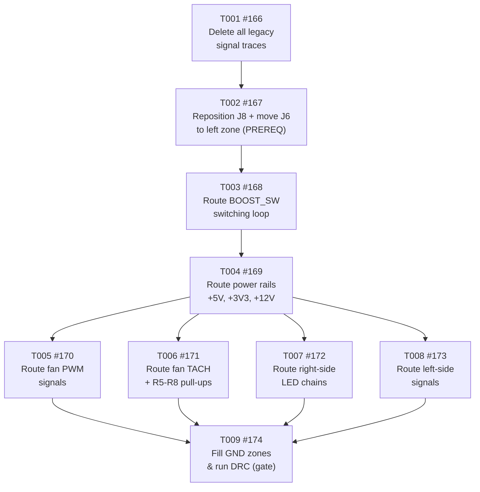

# Tasks: Route All PCB Traces

<!-- Feature: route-pcb-traces | Issue: #83 | Branch: feature/148-correct-gpio-pin-assignments -->
<!-- Generated: 2026-06-10 | Author: orchestrator (re-run stages 2-4) -->
<!-- SUPERSEDES: tasks generated 2026-06-10 at 4f50c78 (issues #157–#165 closed as SUPERSEDED) -->
<!-- Reason: PCB layout changed — ESP32 at x=15–36mm; J6 moved left; Phase 1 repositioning added -->

---

> ⚠️ **SUPERSEDED TASKS NOTICE**
> Issues #157–#165 were **closed as SUPERSEDED on 2026-06-10**.
> They were based on the old ESP32 layout (x=0–21mm) and lacked the critical
> component repositioning prerequisite (Phase 1: move J8 footprint + J6).
> Do **not** reopen or reference those issues. The current task set is #166–#174 below.
>
> Earlier obsolete set #139–#147 (closed 2026-06-09) also remains closed.

---

## Summary

- **Total tasks:** 9 (T001–T009)
- **Layers covered:** Hardware: Layout, Hardware: DRC
- **GitHub parent issue:** [#83 — hw(pcb): route all PCB traces](https://github.com/nielsverhoeven/PoE-FanController/issues/83)
- **Branch:** `feature/148-correct-gpio-pin-assignments`
- **Constitution prerequisite:** v4.3.0 (amended 2026-06-10 — P-HW-04 updated for new ESP32 position)
- **Layers NOT required:** Hardware: Schematic, Hardware: ERC, Hardware: BOM, Firmware: Module, Firmware: Config, Web UI, Unit Tests
  (hardware layout-only change; no schematic edits, no netlist changes, no firmware logic)
- **Corrected pad assignments:** Per issue #148 (J8 GPIO pin corrections applied throughout)
- **New layout:** ESP32 at x=15–36mm; J8 Row A at x=17.81mm; J8 Row B at x=33.19mm; J6 in left zone

---

## Dependency Graph



**Text summary:**
```
T001 → T002 → T003 → T004 ─┬─ T005 ─┐
                             ├─ T006 ─┤
                             ├─ T007 ─┼─ T009 (gate: DRC + Gerbers)
                             └─ T008 ─┘
```

- **T001** (delete legacy traces) has no dependencies — do this first, as an isolated commit.
- **T002** (reposition J8 footprint + move J6) is the **critical prerequisite** for all routing — must follow T001. All routing tasks depend on the new component positions being correct first.
- **T003** (BOOST_SW loop) must follow T002; EMI-critical, route before other power rails.
- **T004** (power rails) must follow T003; gates all signal routing tasks.
- **T005–T008** can execute in parallel (all depend only on T004).
- **T009** (zone fill + DRC) is the convergence gate; all preceding tasks must be complete.

---

## Task List

| ID | GitHub Issue | Title | Status | Depends on |
|----|-------------|-------|--------|------------|
| T001 | [#166](https://github.com/nielsverhoeven/PoE-FanController/issues/166) | Delete all legacy signal traces from PCB | Open | none |
| T002 | [#167](https://github.com/nielsverhoeven/PoE-FanController/issues/167) | Reposition J8 footprint + move J6 to left zone (PREREQUISITE) | Open | T001 |
| T003 | [#168](https://github.com/nielsverhoeven/PoE-FanController/issues/168) | Route BOOST_SW switching loop (>=1.0mm, EMI critical) | Open | T002 |
| T004 | [#169](https://github.com/nielsverhoeven/PoE-FanController/issues/169) | Route power rails (+5V, +3V3, +12V, >=1.0mm) | Open | T003 |
| T005 | [#170](https://github.com/nielsverhoeven/PoE-FanController/issues/170) | Route fan PWM signals (pads 35,34,29,27 -> J2-J5; >=0.25mm) | Open | T004 |
| T006 | [#171](https://github.com/nielsverhoeven/PoE-FanController/issues/171) | Route fan TACH signals + R5-R8 pull-ups (pads 32,31,24,22; >=0.25mm) | Open | T004 |
| T007 | [#172](https://github.com/nielsverhoeven/PoE-FanController/issues/172) | Route right-side LED chains (PROBE_LED + fan indicators D2-D5; >=0.25mm) | Open | T004 |
| T008 | [#173](https://github.com/nielsverhoeven/PoE-FanController/issues/173) | Route left-side signals (STATUS_LED, PROG_LED, DHT11_DATA, DS18B20_DATA; >=0.25mm) | Open | T004 |
| T009 | [#174](https://github.com/nielsverhoeven/PoE-FanController/issues/174) | Fill GND zones and run DRC (gate: 0 shorts, 0 clearance, 0 unconnected) | Open | T001–T008 |

---

## Task Details

### T001: Delete All Legacy Signal Traces

- **Layer:** Hardware: Layout
- **Description:** Use the pcbnew Python API to delete **all** `PCB_TRACK` and `PCB_ARC` objects from
  the board. The legacy traces (from both the old layout and old pad assignments) are invalid.
  This must be done as an isolated commit before any repositioning or routing.
  Script interpreter: `C:\Users\Niels\AppData\Local\Programs\KiCad\10.0\bin\python.exe`
- **Depends on:** none
- **Acceptance:** DRC shows 0 `shorting_items` (was 35), 0 `solder_mask_bridge` violations (was 125); all tracks removed from `.kicad_pcb`; isolated git commit.
- **GitHub issue:** [#166](https://github.com/nielsverhoeven/PoE-FanController/issues/166)

---

### T002: Reposition J8 Footprint + Move J6 to Left Zone (CRITICAL PREREQUISITE)

- **Layer:** Hardware: Layout
- **Description:** Before any routing can begin, reposition PCB components to match the new ESP32 x=15mm offset layout:
  1. Move J8 footprint centre from (10.50, 28.80) mm to **(25.50, 28.80) mm**
     - Row A pads (1–20): x=2.81mm → **x=17.81mm**
     - Row B pads (21–40): x=18.19mm → **x=33.19mm**
  2. Move **J6** (DS18B20 connector) to the left zone (x < 17.81mm) near J9 and LED2+R13
  3. Verify all components in correct zones:
     - Left zone (x=0–17.81mm): J9, LED1+R3, LED2+R13, J6
     - Right zone (x=33.19–56mm): J2–J5, R5–R8, U1, L1, D1, C1, C2, LED6+R15, D2–D5
  Method: KiCad GUI (P-KI-07).
- **Depends on:** T001 (#166)
- **Acceptance:** J8 Row A at x≈17.81mm; J8 Row B at x≈33.19mm; J6 in left zone (x<17.81mm); DRC 0 courtyard violations; isolated git commit.
- **GitHub issue:** [#167](https://github.com/nielsverhoeven/PoE-FanController/issues/167)

---

### T003: Route BOOST_SW Switching Loop

- **Layer:** Hardware: Layout
- **Description:** Route the L1 → U1 → D1 switching loop on F.Cu. Net: `BOOST_SW`.
  Trace width ≥ 1.0 mm (power class, P-HW-07). Route with minimal enclosed loop area to limit radiated EMI.
  All components in right zone (x=33.19–56mm). All traces on F.Cu only.
- **Depends on:** T002 (#167)
- **Acceptance:** `BOOST_SW` loop fully routed; trace width ≥ 1.0 mm verified; minimal loop area achieved.
- **GitHub issue:** [#168](https://github.com/nielsverhoeven/PoE-FanController/issues/168)

---

### T004: Route Power Rails (+5V, +3V3, +12V)

- **Layer:** Hardware: Layout
- **Description:** Route all power distribution rails on F.Cu at ≥ 1.0 mm (power class, P-HW-07).

  | Rail | From | To |
  |------|------|----|
  | +5V | J8 pad 40 (Row B, x=33.19mm) | C1 → L1 → U1 VIN |
  | +3V3 | J8 pad 36 (Row B, x=33.19mm) | R5–R8 pin 1 + R14 pin 1 |
  | +12V | D1 cathode | C2+ → J2–J5 pin 1 (fan VCC) |
  | GND | J8 pads 3,8,13,18,23,28,33,38 | GND zone (copper spurs where needed) |

- **Depends on:** T003 (#168)
- **Acceptance:** All power rail ratsnest cleared; no unconnected power net items; trace widths ≥ 1.0 mm.
- **GitHub issue:** [#169](https://github.com/nielsverhoeven/PoE-FanController/issues/169)

---

### T005: Route Fan PWM Signals

- **Layer:** Hardware: Layout
- **Description:** Route all four fan PWM signal traces on F.Cu (signal class ≥ 0.25 mm).
  All pads and fan headers in right zone (x=33.19–56mm). Route RIGHT; zero-crossing rule applies.

  | Net | From (J8 pad) | GPIO | To |
  |-----|--------------|------|----|
  | FAN1_PWM | pad 35 | GPIO20 | J2 pin 4 |
  | FAN2_PWM | pad 34 | GPIO21 | J3 pin 4 |
  | FAN3_PWM | pad 29 | GPIO26 | J4 pin 4 |
  | FAN4_PWM | pad 27 | GPIO27 | J5 pin 4 |

- **Depends on:** T004 (#169)
- **Acceptance:** All 4 `FANn_PWM` ratsnest items cleared; trace width ≥ 0.25 mm; no trace crosses x<33.19mm.
- **GitHub issue:** [#170](https://github.com/nielsverhoeven/PoE-FanController/issues/170)

---

### T006: Route Fan TACH Signals + R5–R8 Pull-ups

- **Layer:** Hardware: Layout
- **Description:** Route all four fan TACH signal traces including pull-up resistors R5–R8 on F.Cu
  (signal class ≥ 0.25 mm). All in right zone (x=33.19–56mm).

  | Net | From (J8 pad) | GPIO | Via | To |
  |-----|--------------|------|-----|----|
  | FAN1_TACH | pad 32 | GPIO22 | R5 (pin 1→+3V3) | J2 pin 3 |
  | FAN2_TACH | pad 31 | GPIO23 | R6 (pin 1→+3V3) | J3 pin 3 |
  | FAN3_TACH | pad 24 | GPIO46 | R7 (pin 1→+3V3) | J4 pin 3 |
  | FAN4_TACH | pad 22 | GPIO47 | R8 (pin 1→+3V3) | J5 pin 3 |

  +3V3 side of R5–R8 already routed in T004 (#169).

- **Depends on:** T004 (#169)
- **Acceptance:** All 4 `FANn_TACH` nets fully connected; both pads of R5–R8 connected; trace width ≥ 0.25 mm.
- **GitHub issue:** [#171](https://github.com/nielsverhoeven/PoE-FanController/issues/171)

---

### T007: Route Right-Side LED Chains

- **Layer:** Hardware: Layout
- **Description:** Route all right-side LED chains on F.Cu (signal class ≥ 0.25 mm). All in right zone.

  **PROBE_LED chain (GPIO-driven):**
  - J8 pad 21 (GPIO48, Row B, x=33.19mm) → R15 pin 1 → `/PROBE_LED_A` → LED6 anode

  **Fan indicator LED chains (passive, +12V-rail driven):**
  - +12V branch → D2 → `/FAN1_IND` → R9 → GND
  - +12V branch → D3 → `/FAN2_IND` → R10 → GND
  - +12V branch → D4 → `/FAN3_IND` → R11 → GND
  - +12V branch → D5 → `/FAN4_IND` → R12 → GND

- **Depends on:** T004 (#169)
- **Acceptance:** PROBE_LED and `/PROBE_LED_A` nets connected; all 4 `/FANn_IND` nets connected; trace width ≥ 0.25 mm.
- **GitHub issue:** [#172](https://github.com/nielsverhoeven/PoE-FanController/issues/172)

---

### T008: Route Left-Side Signals

- **Layer:** Hardware: Layout
- **Description:** Route all left-side GPIO signal traces on F.Cu (signal class ≥ 0.25 mm).
  All J8 pads are on **Row A (x=17.81mm)**; target components are in **left zone (x < 17.81mm)**.
  **Zero-crossing rule:** all traces must stay at x ≤ 17.81mm (P-HW-04 Amendment v4.3.0).

  | Net | From (J8 pad) | GPIO | Via | To |
  |-----|--------------|------|-----|----|
  | STATUS_LED | pad 6 | GPIO2 | R3 pin 1 | LED1 anode |
  | PROG_LED | pad 14 | GPIO15 | R13 pin 1 | LED2 anode |
  | DHT11_DATA | pad 15 | GPIO16 | — | J9 pin 2 |
  | DS18B20_DATA | pad 19 | GPIO19 | R14 pin 2 | J6 pin 2 |

  J6 was repositioned to left zone in T002 (#167). R14 pin 1 (+3V3) was routed in T004 (#169).

- **Depends on:** T004 (#169)
- **Acceptance:** All 4 signal nets connected; `/LED_A`, `/PROG_LED_A` connected; R14 both pads connected; no trace crosses x=17.81mm; trace width ≥ 0.25 mm.
- **GitHub issue:** [#173](https://github.com/nielsverhoeven/PoE-FanController/issues/173)

---

### T009: Fill GND Zones and Run DRC (Convergence Gate)

- **Layer:** Hardware: DRC
- **Description:** This is the **convergence gate** — all T001–T008 must be complete first.
  1. Fill both GND copper pour zones (`GND_TOP` on F.Cu, `GND_BOT` on B.Cu)
  2. Check for isolated copper islands; add GND vias if needed
  3. Run DRC:
     ```
     C:\Users\Niels\AppData\Local\Programs\KiCad\10.0\bin\kicad-cli.exe pcb drc hardware/kicad/PoE-FanController.kicad_pcb --output hardware/kicad/drc_report.txt
     ```
  4. Verify J8 pads 25, 26, 30, 37, 39 have **zero** connected tracks
  5. Regenerate Gerbers into `hardware/kicad/gerbers/`
  6. Commit Gerbers and updated `.kicad_pcb` to the feature branch

- **Depends on:** T001 (#166), T002 (#167), T003 (#168), T004 (#169), T005 (#170), T006 (#171), T007 (#172), T008 (#173)
- **Acceptance:** DRC report shows 0 errors, 0 unconnected, 0 `shorting_items`, 0 clearance violations; Gerbers committed; issue #83 ready to close.
- **GitHub issue:** [#174](https://github.com/nielsverhoeven/PoE-FanController/issues/174)

---

## Superseded Tasks (DO NOT REOPEN)

### Set 2 — Superseded 2026-06-10 (old ESP32 layout, missing Phase 1)

Issues #157–#165 were based on the old layout (ESP32 at x=0–21mm) and lacked the
component repositioning step. Closed as SUPERSEDED on 2026-06-10.

| Old Issue | Title | Closed reason |
|-----------|-------|---------------|
| [#157](https://github.com/nielsverhoeven/PoE-FanController/issues/157) | T001: Delete all legacy signal traces | SUPERSEDED — missing Phase 1 repositioning |
| [#158](https://github.com/nielsverhoeven/PoE-FanController/issues/158) | T002: Route BOOST_SW switching loop | SUPERSEDED — old layout |
| [#159](https://github.com/nielsverhoeven/PoE-FanController/issues/159) | T003: Route power rails | SUPERSEDED — old layout |
| [#160](https://github.com/nielsverhoeven/PoE-FanController/issues/160) | T004: Route fan PWM signals | SUPERSEDED — old layout |
| [#161](https://github.com/nielsverhoeven/PoE-FanController/issues/161) | T005: Route fan TACH signals | SUPERSEDED — old layout |
| [#162](https://github.com/nielsverhoeven/PoE-FanController/issues/162) | T006: Route LED signal chains | SUPERSEDED — old layout |
| [#163](https://github.com/nielsverhoeven/PoE-FanController/issues/163) | T007: Route sensor signals | SUPERSEDED — old layout |
| [#164](https://github.com/nielsverhoeven/PoE-FanController/issues/164) | T008: Route fan indicator LED chains | SUPERSEDED — old layout |
| [#165](https://github.com/nielsverhoeven/PoE-FanController/issues/165) | T009: Fill GND zones and run DRC | SUPERSEDED — old layout |

### Set 1 — Obsolete 2026-06-10 (wrong J8 pad assignments)

Issues #139–#147 were created on 2026-06-09 with incorrect J8 GPIO pin assignments
(pre-dating issue #148 corrections). Closed as OBSOLETE on 2026-06-10.

| Old Issue | Title | Closed reason |
|-----------|-------|---------------|
| [#139](https://github.com/nielsverhoeven/PoE-FanController/issues/139) | T001: Fix GND Zone Net Assignment | OBSOLETE — wrong pad assignments |
| [#140](https://github.com/nielsverhoeven/PoE-FanController/issues/140) | T002: Route Power Rails | OBSOLETE — wrong pad assignments |
| [#141](https://github.com/nielsverhoeven/PoE-FanController/issues/141) | T003: Route BOOST_SW Switching Loop | OBSOLETE — wrong pad assignments |
| [#142](https://github.com/nielsverhoeven/PoE-FanController/issues/142) | T004: Route Fan PWM Signals | OBSOLETE — wrong pad assignments |
| [#143](https://github.com/nielsverhoeven/PoE-FanController/issues/143) | T005: Route Fan TACH Signals | OBSOLETE — wrong pad assignments |
| [#144](https://github.com/nielsverhoeven/PoE-FanController/issues/144) | T006: Route LED Signal Chains | OBSOLETE — wrong pad assignments |
| [#145](https://github.com/nielsverhoeven/PoE-FanController/issues/145) | T007: Route Sensor Signals | OBSOLETE — wrong pad assignments |
| [#146](https://github.com/nielsverhoeven/PoE-FanController/issues/146) | T008: Route Fan Indicator LED Chains | OBSOLETE — wrong pad assignments |
| [#147](https://github.com/nielsverhoeven/PoE-FanController/issues/147) | T009: Fill GND Zones and Run DRC | OBSOLETE — wrong pad assignments |
