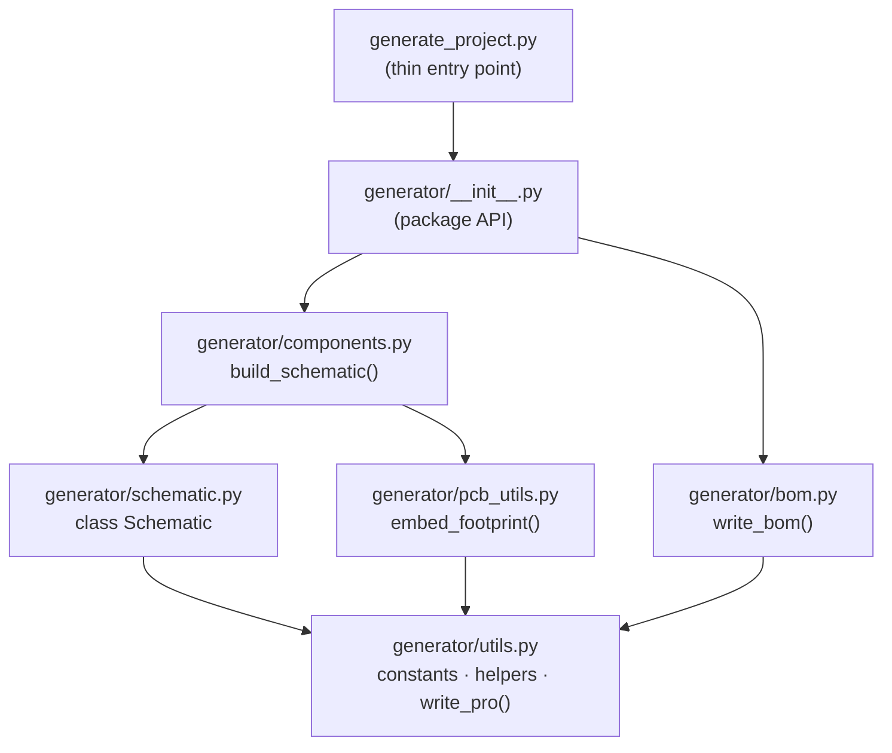

# PoE FanController – Hardware Design Notes

<!-- Last updated: 2026-06-08 | Updated: feature/62-refactor-generator-esp32p4 -->

## Overview
A PoE 802.3at (PoE+) powered device that controls up to 4 PWM fans via the
**Waveshare ESP32-P4-ETH** development board (SKU 32086), mounted HAT-style on a
custom carrier PCB.  The carrier handles PoE power extraction, 12 V fan outputs,
and sensor/LED circuitry; the Waveshare module integrates the ESP32-P4NRW32 SoC,
LAN8720A PHY, CH343P USB-UART bridge, USB-C connector, RESET/BOOT buttons,
32 MB flash, and 32 MB stacked PSRAM.

## Block Diagram
```
[Ethernet cable / PoE+]
       │ 37–57 V DC (PoE pairs)
   ┌───▼──────────────────────────────────┐
   │  J1  RJ45 Würth 615008144521          │  ← PoE power-only port; MDI secondary NC
   └───┬──────────────────────────────────┘    (Waveshare's own RJ45 carries Ethernet data)
       │ PoE centre-tap pairs                  ⚠ PSE port must be set to "force PoE" mode
   ┌───▼──────────────────────────────────┐
   │  U1  Ag9905M PoE+ PD module           │  ← 802.3at Class 4 PD; isolated flyback
   └───┬──────────────────────────────────┘
       │ +12 V, 1.67 A (20 W max)
       ├──────────────────────────────────────► J2–J5  Fan headers (12 V PWM, 4-wire Intel)
       │
   ┌───▼──────────────────────────────────┐
   │  U2  LM2596S-5.0 buck regulator       │  ← 12 V → 5 V, 3 A rated
   └───┬──────────────────────────────────┘
       │ +5 V
   ┌───▼──────────────────────────────────┐
   │  D2  1N5822 Schottky (back-feed prot) │  ← Vf ≈ 0.35 V; prevents USB back-feed
   └───┬──────────────────────────────────┘    when Waveshare programmed via USB-C
       │ +5V_HAT (~4.65 V)
   ┌───▼──────────────────────────────────┐
   │  J8  2×20 HAT header                  │  ← Carrier ↔ Waveshare ESP32-P4-ETH interface
   └───┬──────────────────────────────────┘
       │ Waveshare board (mounted on top)
       │  ├─ ESP32-P4NRW32 SoC (dual-core RISC-V 400 MHz, 32 MB flash, 32 MB PSRAM)
       │  ├─ LAN8720A Ethernet PHY (RMII, internal to Waveshare)
       │  ├─ CH343P USB-UART bridge → USB-C (programming & debug)
       │  ├─ RESET + BOOT buttons
       │  └─ Internal 5 V → 3.3 V LDO
       │        └─ +3V3 back to carrier via J8 pins 1,17
       │              └─ R4 NTC voltage divider, R5–R8 TACH pull-ups
       └── GPIO4–7 (PWM), GPIO8–11 (TACH), GPIO16 (NTC), GPIO2 (LED) routed via J8
```

## Power Budget (802.3at Class 4 = 20 W at PD)

> ⚠ **Tight margin warning:** Only ~5.5% headroom. Do not add further 12 V loads without
> a full re-evaluation and `poe.expert` consultation (constitution §5.2).

| Consumer                              | Rail    | Current   | Power    |
|---------------------------------------|---------|-----------|----------|
| 4 × 12 V fan (max, all channels)     | 12 V    | ≤1.0 A    | ≤12.0 W  |
| LM2596S-5.0 conversion loss (~88% η) | 12→5 V  | —         | ~0.55 W  |
| D2 diode drop loss                    | —       | —         | ~0.35 W  |
| Waveshare ESP32-P4-ETH board          | 5 V (via J8) | ~800 mA | ~4.0 W |
| NTC + TACH pull-ups (passive)         | 3.3 V   | < 5 mA   | ~0.02 W  |
| Ag9905M conversion losses (est.)      | —       | —         | ~2.0 W   |
| **Total**                             |         |           | **~18.9 W** |
| **Ag9905M hard cap (802.3at Class 4)**|         |           | **20.0 W** |
| **Margin**                            |         |           | **~1.1 W (5.5%)** |

## GPIO Allocation (ESP32-P4NRW32 on Waveshare board → carrier via J8)

All carrier-facing signals are routed through J8 (2×20 HAT header).
Ethernet MAC/PHY pins (GPIO28, GPIO31, GPIO32–37, GPIO50) are internal to the
Waveshare board and are **not** connected to J8 carrier pads.

| GPIO        | Function           | Direction | J8 Pad | Notes                                            |
|-------------|--------------------|-----------|---------|-------------------------------------------------|
| GPIO0       | BOOT strapping     | Input     | —       | On Waveshare board (BOOT button); not on J8     |
| GPIO2       | Status LED         | Output    | 3       | Active HIGH; R3 330 Ω in series on carrier      |
| GPIO4       | FAN1 PWM           | Output    | 7       | LEDC CH0, 25 kHz, 8-bit                         |
| GPIO5       | FAN2 PWM           | Output    | 8       | LEDC CH1                                        |
| GPIO6       | FAN3 PWM           | Output    | 10      | LEDC CH2                                        |
| GPIO7       | FAN4 PWM           | Output    | 11      | LEDC CH3                                        |
| GPIO8       | FAN1 TACH          | Input     | 12      | GPIO interrupt (ISR); 10 kΩ pull-up R5 to +3V3  |
| GPIO9       | FAN2 TACH          | Input     | 13      | 10 kΩ pull-up R6 to +3V3                        |
| GPIO10      | FAN3 TACH          | Input     | 15      | 10 kΩ pull-up R7 to +3V3                        |
| GPIO11      | FAN4 TACH          | Input     | 16      | 10 kΩ pull-up R8 to +3V3                        |
| GPIO16      | NTC ADC            | ADC Input | 23      | 12-bit ADC; voltage divider R4 + NTC1           |
| GPIO28      | ETH_MDIO           | Bidir.    | —       | Internal to Waveshare LAN8720A; NC on J8        |
| GPIO31      | ETH_MDC            | Output    | —       | Internal to Waveshare; NC on J8                 |
| GPIO32–37   | RMII EMAC          | I/O       | —       | Fixed IO_MUX; internal to Waveshare             |
| GPIO38      | UART0 TXD          | Output    | —       | Via Waveshare CH343P → USB-C; also J7 bare-UART |
| GPIO39      | UART0 RXD          | Input     | —       | Via Waveshare CH343P → USB-C; also J7 bare-UART |
| GPIO50      | EMAC REF_CLK       | Output    | —       | 50 MHz to LAN8720A; internal to Waveshare       |

## Safety & Isolation Requirements (CRITICAL)

- **Minimum creepage across isolation barrier (J1↔U1 output)**: 3.0 mm
- **Minimum clearance**: 3.0 mm
- **Hipot test**: 1.5 kV AC for 60 s across isolation barrier
- **Slot**: Consider adding a PCB slot between primary (PoE) and secondary sides
- The dashed line in the PCB comment layer marks the isolation barrier at x = 38 mm
- **Never route secondary-side signals across the isolation barrier without the Ag9905M module**

## Fan Header Pinout (J2–J5, all identical)

| Pin | Signal   | Notes                                                |
|-----|----------|------------------------------------------------------|
| 1   | GND      | Ground                                               |
| 2   | +12V     | Fan supply (12 V from Ag9905M)                       |
| 3   | TACH     | Tachometer output from fan; 10 kΩ pull-up to +3V3    |
| 4   | PWM      | 25 kHz PWM input from ESP32 LEDC via J8              |

Standard PC fan pinout (Intel spec). Compatible with 4-wire 12V PWM fans.

## PCB Design Guidelines

- **Layer stack**: 2-layer FR4, 1.6 mm, 1 oz Cu
- **Track widths**: Signal = 0.25 mm; Power (+12V, GND) = 1.0 mm
- **Via**: 0.8 mm diameter, 0.4 mm drill
- **Ground pour**: Both layers (GND). Split at isolation barrier.
- **Component placement priority**:
  1. **External cable connectors on top board edge** (y ≈ 5 mm, per P-HW-03):
     | Ref | Part | Notes |
     |-----|------|-------|
     | J1 | RJ45 Würth 615008144521 | Primary side (x < 38 mm); PoE power only |
     | J2 | Fan header Molex 47053-1000 | Secondary side; courtyard left ≥ 41.0 mm (3 mm creepage) |
     | J3 | Fan header Molex 47053-1000 | Secondary side |
     | J4 | Fan header Molex 47053-1000 | Secondary side |
     | J5 | Fan header Molex 47053-1000 | Secondary side |
     | J7 | Debug UART 1×3 2.54 mm | Right board edge — documented exception P-HW-03 v1.0.1 |
  2. U1 (Ag9905M) close to J1, primary-side power traces (x < 38 mm)
  3. Isolation gap/slot at x = 38 mm (P-ISO-04)
  4. U2 (LM2596S-5.0) + L1 + D1 + D2 grouped together, primary/left of secondary
  5. **J8 (2×20 HAT header)** placed centrally on PCB — documented P-HW-03 exception (v2.0.0); Waveshare board mounts on top facing down; central placement required to align with Waveshare mechanical footprint
  6. Passive components (R3–R8, LED1, NTC1) distributed around J8 as required

## Carrier PCB Component Summary (v2.0.0)

The v2.0.0 carrier board removes all components previously dedicated to the
discrete MCU/PHY/USB stack (U3 ESP32-P4-MINI-1U, U4 CH340C, U5 LAN8720A,
J6 USB-C, SW1 RESET, SW2 BOOT, R1/R2 EN/BOOT pull-ups, R9/R10 USB CC
pull-downs, R11–R15 PHY passives, C3–C11 decoupling caps).  These are now
integrated on the Waveshare ESP32-P4-ETH board.

### Components retained / modified on carrier

| Ref | Value / MPN | Change vs v1.x | Function |
|-----|-------------|----------------|----------|
| J1 | Würth 615008144521 | Role clarified: PoE power only, MDI secondary NC | RJ45 PoE input |
| U1 | Ag9905M | Unchanged | PoE+ PD module, 12 V isolated output |
| U2 | LM2596S-5.0/NOPB | **Changed**: was LM2596S-3.3; same D2PAK package | 12 V → 5 V buck regulator |
| L1 | SRR5028-680Y 68 µH | Unchanged | LM2596 output inductor |
| D1 | 1N5822 | Unchanged | LM2596 freewheeling Schottky |
| C1 | 100 µF / 25 V | Unchanged | LM2596 input bulk cap |
| C2 | 100 µF / 16 V | Voltage rating updated (was /25V) — 5 V rail has more headroom | LM2596 output bulk cap |
| J2–J5 | Molex 47053-1000 | Unchanged | 12 V PWM fan headers |
| R5–R8 | 10 kΩ 0402 | Pull-up source now +3V3 from J8 (was +3V3 from LM2596) | TACH pull-ups |
| R4 | 10 kΩ 0402 | Pull-up source now +3V3 from J8 | NTC voltage divider (top half) |
| NTC1 | NCP15XH103F03RC 10 kΩ | Unchanged | NTC thermistor |
| R3 | 330 Ω 0402 | Unchanged | Status LED current limit |
| LED1 | Green 3 mm THT | Unchanged | Status LED |
| J7 | 3-pin 2.54 mm header | Unchanged | Debug bare-UART (ESP_TX/ESP_RX via J8 → Waveshare CH343P) |

### Components added in v2.0.0

| Ref | Value / MPN | Function |
|-----|-------------|----------|
| J8 | Sullins PREC020DAAN-RC / Würth 61304021821 (2×20, 2.54 mm) | HAT header — carrier ↔ Waveshare ESP32-P4-ETH |
| D2 | 1N5822 | USB back-feed protection Schottky (series between LM2596 +5V and J8 +5V_HAT) |

### Components removed in v2.0.0

Removed because they are now provided by the Waveshare ESP32-P4-ETH board:

`U3` (ESP32-P4-MINI-1U), `U4` (CH340C), `U5` (LAN8720A), `J6` (USB-C),
`SW1` (RESET), `SW2` (BOOT), `R1` (EN pull-up), `R2` (BOOT pull-up),
`R9`/`R10` (USB-C CC pull-downs), `R11`–`R15` (LAN8720A passives),
`C3`–`C11` (decoupling caps).

### DRC baseline (v2.0.0)

The 36 pre-existing `solder_mask_bridge` violations on J6 (USB-C GCT USB4085)
are **no longer present** — J6 was removed in v2.0.0.  The DRC baseline for
v2.0.0 is **zero violations**.  Run `kicad-cli pcb drc` to confirm after any
PCB layout change (P-TEST-03).

> PCB placement coordinates for all components are maintained in
> `hardware/kicad/PoE-FanController.kicad_pcb` via KiCad GUI (P-KI-07).
> Do not edit the `.kicad_pcb` file by hand.

---

## Schematic Conventions

These conventions are enforced by the `hardware/generator/` package (invoked via `hardware/generate_project.py`)
and codified in constitution §7A
(P-SCH-01 – P-SCH-05). The generator is the single source of truth for the schematic; the
`.kicad_sch` file is a build artefact and must never be edited by hand (P-HW-05, P-KI-04).

### Global labels vs. local labels

Any signal that crosses between two of the five functional blocks MUST use `global_label()`.
Purely intra-block connections use `label()`.

| Signal type | Method | Example nets |
|---|---|---|
| Inter-block | `global_label()` | `FAN1_PWM`–`FAN4_PWM`, `FAN1_TACH`–`FAN4_TACH`, `NTC_ADC`, `STATUS_LED` |
| Intra-block | `label()` | `POE_A+`, `POE_A-`, `POE_B+`, `POE_B-`, `+5V_SW`, `+5V_HAT`, `LED_A` |

The `global_label()` method emits a KiCad 10 S-expression with `fields_autoplaced yes` and an
`Intersheetrefs` property carrying `${INTERSHEET_REFS}`, matching the KiCad 10 reference-project
format. The schematic currently contains **25 global labels** (v2.0.0):
- `FAN1_PWM`–`FAN4_PWM`: 2 labels each (fan header + J8) = 8
- `FAN1_TACH`–`FAN4_TACH`: 3 labels each (pull-up resistor, fan header, J8) = 12
- `NTC_ADC`: 3 labels (R4, NTC1, J8)
- `STATUS_LED`: 2 labels (R3, J8)

Label `shape` follows signal direction at the point of connection:

| Shape | Meaning | Example in this schematic |
|---|---|---|
| `input` | This end receives the signal | `J8` pin 23 receiving `NTC_ADC`; `R3` pin 1 receiving `STATUS_LED` |
| `output` | This end drives the signal | `Fan_Header.TACH` driving `FAN1_TACH`; `R4` driving `NTC_ADC` |
| `bidirectional` | Both drive and receive | — (no bidirectional signals in v2.0.0 schematic) |
| `passive` | No defined direction | — (removed with discrete MCU components) |

### Ground domain separation

Two ground nets exist in the schematic and are **never connected** to each other, either in the
schematic or on the PCB:

| Net | Defined on | Side | Function |
|---|---|---|---|
| `GND_PRI` | U1 VOUT_N (pin 6), `pin_type="power_out"` | Primary (PoE) | Return path for PoE input currents only |
| `GND` | U2 GND (pin 3) and all secondary components | Secondary (SELV) | Return path for 12 V fans, 5 V/3.3 V logic |

The isolation barrier is at x = 38 mm on the PCB (P-ISO-02). The copper pour on both layers is
split at this line (P-HW-08). No PCB trace, pad, via, or pour may cross it.

### Section header style

Each functional block opens with a plain-text annotation placed by the `text()` method:

```python
BLUE = (0, 0, 255)
s.text("PoE Power Input", 25, 18, size=2.54, bold=True, color=BLUE)
```

The four section headers in the current schematic (v2.0.0):

| Header text | Components |
|---|---|
| `PoE Power Input` | J1 (RJ45), U1 (Ag9905M) |
| `5V Regulator (LM2596)` | U2, D1, D2, L1, C1, C2 |
| `Fan Headers (4× PWM)` | J2–J5, R5–R8 |
| `Waveshare ESP32-P4-ETH Interface (J8)` | J8, R3, R4, LED1, NTC1 (adjacent area) |

Requirements (P-SCH-03): `bold=True`, `size=2.54` mm, `color=(0,0,255)` (blue).
No ASCII-art decoration (`===`, `---`, `***`) is permitted.

### Power symbol pin types

The `power()` method in the generator defaults to `pin_type="power_out"`:

```python
def power(self, name, x, y, angle=0, pin_type="power_out"):
    self.define_power(name, pin_type=pin_type)
```

Every `#PWR` symbol placed by `power()` — whether a rail source or a power consumer (decoupling
cap, pull-up, ground return) — is therefore defined as `power_out`. This eliminates all
`power_pin_not_driven` ERC errors without needing separate `PWR_FLAG` symbols (P-SCH-04).

The three key rail driver calls that are also explicitly marked `power_out`:

| Call in `generate_project.py` | Net driven |
|---|---|
| `s.power("+12V",    *p["5"], pin_type="power_out")` — U1 VOUT_P | `+12V` rail |
| `s.power("GND_PRI", *p["6"], pin_type="power_out")` — U1 VOUT_N | `GND_PRI` rail |
| `s.power("+5V", *p["2"], pin_type="power_out")` — L1 pin 2 | `+5V` rail |
| `s.power("+3V3", *p["1"],  pin_type="power_out")` — J8 pin 1 | `+3V3` rail (from Waveshare LDO) |
| `s.power("+3V3", *p["17"], pin_type="power_out")` — J8 pin 17 | `+3V3` duplicate |

**Ag9905M VPORT pins:** U1 input pins (VPORT_A±, VPORT_B±) use `passive` in the custom symbol
definition (not `power_in`). Using `power_in` on these pins previously caused spurious
`power_pin_not_driven` ERC errors because no schematic element drives the PoE pair nets — they
are driven externally by the Ethernet PSE. Changing to `passive` removes those errors (P-SCH-05).

### ERC status

> **Note:** The ERC entry below reflects the pre-v2.0.0 schematic (2026-06-06).
> A fresh ERC run against the v2.0.0-generated schematic should be committed to
> `hardware/kicad/erc_output.json` per P-TEST-02.  The component count and warning
> count are expected to decrease significantly (fewer inline symbols; no USB/PHY block).

Last recorded authoritative ERC run: KiCad 10.0.3, `hardware/kicad/erc_output.json`, 2026-06-06.

| Metric | Result |
|---|---|
| **Errors** | **0** |
| **Warnings** | **85** (pre-v2.0.0; expected to decrease) |

All warnings fall into two benign categories:

**`lib_symbol_issues` — "symbol library 'Custom' not included"**
All components are defined inline in `generator/components.py` using `Custom:*` lib IDs. The `Custom`
library is not registered in `PoE-FanController.kicad_pro` because it does not exist on disk;
all symbol definitions are embedded directly in the generated `.kicad_sch` file. KiCad cannot
find the external library and flags each component. This is expected and correct by design
(P-HW-05, P-KI-04).

**`lib_symbol_mismatch` — "symbol 'X' doesn't match copy in library 'power'"**
Inline power symbols (`GND`, `+12V`, `+5V`, `+3V3`, `GND_PRI`) are generated with `pin_type="power_out"`,
whereas the KiCad stock `power` library defines those same names with `pin_type="power_in"`.
KiCad detects the mismatch. Benign: the deviation is intentional (P-SCH-04) and is precisely
what suppresses `power_pin_not_driven` ERC errors project-wide.

Four check types are suppressed in the project-level ERC configuration:

| Suppressed check | Reason |
|---|---|
| `single_global_label` | Precautionary suppress; all 25 global labels appear at ≥ 2 locations |
| `four_way_junction` | No 4-way wire junctions exist in the schematic |
| `simulation_model_issue` | No SPICE models are attached |
| `footprint_filter` | Custom footprint assignments do not match KiCad library filter strings |

---

## Generator Architecture

The schematic and BOM are generated from the `hardware/generator/` Python package (P-KI-04, P-HW-05).
`hardware/generate_project.py` is a **thin entry point** (≤ 37 lines) that delegates all work to the
package. **The generator never reads, creates, or modifies `hardware/kicad/PoE-FanController.kicad_pcb`**
(P-KI-07). The PCB file is KiCad GUI territory.

### Package structure

```
hardware/
├── generate_project.py          # thin entry point — imports package; calls write_pro(),
│                                # build_schematic(), write_bom(); writes .kicad_sch
└── generator/
    ├── __init__.py              # public API: re-exports build_schematic, write_bom
    ├── utils.py                 # constants (G, PL, OUT_DIR, PROJ, SCH_UUID, KICAD_FP_BASE),
    │                            # helpers (_uuid(), snap(), _pt()), write_pro()
    ├── schematic.py             # class Schematic — S-expression builder; render() → .kicad_sch text
    ├── components.py            # build_schematic() — all component symbols, pins, nets, wires, labels
    ├── pcb_utils.py             # embed_footprint() — kept for reference; NOT called by entry point
    └── bom.py                   # write_bom() — writes hardware/bom/bom.csv
```

### Module responsibilities

| Module | Exported symbol(s) | Responsibility |
|---|---|---|
| `generate_project.py` | — (entry point) | CLI entry point; calls `write_pro()`, `build_schematic()`, `write_bom()`; writes `.kicad_sch` |
| `generator/__init__.py` | `build_schematic`, `write_bom` | Package API surface; re-exports from sub-modules |
| `generator/utils.py` | `_uuid`, `snap`, `_pt`, `G`, `PL`, `KICAD_FP_BASE`, `OUT_DIR`, `PROJ`, `SCH_UUID`, `write_pro` | Shared constants and stateless helpers; writes `.kicad_pro` |
| `generator/schematic.py` | `Schematic` | S-expression builder; `render()` produces `.kicad_sch` text; owns no I/O |
| `generator/components.py` | `build_schematic` | Instantiates `Schematic`; defines every component symbol, pin, net, wire, label; returns `Schematic` for caller to `render()` |
| `generator/pcb_utils.py` | `embed_footprint` | Reads `.kicad_mod` files from `KICAD_FP_BASE`; **reference / future tooling only — not called by entry point** |
| `generator/bom.py` | `write_bom` | Reads BOM data; writes `hardware/bom/bom.csv`; no schematic involvement |

### Import graph (acyclic)



All paths terminate at `utils.py`. No module imports its own ancestor.

### Running the generator

```bash
cd hardware
python3 generate_project.py
```

Outputs (all under `hardware/kicad/` or `hardware/bom/`):

| Output file | Written by |
|---|---|
| `hardware/kicad/PoE-FanController.kicad_sch` | `build_schematic()` → `Schematic.render()` |
| `hardware/kicad/PoE-FanController.kicad_pro` | `write_pro()` in `generator/utils.py` |
| `hardware/bom/bom.csv` | `write_bom()` in `generator/bom.py` |

`hardware/kicad/PoE-FanController.kicad_pcb` is **not created or modified** on any generator run.

### How to extend the generator

| Task | File to edit | API entry point |
|---|---|---|
| Add a new schematic component | `generator/components.py` | `build_schematic()` — call `s.define(...)` then `s.place(...)` |
| Add a new S-expression builder method | `generator/schematic.py` | `class Schematic` |
| Add or change a shared constant or helper | `generator/utils.py` | module-level |
| Add a new BOM row | `generator/bom.py` | `write_bom()` |

**Never** add any function that opens and writes `hardware/kicad/PoE-FanController.kicad_pcb` anywhere
under `hardware/generator/`. This is forbidden by P-KI-07 and caught immediately by the CI
`sha256sum` guard described in the [CI section](#ci--automated-checks) below.

### P-KI-07 CI enforcement

The `kicad-erc-drc` job in `hardware-check.yml` includes a `sha256sum` guard around every generator run:

```yaml
- name: Store PCB checksum (P-KI-07 guard baseline)
  run: sha256sum hardware/kicad/PoE-FanController.kicad_pcb > /tmp/pcb_before.sha256

- name: Regenerate schematic from Python
  run: |
    cd hardware
    KICAD_FP_BASE=/usr/share/kicad/footprints python3 generate_project.py

- name: Guard — kicad_pcb must not be modified by generator (P-KI-07)
  run: |
    sha256sum --check /tmp/pcb_before.sha256 || \
      (echo "ERROR: kicad_pcb was modified by generator — P-KI-07 violation" && exit 1)
```

If any byte of the PCB file changes, the guard fails with exit code 1 and blocks the pipeline.

---

## Bill of Materials Summary

Full BOM (with Qty, Manufacturer, MPN, Datasheet links) is generated by `python hardware/generate_project.py`
into `hardware/bom/bom.csv`. Key component selections:

### Major ICs and Connectors (BOM-locked per constitution §2.2)

| Ref | Value / MPN | Package | Role |
|-----|-------------|---------|------|
| U1 | Silvertel Ag9905M | 2×4 pin header 2.54 mm | PoE+ 802.3at PD module, 12 V / 1.67 A isolated |
| U2 | TI LM2596S-3.3/NOPB | D2PAK (TO-263-5) | 3.3 V 3 A fixed buck regulator |
| U3 | Espressif ESP32-WROOM-32D | RF module | Main MCU, WiFi, 4 MB flash |
| U4 | WCH CH340C | SOIC-16 | USB-UART bridge (no external crystal) |
| J1 | Würth 615008144521 | RJ45 horizontal | PoE input with integrated magnetics |
| J2–J5 | Molex 47053-1000 | 4-pin 2.54 mm | 12 V PWM fan headers |
| J6 | GCT USB4085-GF-A | USB-C through-hole | USB-C debug / programming |
| L1 | Bourns SRR5028-680Y | Axial THT | 68 µH buck inductor |
| D1 | ON Semi 1N5822 | DO-201AD THT | 3 A Schottky catch diode |

### Passives Added in Feature #13 (not BOM-locked — equivalents acceptable if value/package match)

| Refs | Qty | Value | Package | MPN | Notes |
|------|-----|-------|---------|-----|-------|
| C3, C4, C5, C6, C7 | 5 | 100 nF | 0402 | Samsung CL05B104KO5NNNC | +3V3 / V3 decoupling, X5R 16 V |
| R1, R2, R4, R5, R6, R7, R8 | 7 | 10 kΩ | 0402 | Yageo RC0402FR-0710KL | EN, BOOT, NTC divider, TACH pull-ups |
| R3 | 1 | 330 Ω | 0402 | Yageo RC0402FR-07330RL | Status LED current limit |
| R9, R10 | 2 | 5.1 kΩ | 0402 | Yageo RC0402FR-075K1L | USB-C CC1/CC2 pull-down resistors |
| LED1 | 1 | Green 3 mm | THT Ø3 mm | Würth 150060GS75000 | Status LED, 565 nm, active HIGH via R3 |
| SW1 | 1 | RESET | 6 mm THT | C&K PTS636 SK43 SMTR LFS | ESP32 EN reset button |
| SW2 | 1 | BOOT | 6 mm THT | C&K PTS636 SK43 SMTR LFS | ESP32 GPIO0 boot-mode button |
| NTC1 | 1 | 10 kΩ NTC | Axial THT P10.16 mm | Murata NCP15XH103F03RC | Temperature sensing (B = 3380 K, GPIO32 ADC) |

---

## Firmware Overview

- **Framework**: Arduino for ESP32 (PlatformIO)
- **Fan PWM**: ESP32 LEDC peripheral, 25 kHz, 8-bit resolution
- **TACH**: GPIO interrupt counting or PCNT peripheral, Hz → RPM
- **Temperature**: ADC + Steinhart-Hart equation for NTC
- **Web interface**: ESPAsyncWebServer + LittleFS (static HTML/CSS/JS)
- **Configuration persistence**: NVS (Non-Volatile Storage)
- **OTA**: ArduinoOTA over local WiFi

## CI / Automated Checks

Full workflow documentation is in [`docs/ci.md`](../docs/ci.md). This section summarises what CI enforces on hardware files.

### Workflows that act on `hardware/`

| Workflow | Trigger | Gate |
|---|---|---|
| **Hardware Check (ERC + DRC)** | `push` / `pull_request` touching `hardware/**` | Generator syntax (all 7 modules); P-KI-07 PCB guard; ERC zero errors; DRC ≤ 67 violations (Docker baseline) |
| **KiCad Hardware Release** | `v*.*.*` tag | DRC zero tolerance, then Gerbers + BOM + schematic PDF → GitHub Release |

### `validate-generator` job — syntax check (7 modules)

The `validate-generator` job runs `python -m py_compile` on every module in the generator package,
not just the entry point (FR-09):

```bash
python -m py_compile hardware/generate_project.py
python -m py_compile hardware/generator/__init__.py
python -m py_compile hardware/generator/utils.py
python -m py_compile hardware/generator/schematic.py
python -m py_compile hardware/generator/components.py
python -m py_compile hardware/generator/pcb_utils.py
python -m py_compile hardware/generator/bom.py
# "Syntax OK — all 7 modules"
```

### `kicad-erc-drc` job — step order

Steps in order:

1. **Store PCB checksum** — `sha256sum hardware/kicad/PoE-FanController.kicad_pcb > /tmp/pcb_before.sha256`
2. **Regenerate schematic from Python** — runs `generate_project.py`; any non-zero exit fails immediately
3. **Guard — kicad_pcb must not be modified by generator (P-KI-07)** — `sha256sum --check /tmp/pcb_before.sha256`; exits 1 if PCB changed
4. **Run ERC** — `kicad-cli sch erc … --format json`
5. **Check ERC results (zero errors enforced)** — Python one-liner; exits 1 if any `severity == "error"`
6. **Run DRC** — `kicad-cli pcb drc … --format json --exit-code-violations || true`
7. **Check DRC violation count (baseline 67)** — exits 1 if `len(violations) > 67`
8. **Upload ERC report** (`if: always()`) — artifact `erc-report`
9. **Upload DRC report** (`if: always()`) — artifact `drc-report`

### KiCad Docker image

Both hardware workflows run `kicad-cli` inside `kicad/kicad:10.0.2` with `--user root`. The development toolchain is locked to KiCad 10.0.3 (P-KI-01); the Docker image uses 10.0.2 because no 10.0.3 image was published on Docker Hub as of 2026-05-09 (P-KI-01 PATCH amendment, constitution v1.1.0).

### DRC baseline

The PR gate allows up to **67 violations** in the Docker/Linux environment (breakdown: 34 `lib_footprint_issues`, 28 `solder_mask_bridge` on J6, 5 `silk_edge_clearance`). Issue #39 tracks driving this to zero. The release workflow uses a **zero-tolerance threshold** regardless of the PR baseline (P-CI-02).

### ERC gate

ERC errors (severity `"error"`) cause an immediate hard failure. Warnings are logged but do not block merge. The current schematic must have zero ERC errors (P-TEST-01).

---

## Bring-up Procedure

1. **No-load power test**: Connect PoE+ switch. Measure Ag9905M output (expect 12.0 ± 0.3 V).
2. **Secondary rail**: Measure LM2596 output (expect 3.30 ± 0.05 V).
3. **UART test**: Connect USB-C. CH340C should enumerate. Open serial at 115200 baud.
4. **Flash firmware**: `pio run -e esp32dev --target upload` via CH340C.
5. **Fan test**: Connect one fan to J2. Command 50% duty cycle from firmware/web UI.
6. **Full load test**: Connect all 4 fans at 100%, run for 10 min. Check temperatures.
